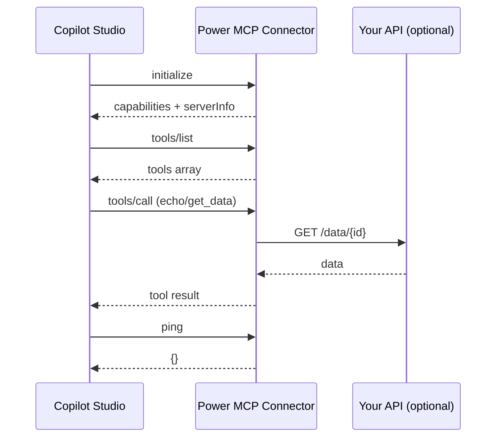

**TL;DR**
- Power MCP is an MCP server implemented inside the **custom code** of a Power Platform connector
- One `/mcp` endpoint, no external hosting, full MCP handshake, tools/list and tools/call
- Works with Copilot Studio actions; respects OBO tokens and Zero Trust
- Template includes full MCP support (2025-11-25) for tools, resources, prompts, logging
- Built-in tools: `echo`, `get_data`; helper methods; optional App Insights telemetry

## What is Power MCP?

Power MCP is my implementation of the Model Context Protocol entirely inside a Power Platform custom connector. The connector exposes a single `/mcp` operation, and the custom C# script handles the MCP handshake, `tools/list`, and `tools/call` on the fly. No Azure Function, no separate server—just the connector you already deploy.

## Why it matters

- **Zero hosting**: everything runs in the connector's custom code
- **Single endpoint**: `/mcp` with `x-ms-agentic-protocol: mcp-streamable-1.0`
- **Tool indirection**: registry-based dispatch with validation, logging, and schema hints
- **Least privilege**: OBO token per user; permissions enforced by the underlying service
- **Composable**: add your domain tools (echo/get_data scaffold included)

## Template highlights

| Feature | Details |
|---------|---------|
| **Full MCP compliance** | JSON-RPC 2.0, MCP 2025-11-25, Copilot Studio tested |
| **No hosting** | Custom connector + `routeRequestToCode` policy handles `/mcp` |
| **Telemetry** | Optional Application Insights with rich events |
| **Tool helpers** | `RequireArgument`, `GetArgument`, `GetConnectionParameter`, `SendExternalRequestAsync` |
| **Example tools** | `echo`, `get_data` (swap with your domain tools) |
| **Stateless** | `listChanged=false`, no server cache, safe for multi-tenant |

## Files in the template

| File | Purpose |
|------|---------|
| `apiDefinition.swagger.json` | Minimal MCP contract with `x-ms-agentic-protocol: mcp-streamable-1.0` |
| `apiProperties.json` | Uses `routeRequestToCode` (`InvokeMCP`) for custom code routing |
| `script.csx` | Full MCP server (methods, tools, helpers, telemetry) |
| `readme.md` | Quick start, helper docs, testing, setup |

📦 **Repo:** [Power MCP Template](https://github.com/troystaylor/SharingIsCaring/tree/main/Connector-Code/Power%20MCP%20Template)

## Architecture

```
┌──────────────────────────────────────────────────────────────┐
│                    Copilot Studio Agent                      │
└──────────────────────────────────────────────────────────────┘
                               │ MCP JSON-RPC
                               ▼
┌──────────────────────────────────────────────────────────────┐
│            Power Platform Custom Connector (MCP)             │
│  • /mcp (OpenAPI)                                           │
│  • script.csx (MCP server: initialize, tools/list, tools/call)│
│  • Tool registry (dictionary dispatch)                      │
└──────────────────────────────────────────────────────────────┘
                               │
           ┌───────────────────┴───────────────────┐
           ▼                                       ▼
      Custom APIs                           Microsoft Graph
                                            (or anything else)
```

## Sequence diagram



## Flow diagram

```mermaid
flowchart TD
    A[Copilot Studio Agent] --> B[/mcp POST/]
    B --> C[InvokeMCP (routeRequestToCode)]
    C --> D[script.csx]
    D -->|initialize| E[Return capabilities]
    D -->|tools/list| F[BuildToolsList]
    D -->|tools/call| G{ExecuteToolAsync}
    G -->|echo| H[ExecuteEchoTool]
    G -->|get_data| I[ExecuteGetData]
    G -->|get_ticket| I
    I --> J[SendExternalRequestAsync]
    H --> K[CreateJsonRpcResponse]
    J --> K
    K --> L[Return to Agent]

    style A fill:#e1f5fe,stroke:#0288d1
    style D fill:#fff3e0,stroke:#fb8c00
    style G fill:#ede7f6,stroke:#5e35b1
```

## Supported MCP methods

| Method | Notes |
|--------|-------|
| `initialize` | Returns capabilities, server info, optional instructions |
| `notifications/initialized` | Ack-only |
| `ping` | Health check |
| `logging/setLevel` | Ack-only |
| `tools/list` | Static list (`listChanged=false`) |
| `tools/call` | Dispatches to `ExecuteToolAsync` |
| `resources/list`, `resources/templates/list`, `resources/read` | Return empty (stubbed) |
| `prompts/list`, `prompts/get` | Return empty (stubbed) |
| `completion/complete` | Returns empty completion |
| `notifications/cancelled` | Ack-only |

## OpenAPI: mark the /mcp endpoint as MCP

```yaml
paths:
  /:
    post:
      operationId: InvokeMCP
      x-ms-agentic-protocol: mcp-streamable-1.0
      summary: MCP endpoint
      description: Handles MCP initialize, tools/list, tools/call
      responses:
        '200':
          description: MCP response stream
```

## Custom code: minimal handler

```csharp
using System.Net;
using System.Net.Http;
using System.Text;
using Newtonsoft.Json;
using Newtonsoft.Json.Linq;
...
```

... (rest unchanged)
