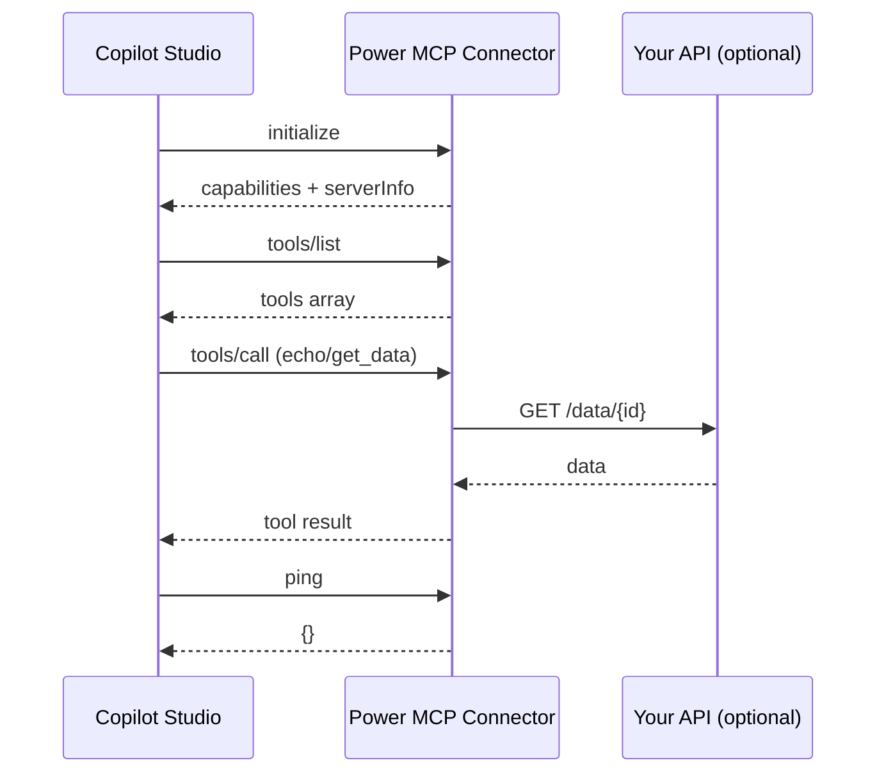
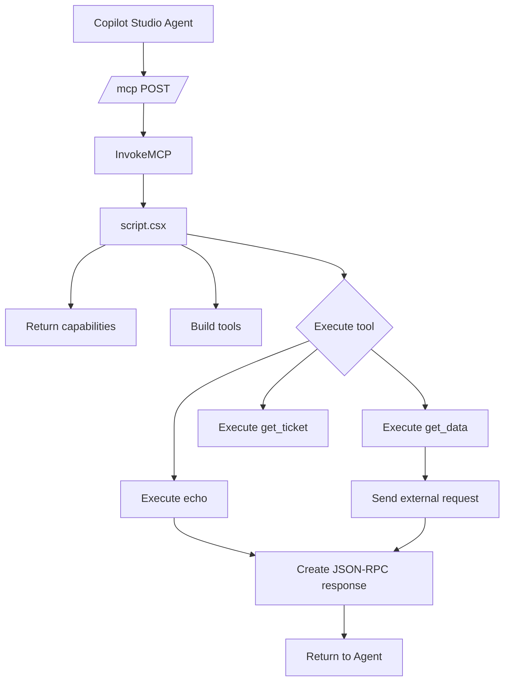

**TL;DR**
- Power MCP is an MCP server implemented inside the **custom code** of a Power Platform connector
- One `/mcp` endpoint, no external hosting, full MCP handshake, tools/list and tools/call
- Works with Copilot Studio actions; respects OBO tokens and Zero Trust
- Template includes full MCP support (2025-11-25) for tools, resources, prompts, logging
- Built-in tools: `echo`, `get_data`; helper methods; optional App Insights telemetry

## What is Power MCP?

Power MCP is my implementation of the Model Context Protocol entirely inside a Power Platform custom connector. The connector exposes a single `/mcp` operation, and the custom C# script handles the MCP handshake, `tools/list`, and `tools/call` on the fly. No Azure Function, no separate server—just the connector you already deploy.

## Why it matters

- **Zero hosting**: everything runs in the connector's custom code
- **Single endpoint**: `/mcp` with `x-ms-agentic-protocol: mcp-streamable-1.0`
- **Tool indirection**: registry-based dispatch with validation, logging, and schema hints
- **Least privilege**: OBO token per user; permissions enforced by the underlying service
- **Composable**: add your domain tools (echo/get_data scaffold included)

## Template highlights

| Feature | Details |
|---------|---------|
| **Full MCP compliance** | JSON-RPC 2.0, MCP 2025-11-25, Copilot Studio tested |
| **No hosting** | Custom connector + `routeRequestToCode` policy handles `/mcp` |
| **Telemetry** | Optional Application Insights with rich events |
| **Tool helpers** | `RequireArgument`, `GetArgument`, `GetConnectionParameter`, `SendExternalRequestAsync` |
| **Example tools** | `echo`, `get_data` (swap with your domain tools) |
| **Stateless** | `listChanged=false`, no server cache, safe for multi-tenant |

## Files in the template

| File | Purpose |
|------|---------|
| `apiDefinition.swagger.json` | Minimal MCP contract with `x-ms-agentic-protocol: mcp-streamable-1.0` |
| `apiProperties.json` | Uses `routeRequestToCode` (`InvokeMCP`) for custom code routing |
| `script.csx` | Full MCP server (methods, tools, helpers, telemetry) |
| `readme.md` | Quick start, helper docs, testing, setup |

📦 **Repo:** [Power MCP Template](https://github.com/troystaylor/SharingIsCaring/tree/main/Connector-Code/Power%20MCP%20Template)

## Architecture

```
┌──────────────────────────────────────────────────────────────┐
│                    Copilot Studio Agent                      │
└──────────────────────────────────────────────────────────────┘
                               │ MCP JSON-RPC
                               ▼
┌──────────────────────────────────────────────────────────────┐
│            Power Platform Custom Connector (MCP)             │
│  • /mcp (OpenAPI)                                           │
│  • script.csx (MCP server: initialize, tools/list, tools/call)│
│  • Tool registry (dictionary dispatch)                      │
└──────────────────────────────────────────────────────────────┘
                               │
           ┌───────────────────┴───────────────────┐
           ▼                                       ▼
      Custom APIs                           Microsoft Graph
                                            (or anything else)
```

## Sequence diagram



## Flow diagram



## Supported MCP methods

| Method | Notes |
|--------|-------|
| `initialize` | Returns capabilities, server info, optional instructions |
| `notifications/initialized` | Ack-only |
| `ping` | Health check |
| `logging/setLevel` | Ack-only |
| `tools/list` | Static list (`listChanged=false`) |
| `tools/call` | Dispatches to `ExecuteToolAsync` |
| `resources/list`, `resources/templates/list`, `resources/read` | Return empty (stubbed) |
| `prompts/list`, `prompts/get` | Return empty (stubbed) |
| `completion/complete` | Returns empty completion |
| `notifications/cancelled` | Ack-only |

## OpenAPI: mark the /mcp endpoint as MCP

```yaml
paths:
  /:
    post:
      operationId: InvokeMCP
      x-ms-agentic-protocol: mcp-streamable-1.0
      summary: MCP endpoint
      description: Handles MCP initialize, tools/list, tools/call
      responses:
        '200':
          description: MCP response stream
```

## MCP JSON-RPC examples

**tools/list**
```javascript
{
  "jsonrpc": "2.0",
  "id": 1,
  "method": "tools/list"
}
```

**tools/call → echo**
```javascript
{
  "jsonrpc": "2.0",
  "id": 2,
  "method": "tools/call",
  "params": {
        "name": "echo",
    "arguments": {
        "message": "Hello from MCP"
    }
  }
}
```

## Setup steps

1. **Import connector** from [SharingIsCaring > Power MCP Template](https://github.com/troystaylor/SharingIsCaring/tree/main/Connector-Code/Power%20MCP%20Template)
2. **Use provided swagger** (`apiDefinition.swagger.json`, path `/`, basePath `/mcp`, `x-ms-agentic-protocol: mcp-streamable-1.0`)
3. **Use provided apiProperties** to route to custom code (`InvokeMCP`)
4. **Paste `script.csx`** into custom code
5. **Configure OAuth** for your backend (Dataverse, Graph, custom API)
6. **Create a connection** and add the connector as an **action** in Copilot Studio

## Testing

```bash
# initialize
curl -X POST https://your-connector/mcp -H "Content-Type: application/json" \
    -d '{"jsonrpc":"2.0","method":"initialize","id":1,"params":{"protocolVersion":"2025-11-25","clientInfo":{"name":"test"}}}'

# list tools
curl -X POST https://your-connector/mcp -H "Content-Type: application/json" \
    -d '{"jsonrpc":"2.0","method":"tools/list","id":2}'

# call echo
curl -X POST https://your-connector/mcp -H "Content-Type: application/json" \
    -d '{"jsonrpc":"2.0","method":"tools/call","id":3,"params":{"name":"echo","arguments":{"message":"Hello"}}}'
```

Copilot Studio: add connector as action → tools surface automatically → test with natural language.

## Error handling and stateless behavior

- Protocol errors (`-32700`, `-32601`, `-32602`, `-32603`) for malformed/unknown methods
- Tool errors returned as successful tool result objects so the model can reason
- `listChanged=false`; no server-side cache; safe in multi-tenant scenarios

## Security

- **Least privilege**: connector forwards the user's `Authorization` header (OBO), honoring Entra permissions
- **API keys/tokens**: use connection parameters (masked if secret); do not hardcode
- **Headers**: the connector forwards `Authorization`
- **Zero trust**: validate required args (`RequireArgument`) and fail fast on unknown tools

## Limitations

- **Static tools**: no discovery; tools defined in `BuildToolsList`
- **No streaming**: `tools/call` returns full result; no partial/progress notifications
- **No notifications/resources/prompts content**: stubs return empty arrays
- **Payload size**: large responses may hit connector limits—paginate and filter (`$top`, server-side paging)
- **Timeouts/retries**: no retries/backoff; long-running calls may time out
- **JSON only**: responses parsed as JSON; non-JSON APIs must be transformed

## Resources

- Advanced (coming soon): Orchestration patterns post
- GitHub: [Connector-Code/Power MCP Template](https://github.com/troystaylor/SharingIsCaring/tree/main/Connector-Code/Power%20MCP%20Template)
- MCP: [modelcontextprotocol.io](https://modelcontextprotocol.io/)

#PowerMCP #CopilotStudio #MCP #PowerPlatform #AIAgents
