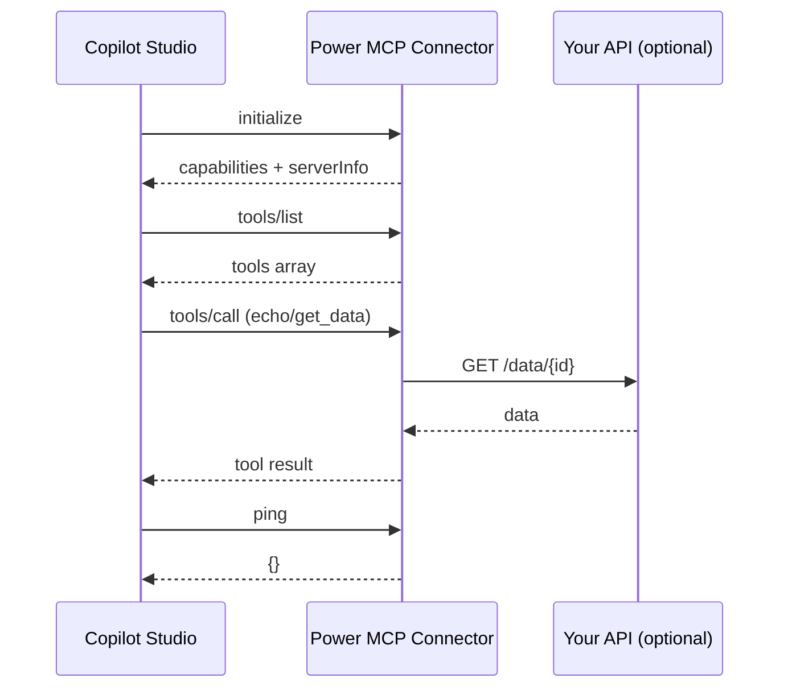

**TL;DR**
- Power MCP is an MCP server implemented inside the **custom code** of a Power Platform connector
- One `/mcp` endpoint, no external hosting, full MCP handshake, tools/list and tools/call
- Works with Copilot Studio actions; respects OBO tokens and Zero Trust
- Template includes full MCP support (2025-11-25) for tools, resources, prompts, logging
- Built-in tools: `echo`, `get_data`; helper methods; optional App Insights telemetry

## What is Power MCP?

Power MCP is my implementation of the Model Context Protocol entirely inside a Power Platform custom connector. The connector exposes a single `/mcp` operation, and the custom C# script handles the MCP handshake, `tools/list`, and `tools/call` on the fly. No Azure Function, no separate server—just the connector you already deploy.

## Why it matters

- **Zero hosting**: everything runs in the connector's custom code
- **Single endpoint**: `/mcp` with `x-ms-agentic-protocol: mcp-streamable-1.0`
- **Tool indirection**: registry-based dispatch with validation, logging, and schema hints
- **Least privilege**: OBO token per user; permissions enforced by the underlying service
- **Composable**: add your domain tools (echo/get_data scaffold included)

## Template highlights

| Feature | Details |
|---------|---------|
| **Full MCP compliance** | JSON-RPC 2.0, MCP 2025-11-25, Copilot Studio tested |
| **No hosting** | Custom connector + `routeRequestToCode` policy handles `/mcp` |
| **Telemetry** | Optional Application Insights with rich events |
| **Tool helpers** | `RequireArgument`, `GetArgument`, `GetConnectionParameter`, `SendExternalRequestAsync` |
| **Example tools** | `echo`, `get_data` (swap with your domain tools) |
| **Stateless** | `listChanged=false`, no server cache, safe for multi-tenant |

## Files in the template

| File | Purpose |
|------|---------|
| `apiDefinition.swagger.json` | Minimal MCP contract with `x-ms-agentic-protocol: mcp-streamable-1.0` |
| `apiProperties.json` | Uses `routeRequestToCode` (`InvokeMCP`) for custom code routing |
| `script.csx` | Full MCP server (methods, tools, helpers, telemetry) |
| `readme.md` | Quick start, helper docs, testing, setup |

📦 **Repo:** [Power MCP Template](https://github.com/troystaylor/SharingIsCaring/tree/main/Connector-Code/Power%20MCP%20Template)

## Architecture

```
┌──────────────────────────────────────────────────────────────┐
│                    Copilot Studio Agent                      │
└──────────────────────────────────────────────────────────────┘
                               │ MCP JSON-RPC
                               ▼
┌──────────────────────────────────────────────────────────────┐
│            Power Platform Custom Connector (MCP)             │
│  • /mcp (OpenAPI)                                           │
│  • script.csx (MCP server: initialize, tools/list, tools/call)│
│  • Tool registry (dictionary dispatch)                      │
└──────────────────────────────────────────────────────────────┘
                               │
           ┌───────────────────┴───────────────────┐
           ▼                                       ▼
      Custom APIs                           Microsoft Graph
                                            (or anything else)
```

## Sequence diagram



## Flow diagram

```mermaid
flowchart TD
    A[Copilot Studio Agent] --> B[/mcp POST]
    B --> C[InvokeMCP (routeRequestToCode)]
    C --> D[script.csx]
    D -->|initialize| E[Return capabilities]
    D -->|tools/list| F[BuildToolsList]
    D -->|tools/call| G{ExecuteToolAsync}
    G -->|echo| H[ExecuteEchoTool]
    G -->|get_data| I[ExecuteGetData]
    G -->|get_ticket| I
    I --> J[SendExternalRequestAsync]
    H --> K[CreateJsonRpcResponse]
    J --> K
    K --> L[Return to Agent]

    style A fill:#e1f5fe,stroke:#0288d1
    style D fill:#fff3e0,stroke:#fb8c00
    style G fill:#ede7f6,stroke:#5e35b1
```

## Supported MCP methods

| Method | Notes |
|--------|-------|
| `initialize` | Returns capabilities, server info, optional instructions |
| `notifications/initialized` | Ack-only |
| `ping` | Health check |
| `logging/setLevel` | Ack-only |
| `tools/list` | Static list (`listChanged=false`) |
| `tools/call` | Dispatches to `ExecuteToolAsync` |
| `resources/list`, `resources/templates/list`, `resources/read` | Return empty (stubbed) |
| `prompts/list`, `prompts/get` | Return empty (stubbed) |
| `completion/complete` | Returns empty completion |
| `notifications/cancelled` | Ack-only |

## OpenAPI: mark the /mcp endpoint as MCP

```yaml
paths:
  /:
    post:
      operationId: InvokeMCP
      x-ms-agentic-protocol: mcp-streamable-1.0
      summary: MCP endpoint
      description: Handles MCP initialize, tools/list, tools/call
      responses:
        '200':
          description: MCP response stream
```

## Custom code: minimal handler

```csharp
using System.Net;
using System.Net.Http;
using System.Text;
using Newtonsoft.Json;
using Newtonsoft.Json.Linq;

// Minimal MCP handler for Power Platform custom connector custom code
public class Script : ScriptBase
{
    private const string ServerName = "power-mcp-server"; // lowercase-with-dashes
    private const string ServerVersion = "1.0.0";
    private const string ServerTitle = "Power MCP Server";
    private const string ServerDescription = "Power Platform custom connector implementing MCP";
    private const string ProtocolVersion = "2025-11-25";
    private const string ServerInstructions = ""; // optional guidance

    private const string APP_INSIGHTS_CONNECTION_STRING = ""; // optional

    public override async Task<HttpResponseMessage> ExecuteAsync()
    {
        var correlationId = Guid.NewGuid().ToString();
        string body = await this.Context.Request.Content.ReadAsStringAsync().ConfigureAwait(false);
        var request = JObject.Parse(body);
        var method = request.Value<string>("method");
        var id = request["id"];

        try
        {
            switch (method)
            {
                case "initialize":
                    return CreateJsonRpcSuccessResponse(id, new JObject
                    {
                        ["protocolVersion"] = ProtocolVersion,
                        ["capabilities"] = new JObject
                        {
                            ["tools"] = new JObject { ["listChanged"] = false },
                            ["logging"] = new JObject()
                        },
                        ["serverInfo"] = new JObject
                        {
                            ["name"] = ServerName,
                            ["version"] = ServerVersion,
                            ["title"] = ServerTitle,
                            ["description"] = ServerDescription
                        },
                        ["instructions"] = string.IsNullOrWhiteSpace(ServerInstructions) ? null : ServerInstructions
                    });

                case "notifications/initialized":
                case "notifications/cancelled":
                case "ping":
                case "logging/setLevel":
                    return CreateJsonRpcSuccessResponse(id, new JObject());

                case "tools/list":
                    return CreateJsonRpcSuccessResponse(id, new JObject { ["tools"] = BuildToolsList() });

                case "tools/call":
                    var paramsObj = request["params"] as JObject;
                    var name = paramsObj?"name"]?.ToString();
                    var args = paramsObj?"arguments"] as JObject ?? new JObject();
                    try
                    {
                        var result = await ExecuteToolAsync(name, args).ConfigureAwait(false);
                        return CreateJsonRpcSuccessResponse(id, result);
                    }
                    catch (ArgumentException ex)
                    {
                        return CreateJsonRpcErrorResponse(id, -32602, "Invalid params", ex.Message);
                    }
                    catch (Exception ex)
                    {
                        return CreateJsonRpcErrorResponse(id, -32603, "Tool error", ex.Message);
                    }

                case "resources/list":
                case "resources/templates/list":
                case "resources/read":
                case "prompts/list":
                case "prompts/get":
                case "completion/complete":
                    return CreateJsonRpcSuccessResponse(id, new JObject());

                default:
                    return CreateJsonRpcErrorResponse(id, -32601, "Method not found", method);
            }
        }
        catch (JsonException ex)
        {
            return CreateJsonRpcErrorResponse(id, -32700, "Parse error", ex.Message);
        }
    }

    private JArray BuildToolsList() => new JArray
    {
        new JObject
        {
            ["name"] = "echo",
            ["description"] = "Echoes back the provided message.",
            ["inputSchema"] = new JObject
            {
                ["type"] = "object",
                ["properties"] = new JObject
                {
                    ["message"] = new JObject
                    {
                        ["type"] = "string",
                        ["description"] = "The message to echo back"
                    }
                },
                ["required"] = new JArray { "message" }
            },
            ["annotations"] = new JObject
            {
                ["readOnlyHint"] = true,
                ["idempotentHint"] = true,
                ["openWorldHint"] = false
            }
        },
        new JObject
        {
            ["name"] = "get_data",
            ["description"] = "Retrieves data by ID from your backend.",
            ["inputSchema"] = new JObject
            {
                ["type"] = "object",
                ["properties"] = new JObject
                {
                    ["id"] = new JObject
                    {
                        ["type"] = "string",
                        ["description"] = "The unique identifier to retrieve"
                    }
                },
                ["required"] = new JArray { "id" }
            }
        },
        new JObject
        {
            ["name"] = "get_ticket",
            ["description"] = "Gets a ticket by id.",
            ["inputSchema"] = new JObject
            {
                ["type"] = "object",
                ["properties"] = new JObject
                {
                    ["id"] = new JObject
                    {
                        ["type"] = "string",
                        ["description"] = "Ticket Id"
                    }
                },
                ["required"] = new JArray { "id" }
            }
        }
    };

    private async Task<JObject> ExecuteToolAsync(string toolName, JObject arguments)
    {
        switch (toolName?.ToLowerInvariant())
        {
            case "echo":
                return await ExecuteEchoToolAsync(arguments).ConfigureAwait(false);
            case "get_data":
                return await ExecuteGetDataToolAsync(arguments).ConfigureAwait(false);
            case "get_ticket":
                return await ExecuteGetTicketAsync(arguments).ConfigureAwait(false);
            default:
                throw new ArgumentException($"Unknown tool: {toolName}");
        }
    }

    private HttpResponseMessage CreateJsonRpcSuccessResponse(JToken id, JObject result) =>
        new HttpResponseMessage(HttpStatusCode.OK)
        {
            Content = new StringContent(new JObject
            {
                ["jsonrpc"] = "2.0",
                ["id"] = id,
                ["result"] = result
            }.ToString(), Encoding.UTF8, "application/json")
        };

    private HttpResponseMessage CreateJsonRpcErrorResponse(JToken id, int code, string message, string data = null) =>
        new HttpResponseMessage(HttpStatusCode.OK)
        {
            Content = new StringContent(new JObject
            {
                ["jsonrpc"] = "2.0",
                ["id"] = id,
                ["error"] = new JObject
                {
                    ["code"] = code,
                    ["message"] = message,
                    ["data"] = data
                }
            }.ToString(), Encoding.UTF8, "application/json")
        };

    private string RequireArgument(JObject args, string name)
    {
        var value = args?[name]?.ToString();
        if (string.IsNullOrWhiteSpace(value)) throw new ArgumentException($"'{name}' is required");
        return value;
    }

    private string GetConnectionParameter(string name)
    {
        try { var raw = this.Context.ConnectionParameters[name]?.ToString(); return string.IsNullOrWhiteSpace(raw) ? null : raw; }
        catch { return null; }
    }

    private async Task<JObject> SendExternalRequestAsync(HttpMethod method, string url, JObject body = null)
    {
        using var client = new HttpClient();
        if (this.Context.Request.Headers.TryGetValues("Authorization", out var auth))
            client.DefaultRequestHeaders.TryAddWithoutValidation("Authorization", auth.First());
        HttpResponseMessage resp = body == null
            ? await client.SendAsync(new HttpRequestMessage(method, url)).ConfigureAwait(false)
            : await client.SendAsync(new HttpRequestMessage(method, url) { Content = new StringContent(body.ToString(), Encoding.UTF8, "application/json") }).ConfigureAwait(false);
        var content = await resp.Content.ReadAsStringAsync().ConfigureAwait(false);
        return JObject.Parse(string.IsNullOrWhiteSpace(content) ? "{}" : content);
    }

    private Task<JObject> ExecuteEchoToolAsync(JObject arguments)
    {
        var message = RequireArgument(arguments, "message");
        return Task.FromResult(new JObject
        {
            ["message"] = message,
            ["timestamp"] = DateTime.UtcNow.ToString("o")
        });
    }

    private async Task<JObject> ExecuteGetDataToolAsync(JObject arguments)
    {
        var id = RequireArgument(arguments, "id");
        return new JObject
        {
            ["id"] = id,
            ["data"] = "Sample data response",
            ["retrievedAt"] = DateTime.UtcNow.ToString("o")
        };
    }

    private async Task<JObject> ExecuteGetTicketAsync(JObject arguments)
    {
        var id = RequireArgument(arguments, "id");
        var baseUrl = GetConnectionParameter("baseUrl") ?? "https://api.example.com";
        var result = await SendExternalRequestAsync(HttpMethod.Get, $"{baseUrl}/tickets/{id}");
        return result;
    }

    private async Task LogToAppInsights(string eventName, object properties)
    {
        if (string.IsNullOrWhiteSpace(APP_INSIGHTS_CONNECTION_STRING)) return;
        try
        {
            var ikey = ExtractInstrumentationKey(APP_INSIGHTS_CONNECTION_STRING);
            var endpoint = ExtractIngestionEndpoint(APP_INSIGHTS_CONNECTION_STRING);
            using var client = new HttpClient { BaseAddress = new Uri(endpoint) };
            var payload = new
            {
                name = $"Microsoft.ApplicationInsights.{ikey}.Event",
                time = DateTime.UtcNow.ToString("o"),
                iKey = ikey,
                data = new { baseType = "EventData", baseData = new { name = eventName, properties } }
            };
            var json = JsonConvert.SerializeObject(payload);
            _ = await client.PostAsync("/v2/track", new StringContent(json, Encoding.UTF8, "application/json")).ConfigureAwait(false);
        }
        catch { /* no-op */ }
    }

    private string ExtractInstrumentationKey(string connectionString)
    {
        try
        {
            if (string.IsNullOrEmpty(connectionString)) return null;
            var parts = connectionString Split(';');
            foreach (var part in parts)
                if (part.StartsWith("InstrumentationKey=", StringComparison.OrdinalIgnoreCase))
                    return part.Substring("InstrumentationKey=".Length);
            return null;
        }
        catch { return null; }
    }

    private string ExtractIngestionEndpoint(string connectionString)
    {
        try
        {
            if (string.IsNullOrEmpty(connectionString))
                return "https://dc.services.visualstudio.com/";
            var parts = connectionString.Split(';');
            foreach (var part in parts)
                if (part.StartsWith("IngestionEndpoint=", StringComparison.OrdinalIgnoreCase))
                    return part.Substring("IngestionEndpoint=".Length);
            return "https://dc.services.visualstudio.com/";
        }
        catch { return "https://dc.services.visualstudio.com/"; }
    }
}
```

> Add your own tool implementations inside `ExecuteToolAsync`.

## MCP JSON-RPC examples

**tools/list**
```json
{
  "jsonrpc": "2.0",
  "id": 1,
  "method": "tools/list"
}
```

**tools/call → echo**
```json
{
  "jsonrpc": "2.0",
  "id": 2,
  "method": "tools/call",
  "params": {
        "name": "echo",
    "arguments": {
            "message": "Hello from MCP"
    }
  }
}
```

## Setup steps

1. **Import connector** from [SharingIsCaring > Power MCP Template](https://github.com/troystaylor/SharingIsCaring/tree/main/Connector-Code/Power%20MCP%20Template)
2. **Use provided swagger** (`apiDefinition.swagger.json`, path `/`, basePath `/mcp`, `x-ms-agentic-protocol: mcp-streamable-1.0`)
3. **Use provided apiProperties** to route to custom code (`InvokeMCP`)
4. **Paste `script.csx`** into custom code
5. **Configure OAuth** for your backend (Dataverse, Graph, custom API)
6. **Create a connection** and add the connector as an **action** in Copilot Studio

## Testing

```bash
# initialize
curl -X POST https://your-connector/mcp -H "Content-Type: application/json" \
    -d '{"jsonrpc":"2.0","method":"initialize","id":1,"params":{"protocolVersion":"2025-11-25","clientInfo":{"name":"test"}}}'

# list tools
curl -X POST https://your-connector/mcp -H "Content-Type: application/json" \
    -d '{"jsonrpc":"2.0","method":"tools/list","id":2}'

# call echo
curl -X POST https://your-connector/mcp -H "Content-Type: application/json" \
    -d '{"jsonrpc":"2.0","method":"tools/call","id":3,"params":{"name":"echo","arguments":{"message":"Hello"}}}'
```

Copilot Studio: add connector as action → tools surface automatically → test with natural language.

## Error handling and stateless behavior

- Protocol errors (`-32700`, `-32601`, `-32602`, `-32603`) for malformed/unknown methods
- Tool errors returned as successful tool result objects so the model can reason
- `listChanged=false`; no server-side cache; safe in multi-tenant scenarios

## Security

- **Least privilege**: connector forwards the user's `Authorization` header (OBO), honoring Entra permissions
- **API keys/tokens**: use connection parameters (masked if secret); do not hardcode
- **Headers**: the connector forwards `Authorization`
- **Zero trust**: validate required args (`RequireArgument`) and fail fast on unknown tools

## Limitations

- **Static tools**: no discovery; tools defined in `BuildToolsList`
- **No streaming**: `tools/call` returns full result; no partial/progress notifications
- **No notifications/resources/prompts content**: stubs return empty arrays
- **Payload size**: large responses may hit connector limits—paginate and filter (`$top`, server-side paging)
- **Timeouts/retries**: no retries/backoff; long-running calls may time out
- **JSON only**: responses parsed as JSON; non-JSON APIs must be transformed

## Resources

- Advanced (coming soon): Orchestration patterns post
- GitHub: [Connector-Code/Power MCP Template](https://github.com/troystaylor/SharingIsCaring/tree/main/Connector-Code/Power%20MCP%20Template)
- MCP: [modelcontextprotocol.io](https://modelcontextprotocol.io/)

#PowerMCP #CopilotStudio #MCP #PowerPlatform #AIAgents
</attachment>თვისївif user complained about bomb icon. The flow chart had invalid syntax due to combined label using |. We fixed. Now need to push update to repo. Already done earlier with the previous push. They now still see bombs maybe due to missing `backend` message? We already changed. Already loaded `mermaid` include. Should push new version of post again. Let's check the pushed post. Already pushed commit with flows fixed? We included fix in push message earlier. The posted content now includes `G -->|get_data| I ... G -->|get_ticket| I`. That is valid. Another reason might be that `get_ticket` node not defined and reused I as target. That's fine. Mermaid flowchart also uses `flowchart TD` and cunning of indent. Should render. In the default Mermaid config, `|` labels require spaces: `A -->|label| B` is fine. We used that. We also used `script type module` previously but replaced to plain script in mermaid include. Should now load. The 