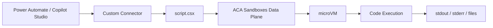

Code execution in automation workflows has always been constrained. Power Automate gives you expressions and inline scripting, but what if your flow needs to run a full pandas analysis on a CSV, convert FetchXML to OData, evaluate nested Power Fx formulas, lint an OpenAPI spec with Spectral, render Jinja2 prompt templates, or test regex patterns with named capture groups — all in an isolated, ephemeral microVM? That's the problem [ACA Sandboxes](https://sandboxes.azure.com/) solves, and this connector puts 16 languages and modes directly into Power Platform and Copilot Studio.

## What this connector does

The ACA Code Interpreter is a dual-mode custom connector — typed operations with full schemas for Power Automate, plus an MCP endpoint for Copilot Studio agents. Each code execution runs inside a fresh microVM with deny-default egress networking. The sandbox boots in seconds, executes your code, and auto-suspends after 5 minutes idle.

It supports 16 languages and modes:

| Language | Identifier | Runtime |
|----------|-----------|---------|
| Python | python | Python 3.14+ with pandas, numpy, matplotlib, scikit-learn |
| JavaScript | javascript | Node.js 20+ |
| TypeScript | typescript | tsx (via npx) |
| Power Fx | powerfx | Custom CLI (Microsoft Power Fx engine) |
| Bash | bash | GNU Bash |
| PowerShell | powershell | pwsh 7.6+ |
| Ruby | ruby | Ruby 3.2+ |
| Perl | perl | Perl 5 |
| PHP | php | PHP CLI |
| SQL | sql | SQLite 3.45+ (in-memory) |
| Adaptive Card | adaptivecard | JSON validator |
| FetchXML | fetchxml | Parser + OData converter |
| OpenAPI Lint | openapi-lint | Spectral-based linter |
| Prompt | prompt | Jinja2 template renderer |
| Expression | expression | Power Automate expression evaluator |
| Regex | regex | Pattern tester with match output |

The first ten are traditional runtimes. The last six are Power Platform-specific modes — tools you'd normally run outside of your workflow that now live inside it.

## Architecture

The connector talks directly to the ACA Sandboxes data plane at `https://management.{region}.azuredevcompute.io`. Each sandbox is a CloudHypervisor microVM with configurable CPU (500m–4000m) and memory (1–8 GiB). The custom disk image bakes in all 16 runtimes plus the specialized tooling (Power Fx CLI, expression evaluator, FetchXML parser, etc.).



The `script.csx` handles:
- **Routing** — dispatches typed operations and MCP tool calls to the same underlying sandbox client
- **Multi-line code** — Base64 encodes code into a temp file to avoid shell escaping issues
- **Output truncation** — caps stdout/stderr at 4 KB to stay within connector response limits
- **Auto-session creation** — the MCP `execute_code` tool creates a session on the fly if no `session_id` is provided
- **Telemetry** — fires events to Application Insights for execution tracking

## Operations

The connector exposes eight operations:

| Operation | Purpose |
|-----------|---------|
| CreateSession | Boot an isolated sandbox microVM |
| ExecuteCode | Run code in any of the 16 languages |
| UploadFile | Stage data files in the sandbox |
| DownloadFile | Retrieve generated artifacts |
| ListFiles | Browse the sandbox filesystem |
| GetSession | Check sandbox state |
| DestroySession | Clean up resources |
| InvokeMCP | Copilot Studio MCP endpoint |

The MCP endpoint exposes the same capabilities as tools — `execute_code`, `upload_file`, `download_file`, `list_files`, `create_session`, and `destroy_session` — so Copilot Studio agents can call them conversationally.

## Security model

Every sandbox starts with deny-default egress. Only pypi.org and npmjs.org are allowed by default (for package installation). You can allowlist additional hosts at session creation time via the `egressAllowHosts` parameter, but nothing goes out unless explicitly permitted.

The connector authenticates to the ACA data plane using OAuth 2.0 with the `https://dynamicsessions.io/.default` token audience. The Entra app requires the `Sessions.ReadWrite.All` permission from Azure ContainerApps Sessions.

## Deployment

Infrastructure is defined in Bicep (subscription-scoped). The deployment creates a resource group, sandbox group, and RBAC assignments:

```powershell
az deployment sub create --name aca-code-interpreter `
    --location westus2 `
    --template-file infra/main.bicep `
    --parameters principalId=$(az ad signed-in-user show --query id -o tsv)
```

The disk image builds via Docker. A full image includes all 16 runtimes; a lite image covers just Python and Bash:

```powershell
cd infra
.\build-image.ps1          # Full (all 16 runtimes)
.\build-image.ps1 -Lite    # Lite (Python + Bash only)
```

After deploying infrastructure and building the image, deploy the connector with PAC CLI:

```powershell
pac connector create `
    -df apiDefinition.swagger.json `
    -sf script.csx `
    -env <environment-id>
```

Then configure OAuth in the portal Security tab with the `https://dynamicsessions.io/.default` scope.

## Language examples

Beyond straightforward Python or Bash scripts, the specialized modes handle tasks that normally require separate tooling.

### Power Fx evaluation

Test Power Fx formulas without deploying a canvas app:

```json
{
  "sessionId": "abc123",
  "language": "powerfx",
  "code": "With({items: [1,2,3,4,5]}, Sum(items, Value) & \" total, \" & CountRows(Filter(items, Value > 3)) & \" above threshold\")"
}
```

Returns: `15 total, 2 above threshold`

### FetchXML to OData conversion

Convert a FetchXML query into its equivalent OData URL — useful when migrating Dynamics integrations from classic to modern endpoints:

```json
{
  "sessionId": "abc123",
  "language": "fetchxml",
  "code": "<fetch top='50'><entity name='account'><attribute name='name'/><attribute name='revenue'/><filter><condition attribute='statecode' operator='eq' value='0'/><condition attribute='revenue' operator='gt' value='1000000'/></filter><order attribute='revenue' descending='true'/></entity></fetch>"
}
```

Returns the OData equivalent:

```
/api/data/v9.2/accounts?$select=name,revenue&$filter=statecode eq 0 and revenue gt 1000000&$orderby=revenue desc&$top=50
```

### Power Automate expression evaluation

Validate complex expressions outside of a running flow:

```json
{
  "sessionId": "abc123",
  "language": "expression",
  "code": "formatDateTime(addDays(utcNow(), -7), 'yyyy-MM-dd')"
}
```

Returns the evaluated result (e.g., `2026-06-29`). Particularly useful for building expression libraries or debugging nested `if`/`coalesce` chains.

### OpenAPI linting

Run Spectral against an API spec inline during a deployment approval flow:

```json
{
  "sessionId": "abc123",
  "language": "openapi-lint",
  "code": "{\n  \"openapi\": \"3.0.0\",\n  \"info\": { \"title\": \"My API\" },\n  \"paths\": { \"/users\": { \"get\": { \"responses\": {} } } }\n}"
}
```

Returns structured violations:

```
[warning] info-description: OpenAPI object info description must be present.
[error] operation-operationId: Operation must have operationId.
[warning] oas3-api-servers: OpenAPI servers must be present and non-empty.
```

### Adaptive Card validation

Validate card JSON before sending it through a Teams bot or connector:

```json
{
  "sessionId": "abc123",
  "language": "adaptivecard",
  "code": "{ \"type\": \"AdaptiveCard\", \"version\": \"1.5\", \"body\": [{ \"type\": \"TextBlock\", \"text\": \"Hello\", \"invalidProp\": true }] }"
}
```

Returns any schema violations, unknown properties, or version compatibility warnings.

### Regex pattern testing

Test regex patterns with match output and capture groups:

```json
{
  "sessionId": "abc123",
  "language": "regex",
  "code": "(?P<year>\\d{4})-(?P<month>\\d{2})-(?P<day>\\d{2})",
  "variables": {
    "input": "Created on 2026-07-06 and updated on 2026-07-05"
  }
}
```

Returns all matches with named groups:

```json
[
  {"match": "2026-07-06", "groups": {"year": "2026", "month": "07", "day": "06"}},
  {"match": "2026-07-05", "groups": {"year": "2026", "month": "07", "day": "05"}}
]
```

### Prompt template rendering

Render Jinja2 prompt templates with variable substitution:

```json
{
  "sessionId": "abc123",
  "language": "prompt",
  "code": "You are a {{role}} assistant. The user's name is {{name}} and they work in {{department}}.\n\nRespond urgently.",
  "variables": {
    "role": "technical support",
    "name": "Dana",
    "department": "Engineering",
    "priority": "high"
  }
}
```

Returns the fully rendered prompt string — useful for testing templates before committing them to a prompt library.

## Use cases

**Data analysis in flows** — Upload a CSV, run a pandas script, download the transformed output. No Azure Functions, no Logic Apps connectors, no external dependencies.

**Copilot Studio code agent** — Give your agent the ability to write and run code. The MCP tools auto-create sessions, so the agent just says "run this Python" and gets results back.

**OpenAPI validation** — Lint an API spec inline during a deployment approval flow. The Spectral-based linter runs in the sandbox and returns any violations.

**Power Automate expression testing** — Evaluate complex expressions outside of a running flow. Useful for building expression libraries or validating user-submitted formulas.

**FetchXML to OData** — Convert FetchXML queries to OData URLs programmatically. Helpful when migrating from classic Dynamics APIs to modern endpoints.

## Project structure

```
ACA Code Interpreter/
├── apiDefinition.swagger.json    # OpenAPI 2.0 (8 operations + MCP)
├── apiProperties.json            # OAuth config, scriptOperations
├── script.csx                    # C# connector logic
├── infra/
│   ├── Dockerfile                # Full image (all 16 runtimes)
│   ├── Dockerfile.lite           # Lite image (Python + Bash)
│   ├── build-image.ps1           # Build + import script
│   ├── deploy.ps1                # End-to-end deployment
│   ├── main.bicep                # Subscription-scoped infra
│   ├── main.bicepparam           # Parameters
│   ├── modules/
│   │   └── sandbox-group.bicep   # Sandbox group + RBAC
│   └── tools/
│       ├── pfx/                  # Power Fx CLI (.NET)
│       ├── expr-eval/            # Expression evaluator (.NET)
│       ├── validate-card.js      # Adaptive Card validator
│       ├── fetchxml_eval.py      # FetchXML → OData converter
│       ├── lint-openapi.js       # OpenAPI linter (Spectral)
│       ├── render_prompt.py      # Jinja2 prompt renderer
│       └── regex_test.py         # Regex pattern tester
└── readme.md
```

## What's next

The sandbox architecture opens up interesting possibilities. Session persistence between flow runs (resume a suspended VM), GPU-enabled sandboxes for ML inference, and multi-file project scaffolding are all on the roadmap.

The full source is available in the [SharingIsCaring repository](https://github.com/troystaylor/SharingIsCaring/tree/main/ACA%20Code%20Interpreter).
