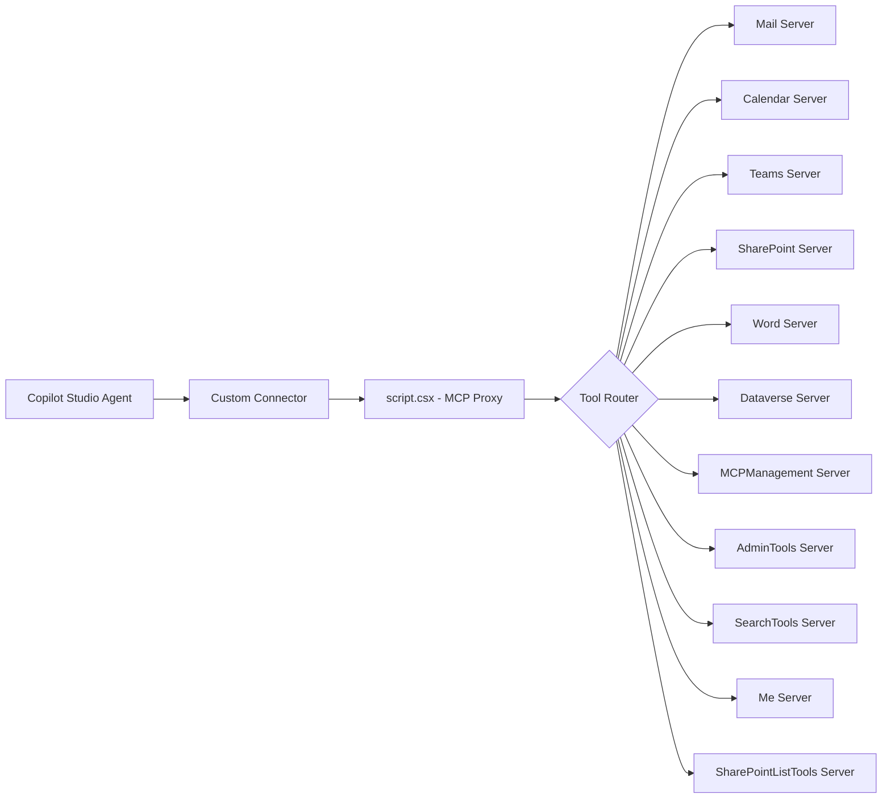

Microsoft Agent 365 gives pro-code developers enterprise-grade agent capabilities — Entra-backed identity, OpenTelemetry observability, governed Work IQ tools for M365 data, and notifications via Teams/Outlook/email. The [Agent 365 Skills](https://techcommunity.microsoft.com/blog/agent-365-blog/agent-365-skills-bring-your-agents-into-microsoft-agent-365-in-minutes/4529838) and CLI serve developers in VS Code, Claude Code, and GitHub Copilot. But Power Platform makers had no equivalent on-ramp — until now.

This connector bridges that gap. It's an MCP proxy that routes Copilot Studio tool calls to any of 11 Agent 365 backend servers, giving your Power Platform agents the same capabilities the SDK provides to pro-code developers.

## What changed in v1.1

- **Protocol version**: Updated to `2025-12-01`
- **Server version**: `1.1.0`
- **`listChanged` capability**: Now advertises `true`, signaling that available tools can change dynamically
- **Initialization guard**: All `tools/list` and `tools/call` requests now require a prior `initialize` handshake, matching the MCP spec strictly
- **Error handling**: Richer JSON-RPC error responses with data payloads for debugging

## How it works

The connector exposes a single MCP endpoint (`x-ms-agentic-protocol: mcp-streamable-1.0`). When Copilot Studio sends a `tools/call` request, the `script.csx` resolves the tool name to one of 11 Agent 365 backend servers and forwards the JSON-RPC payload directly.



The backend URL pattern is:

```
https://agent365.svc.cloud.microsoft/mcp/environments/{envId}/servers/{serverName}
```

Each server name maps to a specific Agent 365 capability domain. The connector just routes — all tool schemas, permissions, and rate limits are enforced server-side by Agent 365.

## Available servers

| Server | Purpose |
|--------|---------|
| mcpmanagement | MCP server lifecycle — create, update, delete servers and tools |
| admintools | Agent 365 governance and administration |
| searchtools | Copilot Search across Microsoft 365 content |
| me | User profile (manager, reports, profile info) |
| dataverse | Dataverse CRUD and domain tools |
| mail | Outlook Mail (create, update, delete, reply) |
| calendar | Outlook Calendar (create/update events, accept/decline) |
| odspremoteserver | OneDrive/SharePoint file operations |
| sharepointlisttools | SharePoint list tools (list, create, update items) |
| teams | Teams (chat, channel, membership, messaging) |
| word | Word document tools (create/read, comments) |

## Authentication

The connector uses OAuth 2.0 with the `https://agent365.svc.cloud.microsoft/.default` scope. You register an Entra app, add the redirect URI for Power Platform (`https://global.consent.azure-apim.net/redirect`), and configure the custom API permission. No additional connection parameters — OAuth handles everything.

## Deployment

1. Edit `script.csx` — set the `EnvId` constant to your Dataverse environment GUID
2. Import via Maker portal (Custom connectors > Import OpenAPI) or deploy with PAC CLI:

```powershell
pac connector create `
    -df apiDefinition.swagger.json `
    -sf script.csx `
    -env <environment-id>
```

3. Configure OAuth in the Security tab with your app registration client ID and the `https://agent365.svc.cloud.microsoft/.default` scope
4. Create a connection and test

## Copilot Studio usage

Add this connector to your agent. Copilot Studio detects the MCP endpoint and makes all 11 server tools available via natural language. Your agent can:

- **Send and manage email** — draft messages, reply, search inbox, manage folders
- **Schedule meetings** — create events, check availability, accept/decline invitations
- **Work with Teams** — send messages, create channels, manage membership
- **Access SharePoint** — upload/download files, query lists, update list items
- **Edit Word documents** — create documents, read content, add comments
- **Query Dataverse** — CRUD operations across any entity
- **Manage other MCP servers** — create, update, and delete servers and tools programmatically
- **Search M365 content** — full Copilot Search across the tenant

## Relationship to Agent 365 Skills

| Approach | Audience | What it does |
|----------|----------|--------------|
| Agent 365 Skills | Developers in VS Code/Claude Code/GitHub Copilot | AI-guided setup, observability, Work IQ wiring, testing |
| Agent 365 CLI | Developers at the command line | Blueprint creation, deployment, publishing |
| This connector | Power Platform makers and Copilot Studio agents | MCP access to the same management plane and Work IQ tools |

All three share the same backend. The connector isn't a subset — it routes to the same servers with the same capabilities.

## What's next

The `listChanged: true` capability flag means the connector can eventually support dynamic tool discovery — when Agent 365 adds new servers or tools, your agent picks them up without redeploying the connector.

The full source is available in the [SharingIsCaring repository](https://github.com/troystaylor/SharingIsCaring/tree/main/Agent%20365%20MCP).
