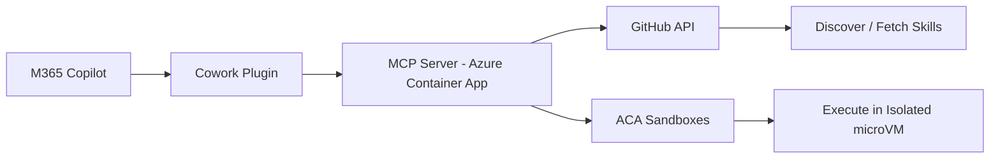

The [agentskills.io](https://agentskills.io/) ecosystem has over 8,800 skill repositories on GitHub — SKILL.md files that teach AI agents how to scaffold projects, configure services, and build solutions step by step. But discovering the right skill and actually executing it requires context-switching between a browser, a terminal, and whatever coding assistant you're using.

This Cowork plugin brings that entire workflow into M365 Copilot. Ask Copilot to find a skill, learn from it, or apply it — and it searches GitHub, fetches the instructions, and runs the steps in a fresh ACA Sandbox with .NET, Node, or Python pre-installed.

## How it works



The plugin runs a Node.js MCP server on Azure Container Apps. When Copilot invokes a tool, the server either queries GitHub for skill metadata or spins up an ACA Sandbox to execute commands. Each sandbox is an isolated Linux microVM — no shared state, no persistence between executions unless you're working within the same session.

## Tools

The plugin exposes 10 MCP tools:

| Tool | Purpose |
|------|---------|
| get_curated_registry | Curated list of known skill repositories |
| search_skills | Search GitHub for SKILL.md files by keyword |
| list_skills | List skills in a repository path |
| get_skill | Fetch full SKILL.md content |
| apply_skill | One-shot: fetch skill + extract commands + execute in sandbox |
| execute_in_sandbox | Run shell commands in an isolated ACA Sandbox |
| read_sandbox_file | Read a file from a sandbox |
| list_sandbox_files | List directory contents in a sandbox |
| get_sandbox_status | Check sandbox state and command history |
| delete_sandbox | Clean up a sandbox |

The first four handle discovery. The last five provide direct sandbox access. `apply_skill` combines both — it fetches the skill, parses the steps, and executes them in sequence.

## Example prompts

Once the plugin is installed, you can ask M365 Copilot:

- "Search for agent skills about building REST APIs with ASP.NET Core, then apply the best one in a sandbox"
- "What .NET AI skills are available?"
- "Apply the mcp-csharp-create skill from dotnet/skills"
- "Find skills for setting up a Next.js project with authentication"
- "Show me what the playwright-testing skill does without running it"

The "learn from" path fetches the skill and explains it without execution — useful for understanding what a skill does before committing to running it.

## Cowork agent skills

The plugin includes three agent skills (SKILL.md files in the `skills/` directory) that guide Copilot's behavior:

| Skill | Behavior |
|-------|----------|
| discover-skills | Search, browse, and compare skills from the registry |
| apply-skill | Execute skill steps in a sandbox, handle errors, report results |
| learn-from-skill | Explain a skill's purpose and steps without running anything |

These aren't just documentation — Copilot reads them to understand how to orchestrate the tools for each scenario.

## Deployment

### Deploy the MCP server

```bash
# Create resources
az group create --name rg-agent-skills --location westus2
az acr create --name agentskillsacr --resource-group rg-agent-skills \
  --sku Basic --admin-enabled true

# Build and deploy
cd server
az acr build --registry agentskillsacr --resource-group rg-agent-skills \
  --image aca-agent-skills-mcp:latest .

az containerapp env create --name agent-skills-env \
  --resource-group rg-agent-skills --location westus2

az containerapp create \
  --name aca-agent-skills-mcp \
  --resource-group rg-agent-skills \
  --environment agent-skills-env \
  --image agentskillsacr.azurecr.io/aca-agent-skills-mcp:latest \
  --registry-server agentskillsacr.azurecr.io \
  --target-port 8080 \
  --ingress external \
  --min-replicas 1
```

### Enable sandbox access

```bash
# Assign managed identity
az containerapp identity assign --name aca-agent-skills-mcp \
  --resource-group rg-agent-skills --system-assigned

# Grant sandbox data owner role
az role assignment create \
  --assignee $(az containerapp show --name aca-agent-skills-mcp \
    --resource-group rg-agent-skills --query identity.principalId -o tsv) \
  --role "Container Apps SandboxGroup Data Owner" \
  --scope /subscriptions/$(az account show --query id -o tsv)/resourceGroups/rg-agent-skills
```

### Set environment variables

```bash
az containerapp update --name aca-agent-skills-mcp \
  --resource-group rg-agent-skills \
  --set-env-vars \
    "AZURE_SUBSCRIPTION_ID=$(az account show --query id -o tsv)" \
    "AZURE_RESOURCE_GROUP=rg-agent-skills" \
    "SANDBOX_GROUP_NAME=agent-skills-sandboxes" \
    "SANDBOX_REGION=westus2" \
    "GITHUB_TOKEN=<your-github-pat>"
```

### Install the Cowork plugin

1. Update `manifest.json` with your Container App's FQDN
2. Package: zip the root files (manifest.json, icons, agent-skills-tools.json, skills/)
3. Upload to M365 Admin Center > Agents > All Agents > Add Agent

## Optional: .NET SDK disk image

To speed up .NET skill execution (eliminates SDK install time on each sandbox):

```bash
token=$(az account get-access-token --resource "https://dynamicsessions.io" \
  --query accessToken -o tsv)

curl -X PUT "https://management.westus2.azuredevcompute.io/subscriptions/<sub>/resourceGroups/rg-agent-skills/sandboxGroups/agent-skills-sandboxes/diskimages" \
  -H "Authorization: Bearer $token" \
  -H "Content-Type: application/json" \
  -d '{"image":{"base":"mcr.microsoft.com/dotnet/sdk:10.0"},"labels":{"name":"dotnet-sdk-10"}}'
```

## Project structure

```
├── manifest.json              # Cowork plugin manifest (v1.28)
├── agent-skills-tools.json    # MCP tool declarations for Cowork
├── color.png / outline.png    # Plugin icons
├── skills/                    # Cowork agent skills (SKILL.md files)
│   ├── discover-skills/       # Find and browse skills
│   ├── apply-skill/           # Execute skill steps in sandbox
│   └── learn-from-skill/      # Get guidance without execution
└── server/                    # Node.js MCP server
    ├── index.js               # Express + MCP SDK transport
    ├── tools/github.js        # GitHub API tools
    ├── tools/sandbox.js       # ACA Sandbox execution tools
    ├── public/                # MCP App widgets
    └── Dockerfile
```

## What makes this different

Most skill execution today happens locally — in your terminal, in your IDE. This plugin moves execution to ephemeral cloud sandboxes. That means:

- **No local environment requirements** — the sandbox has .NET, Node, and Python pre-installed
- **Isolation** — skills can't affect your machine or each other
- **Auditability** — command history and sandbox state are queryable via MCP tools
- **Accessibility** — anyone with M365 Copilot can apply a skill, not just developers with configured local environments

The full source is available in the [SharingIsCaring repository](https://github.com/troystaylor/SharingIsCaring/tree/main/Cowork%20Plugins/ACA%20Agent%20Skills).
