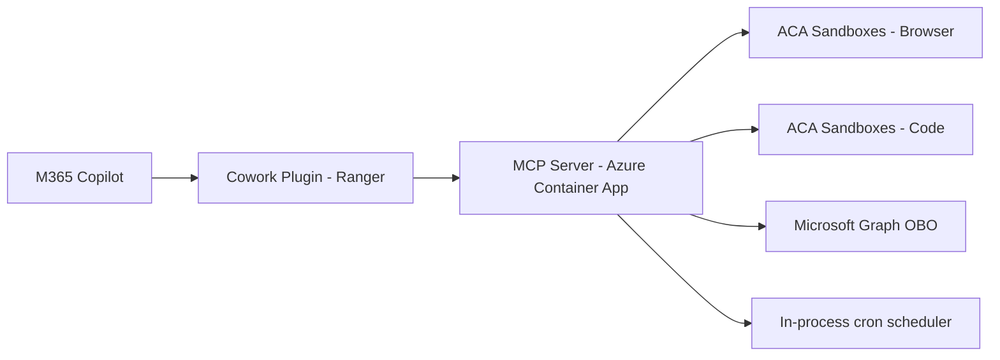

Microsoft Scout shipped in Frontier preview with browser automation, code execution, persistent memory, and M365 access. It's impressive — but it requires a GitHub Copilot Business or Enterprise license on top of your M365 Copilot license, runs only on desktop, needs Intune policy configuration, and routes LLM interactions through external AI models via the GitHub Copilot SDK.

Ranger delivers the same capabilities through Copilot Cowork using only M365 Copilot Credits you've already purchased. No additional licensing. No desktop app. No Intune enrollment. It works anywhere Cowork works — web, Teams, and mobile. You do need a small Azure footprint (a Container App and ACA Sandboxes — roughly $15-30/mo plus pay-per-use compute), but no per-user seat cost beyond what you're already paying for M365 Copilot.

## The licensing difference

Scout's [prerequisites on Microsoft Learn](https://learn.microsoft.com/microsoft-scout/get-started#prerequisites) explicitly require both:

1. **Microsoft 365 Copilot license** — access to M365 Copilot
2. **GitHub Copilot Business or Enterprise license** — LLM processing through the GitHub Copilot SDK

The [Responsible AI FAQ](https://learn.microsoft.com/microsoft-scout/microsoft-scout-responsible-ai-faq#how-does-microsoft-scout-handle-my-data) confirms: "LLM interactions in Microsoft Scout are processed through GitHub Copilot, which operates under separate terms. In those cases, prompts, content, and related data may be transmitted outside Microsoft 365, including to third-party model providers configured through GitHub Copilot."

Cowork plugins consume M365 Copilot Credits through [usage-based billing](https://learn.microsoft.com/microsoft-365/copilot/usage-based-billing-overview-copilot-credits) — the same credits your organization already manages for other M365 Copilot features. No separate GitHub license needed. Data stays within your M365 compliance boundary.

## What Ranger provides

28 MCP tools organized across 9 skills:

| Category | Tools | Implementation |
|----------|-------|----------------|
| Browser automation | 9 Playwright tools | Cloud Playwright in ACA Sandboxes |
| Code execution | Python, bash, JS, TS, .NET, R | Isolated microVMs with 31 pre-installed packages |
| Documents | Word, Excel, PowerPoint | python-docx, openpyxl, python-pptx |
| Memory | save, recall, list | In-memory (Cosmos DB with private endpoint for prod) |
| OneDrive | save, read, list, delete | Graph OBO — full CRUD |
| Email and Teams | send email, post message | Graph OBO |
| Calendar | list, create, free/busy, delete | Graph OBO |
| Internet search | browser-based Bing | No API key required |
| Parallel execution | run_parallel | Concurrent Promise.all |

## Architecture

The MCP server runs on Azure Container Apps with a system-assigned managed identity. Browser and code execution happen in isolated ACA Sandbox microVMs — each session gets a fresh Linux VM with no shared state. M365 access uses Graph On-Behalf-Of flow with explicit scopes for OneDrive, Email, Teams, and Calendar.

The server uses plain JSON-RPC over HTTPS (not SSE). Cowork requires this transport for tool injection.

## How it compares to Scout

| Aspect | Scout | Ranger |
|--------|-------|--------|
| Licensing | M365 Copilot + GitHub Copilot license | M365 Copilot Credits only |
| LLM routing | GitHub Copilot SDK (external models) | M365 Copilot (internal) |
| Form factor | Desktop app (Windows/macOS) | Cowork plugin (web, Teams, mobile) |
| Admin setup | Frontier enrollment + Intune policy + attestation | M365 Admin Center app deployment |
| Browser | Local Playwright | Cloud Playwright in ACA Sandboxes |
| Code execution | Local shell | Isolated microVMs (6 languages, 31 packages) |
| Automations | Heartbeat + scheduled (desktop must be on) | In-process cron (24/7, no desktop) |
| Multi-user | Single desktop user | Any M365 Copilot user in the org |
| Governance | Intune | M365 Admin Center + Defender |
| Data residency | Data transmitted outside M365 via GitHub | Stays within M365 compliance boundary |

## Azure resources

| Resource | Purpose | Cost |
|----------|---------|------|
| Container App (minReplicas: 1) | MCP server | ~$15-30/mo |
| ACA Sandboxes | Per-session compute (browser/code) | Pay-per-use |
| Entra App Registration | OAuth + OBO for Graph | Free |

## Key technical insights

A few things I learned building this:

1. **Cowork requires plain JSON-RPC** — the MCP SDK's `StreamableHTTPServerTransport` returns SSE, which Cowork can parse for discovery but won't inject tools from. You need a raw JSON-RPC handler.
2. **OAuth client registration** (not SSO) in Teams Developer Portal is required for `tools/call` to work.
3. **devPreview schema** with no `mcpToolDescription` enables dynamic tool discovery.
4. **OBO with explicit scopes** — using `.default` only returns `User.Read`. You must list individual scopes (Files.ReadWrite.All, Mail.Send, etc.).
5. **readOnlyHint: true** on tools skips the user confirmation prompt in Cowork.
6. **Disk images** for custom sandbox environments are created via the `azure-containerapps-sandbox` Python SDK with `registry_credentials`.

## Deployment

The deployment is four steps: build the container image, assign RBAC, register OAuth in Teams Developer Portal, and upload the plugin package. Full instructions are in the repository.

## Source

The complete implementation — MCP server, skill definitions, custom sandbox Dockerfiles, and deployment scripts — is in the [Cowork Plugins/Ranger](https://github.com/troystaylor/SharingIsCaring/tree/main/Cowork%20Plugins/Ranger) folder of my SharingIsCaring repository.
