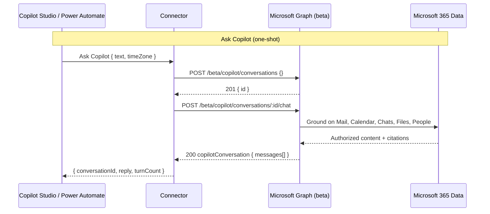

Microsoft 365 Copilot answers questions with your enterprise data behind it—your mail, calendar, chats, files, and people. The Graph beta Copilot Chat API lets you send prompts to that same engine from your own apps. This connector wraps that API for Power Platform, so you can ask Copilot from a Power Automate flow or hand three MCP tools to a Copilot Studio agent.

You can find the complete code in my [SharingIsCaring repository](https://github.com/troystaylor/SharingIsCaring/tree/main/Copilot%20Chat).

## What it does

The connector calls the Microsoft Graph beta Copilot Chat API (`/beta/copilot/conversations`). You send a prompt, Copilot grounds its answer on the signed-in user's Microsoft 365 data—respecting that user's access controls—and returns a reply with citations. Because it runs as the signed-in user, every question needs a Microsoft 365 Copilot license.

## Operations

Four operations cover single questions, multi-turn conversations, and Copilot Studio.

| Operation | What it does |
|-----------|--------------|
| Ask Copilot (`AskCopilot`) | One-shot: creates a conversation and sends the first prompt, returning Copilot's reply. Best for single questions. |
| Create Conversation (`CreateConversation`) | Creates a conversation and returns its ID for multi-turn chat. |
| Send Chat Message (`SendChatMessage`) | Sends a prompt to an existing conversation and returns the full conversation with Copilot's response. |
| Invoke MCP (`InvokeMCP`) | Model Context Protocol endpoint for Copilot Studio. Exposes `ask_copilot`, `create_conversation`, and `send_message` tools. |

Use Ask Copilot when you have one question. For a back-and-forth, call Create Conversation once, then call Send Chat Message with the returned `conversationId` for each follow-up.

## Grounding options

Ask Copilot and Send Chat Message accept extra context to steer the answer:

- **Time Zone** — IANA time zone (for example, `America/New_York`) used to interpret time-relative prompts like "tomorrow morning." Defaults to `UTC`.
- **Additional Context** — a list of free-text strings added as grounding.
- **File URLs** — OneDrive or SharePoint file URLs to use as context.
- **Enable Web Search** — set to `false` to restrict grounding to enterprise data only.

## Example

Ask Copilot:

```json
{
  "text": "What meetings do I have tomorrow morning?",
  "timeZone": "America/New_York"
}
```

Response:

```json
{
  "conversationId": "0d110e7e-2b7e-4270-a899-fd2af6fde333",
  "reply": "You have 1 meeting tomorrow at 9 AM: Zava Engineering Standup...",
  "turnCount": 1,
  "conversation": { "id": "0d110e7e-...", "messages": [] }
}
```

For a multi-turn thread, call Create Conversation, then Send Chat Message repeatedly with the returned `conversationId`.

## MCP tools for Copilot Studio

Invoke MCP is the Model Context Protocol endpoint. Point a Copilot Studio agent at it and the agent gets three tools:

- `ask_copilot` — send a prompt and get a grounded reply
- `create_conversation` — start a multi-turn conversation
- `send_message` — continue a conversation by ID

The agent extracts parameters from the user's request, calls the right tool, and reads back Copilot's answer. That gives you Copilot's enterprise grounding inside a Copilot Studio agent alongside your other tools.

## Data flow



## Prerequisites

- A **Microsoft 365 Copilot** license for every user who signs in to the connection.
- A Microsoft Entra ID **app registration**. This connector uses the generic `aad` identity provider with your own client ID and secret.
- **Delegated permissions only** — the Chat API doesn't support application permissions.

## Set up credentials

The connector uses OAuth 2.0 (authorization code) with Microsoft Entra ID. Register an app and grant these delegated Microsoft Graph permissions—all are required for the Chat API to succeed:

- `Sites.Read.All`
- `Mail.Read`
- `People.Read.All`
- `OnlineMeetingTranscript.Read.All`
- `Chat.Read`
- `ChannelMessage.Read.All`
- `ExternalItem.Read.All`

Steps:

1. In the [Microsoft Entra admin center](https://entra.microsoft.com), register a new application.
2. Add a **Web** redirect URI: `https://global.consent.azure-apim.net/redirect`.
3. Under **API permissions**, add the seven delegated permissions above and grant admin consent.
4. Under **Certificates & secrets**, create a client secret. Record the Application (client) ID and secret value.
5. Set the client ID in `apiProperties.json` (`clientId`) and provide the client secret on the connector's **Security** tab after deployment.

## Deploy with PAC CLI

A known PAC CLI issue blocks OAuth `connectionParameters` on create, so deploy in two steps and configure OAuth in the portal:

```powershell
# 1. Create the connector with the definition, properties, and script
pac connector create `
  --api-definition-file "apiDefinition.swagger.json" `
  --api-properties-file "apiProperties.json" `
  --script-file "script.csx"

# 2. In the Power Platform portal, open the connector's Security tab and set:
#    - Client ID and Client secret from your app registration
#    - Confirm the redirect URL matches https://global.consent.azure-apim.net/redirect
```

## Telemetry

`script.csx` includes an Application Insights hook (`LogToAppInsights`) that emits events for requests, Graph calls, MCP tool calls, and errors. It's disabled by default—the instrumentation key is a placeholder, and telemetry is skipped until you set a real key. Replace the `APP_INSIGHTS_KEY` constant to turn it on. Telemetry failures are swallowed and never block an operation.

## Limitations

- **Beta API** — subject to change and not supported for production by Microsoft.
- **Delegated only** — no application (app-only) permission support.
- **License required** — each signing-in user needs a Microsoft 365 Copilot license.
- **No streaming** — the connector uses the synchronous `chat` endpoint, so `chatOverStream` isn't exposed.

## References

- [Microsoft 365 Copilot Chat API overview](https://learn.microsoft.com/en-us/microsoft-365/copilot/extensibility/api/ai-services/chat/overview)
- [Create copilotConversation](https://learn.microsoft.com/microsoft-365/copilot/extensibility/api/ai-services/chat/copilotroot-post-conversations)
- [copilotConversation: chat](https://learn.microsoft.com/microsoft-365/copilot/extensibility/api/ai-services/chat/copilotconversation-chat)

Full source is in the [SharingIsCaring repository](https://github.com/troystaylor/SharingIsCaring/tree/main/Copilot%20Chat).

#PowerPlatform #CopilotStudio #MCP #CustomConnectors #PowerAutomate #GraphAPI
