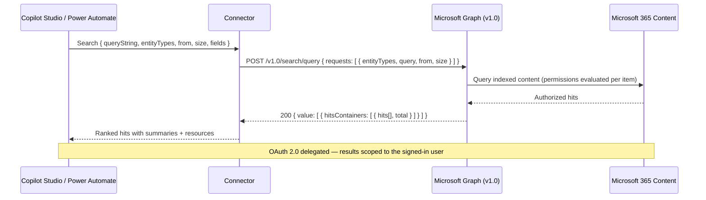

Search sits under everything a Microsoft 365 agent does. Before Copilot can summarize a document or answer a question, it has to find the right content across files, email, Teams messages, calendar events, SharePoint, and connector items. The Microsoft Graph Search API is the same index that powers that retrieval. This custom MCP connector puts it behind a Power Platform connector, so a Power Automate flow or a Copilot Studio agent can run the same enterprise search—with every result scoped to the signed-in user's access.

You can find the complete code in my [SharingIsCaring repository](https://github.com/troystaylor/SharingIsCaring/tree/main/Copilot%20Search).

## What it does

The MCP connector wraps the Microsoft Graph v1.0 Search API (`POST /v1.0/search/query`). Send a query and the entity types you want, and Graph returns ranked hits with summaries and resource links. Permissions are evaluated per item, so users only see content they already have access to.

Searchable content includes:

- Files in OneDrive and SharePoint
- Email
- Teams messages
- Calendar events
- SharePoint sites and lists
- People
- Copilot connector (external) items

## Operations

| Operation | What it does |
|-----------|--------------|
| Search (`Search`) | Search one or more entity types with a query, paging, and optional field selection. |
| Invoke MCP (`InvokeMCP`) | Model Context Protocol endpoint for Copilot Studio. Exposes `search`, `search_files`, `search_email`, `search_teams_messages`, `search_events`, and `search_external_items` tools. |

## Search parameters

- **Query** — the search text. Supports [Keyword Query Language (KQL)](https://learn.microsoft.com/en-us/sharepoint/dev/general-development/keyword-query-language-kql-syntax-reference), for example `budget filetype:xlsx`.
- **Entity Types** — content types to search. File types (`site`, `drive`, `driveItem`, `list`, `listItem`) must be searched together and can't be combined with non-file types in one request.
- **From / Size** — paging, using a zero-based offset and page size.
- **Fields** — specific properties to return per hit.
- **Query Template** — advanced KQL template, for example `{searchTerms} CreatedBy:Bob`.
- **Content Sources** — for `externalItem`, the connector connection(s) to query, for example `/external/connections/connectionId`.
- **Enable Top Results** — for `message`, return the most relevant results first.

## MCP tools for Copilot Studio

Invoke MCP is the Model Context Protocol endpoint. Point a Copilot Studio agent at it and the agent gets six tools:

- `search` — general search across entity types
- `search_files` — OneDrive and SharePoint files
- `search_email` — mail
- `search_teams_messages` — Teams chat and channel messages
- `search_events` — calendar events
- `search_external_items` — Copilot connector content

The dedicated tools save the agent from choosing entity types by hand—ask for files and the agent calls `search_files` directly.

## Example

Search files:

```json
{
  "queryString": "quarterly budget filetype:xlsx",
  "entityTypes": [ "driveItem" ],
  "size": 10
}
```

Response (abridged):

```json
{
  "value": [
    {
      "searchTerms": [ "quarterly", "budget" ],
      "hitsContainers": [
        {
          "total": 3,
          "moreResultsAvailable": false,
          "hits": [
            {
              "hitId": "01ABC...",
              "rank": 1,
              "summary": "...quarterly <c0>budget</c0> figures...",
              "resource": { "name": "Q3-Budget.xlsx", "webUrl": "https://..." }
            }
          ]
        }
      ]
    }
  ]
}
```

## Data flow



## Prerequisites

- A Microsoft Entra ID **app registration**. This connector uses the generic `aad` identity provider with your own client ID and secret.
- **Delegated permissions** — searches run in the context of the signed-in user.

## Set up credentials

The connector uses OAuth 2.0 (authorization code) with Microsoft Entra ID. Register an app and grant the delegated Microsoft Graph permissions for the entity types you plan to search:

| Entity type | Delegated permission |
|-------------|----------------------|
| `message` (email) | `Mail.Read` |
| `event` (calendar) | `Calendars.Read` |
| `chatMessage` (Teams) | `Chat.Read`, `ChannelMessage.Read.All` |
| `driveItem`, `drive` (files) | `Files.Read.All` |
| `site`, `list`, `listItem` (SharePoint) | `Sites.Read.All` |
| `externalItem` (connectors) | `ExternalItem.Read.All` |
| `person` (people) | `People.Read` |

Answer types `bookmark`, `acronym`, and `qna` are also supported by the Search API but require `Bookmark.Read.All`, `Acronym.Read.All`, and `QnA.Read.All` respectively. Add those scopes if you need them.

Steps:

1. In the [Microsoft Entra admin center](https://entra.microsoft.com), register a new application.
2. Add a **Web** redirect URI: `https://global.consent.azure-apim.net/redirect`.
3. Under **API permissions**, add the delegated permissions above and grant admin consent.
4. Under **Certificates & secrets**, create a client secret. Record the Application (client) ID and secret value.
5. Set the client ID in `apiProperties.json` (`clientId`) and provide the client secret on the connector's **Security** tab after deployment.

## Deploy with PAC CLI

A known PAC CLI issue blocks OAuth `connectionParameters` on create, so deploy in two steps and configure OAuth in the portal:

```powershell
# 1. Create the connector with the definition, properties, and script
pac connector create `
  --api-definition-file "apiDefinition.swagger.json" `
  --api-properties-file "apiProperties.json" `
  --script-file "script.csx"

# 2. In the Power Platform portal, open the connector's Security tab and set:
#    - Client ID and Client secret from your app registration
#    - Confirm the redirect URL matches https://global.consent.azure-apim.net/redirect
```

## Telemetry

`script.csx` includes an Application Insights hook (`LogToAppInsights`) that emits events for requests, Graph calls, MCP tool calls, and errors. It's disabled by default—the instrumentation key is a placeholder, and telemetry is skipped until you set a real key. Replace the `APP_INSIGHTS_KEY` constant to turn it on. Telemetry failures are swallowed and never block an operation.

## Limitations

- **Delegated only** — this connector runs user-context search. Application-permission search for `driveItem`/`listItem` also requires a `region` in the request and isn't exposed here.
- **File-type interleaving** — file entity types must all be in the same request and can't mix with non-file types.
- **`person` can't be combined** with any other entity type in a single request—search people on their own.
- **Paging** — `from`/`size` must be consistent when combining entity types. Page size maxes at 25 for `message` and `event`, and up to 1000 for SharePoint and OneDrive types.

## References

- [Microsoft Search API overview](https://learn.microsoft.com/en-us/graph/search-concept-overview)
- [searchEntity: query](https://learn.microsoft.com/graph/api/search-query?view=graph-rest-1.0)
- [Scope search based on entity types](https://learn.microsoft.com/graph/api/resources/search-api-overview?view=graph-rest-1.0)

Full source is in the [SharingIsCaring repository](https://github.com/troystaylor/SharingIsCaring/tree/main/Copilot%20Search).

#PowerPlatform #CopilotStudio #MCP #CustomConnectors #MicrosoftSearch #GraphAPI
