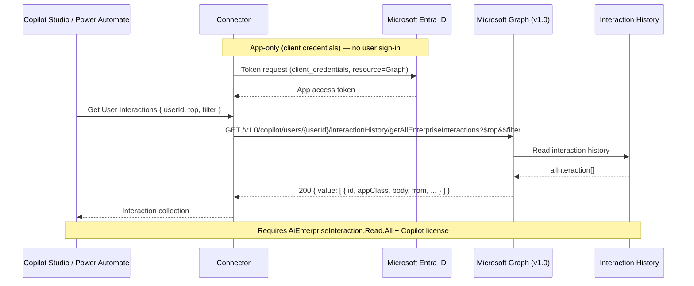

Every Copilot prompt and response across Teams, Word, Outlook, and BizChat is captured in the interaction history service. Compliance teams need that record for auditing, and analytics teams want it for adoption reporting. The Microsoft Graph AI Interaction Export API exposes it, and this custom MCP connector brings it into Power Automate and Copilot Studio.

You can find the complete code in my [SharingIsCaring repository](https://github.com/troystaylor/SharingIsCaring/tree/main/Copilot%20Interaction%20Export).

## App-only authentication

This connector is different from the [Copilot Chat](https://troystaylor.com/power%20platform/custom%20connectors/2026-07-23-copilot-chat-connector.html) and [Copilot Search](https://troystaylor.com/power%20platform/custom%20connectors/2026-07-24-copilot-search-connector.html) connectors, which sign in as the user. The Export API supports **application (app-only) permissions only**. The connection authenticates as the app itself through the client credentials flow—no user signs in. Plan your app registration and connection around that.

## What it does

The connector wraps the Microsoft Graph v1.0 `getAllEnterpriseInteractions` API. Pass a user ID and it returns that user's Copilot interactions—prompts, responses, the app each one came from, accessed resources, and timestamps—so you can feed the data into compliance workflows, audit logs, or analytics.

## Operations

| Operation | What it does |
|-----------|--------------|
| Get User Interactions (`GetUserInteractions`) | Get all Copilot interactions for a user, with optional `$top` and `$filter`. |
| Invoke MCP (`InvokeMCP`) | Model Context Protocol endpoint for Copilot Studio. Exposes `get_user_interactions` and `get_user_interactions_by_app` tools. |

## Parameters

- **User ID** — the object ID or user principal name of the user whose interactions to export.
- **Top** — the number of interactions to return. `100` is a good value for performance.
- **Filter** — an OData filter, for example `appClass eq 'IPM.SkypeTeams.Message.Copilot.BizChat'`.

## MCP tools for Copilot Studio

Invoke MCP is the Model Context Protocol endpoint. A Copilot Studio agent pointed at it gets two tools:

- `get_user_interactions` — all interactions for a user
- `get_user_interactions_by_app` — interactions filtered to a specific app class

The by-app tool saves the agent from writing the OData filter by hand when someone asks for, say, just their Teams Copilot activity.

## Example

Get a user's BizChat interactions:

Request: `userId = 4db02e4b-d144-400e-b194-53253a34c5be`, `$filter = appClass eq 'IPM.SkypeTeams.Message.Copilot.BizChat'`

Response (abridged):

```json
{
  "value": [
    {
      "id": "1732148357313",
      "sessionId": "19:YzBP1kUdkNjFtJnketPYT8kQdQ3A08Y51rDTxE_ENIk1@thread.v2",
      "appClass": "IPM.SkypeTeams.Message.Copilot.BizChat",
      "interactionType": "aiResponse",
      "conversationType": "bizchat",
      "createdDateTime": "2024-11-21T00:19:17.313Z",
      "locale": "en-us",
      "body": { "contentType": "html", "content": "<attachment id=\"4062...\"></attachment>" },
      "from": { "application": { "displayName": "Microsoft 365 Chat", "applicationIdentityType": "bot" } }
    }
  ]
}
```

## Data flow



## Prerequisites

- A Microsoft Entra ID **app registration** with the **`AiEnterpriseInteraction.Read.All`** application permission and **admin consent** granted.
- Users whose interactions you export must have a valid **Microsoft 365 Copilot** license with the *Microsoft Copilot with Graph-grounded chat* service plan.

## Set up credentials

The connector authenticates as the application through the client credentials flow:

1. In the [Microsoft Entra admin center](https://entra.microsoft.com), register a new application.
2. Under **API permissions**, add the **Application** permission **Microsoft Graph → `AiEnterpriseInteraction.Read.All`**, then grant admin consent.
3. Under **Certificates & secrets**, create a client secret. Record the Application (client) ID, secret value, and your Directory (tenant) ID.
4. Set the client ID in `apiProperties.json` (`clientId`) and your tenant ID in `apiProperties.json` (`customParameters.tenantId`). A concrete tenant is required—the client credentials flow can't use `common`.
5. On the connector's **Security** tab after deployment, provide the client secret. The connection acquires an app-only token, so no user signs in.

## Deploy with PAC CLI

A known PAC CLI issue blocks OAuth `connectionParameters` on create, so deploy in two steps and configure OAuth in the portal:

```powershell
# 1. Create the connector with the definition, properties, and script
pac connector create `
  --api-definition-file "apiDefinition.swagger.json" `
  --api-properties-file "apiProperties.json" `
  --script-file "script.csx"

# 2. In the Power Platform portal, open the connector's Security tab and set:
#    - Client ID and Client secret from your app registration
#    (Grant type = client_credentials and the tenant ID are already set in apiProperties.json)
```

## Telemetry

`script.csx` includes an Application Insights hook (`LogToAppInsights`) that emits events for requests, Graph calls, MCP tool calls, and errors. It's disabled by default—the instrumentation key is a placeholder, and telemetry is skipped until you set a real key. Replace the `APP_INSIGHTS_KEY` constant to turn it on. Telemetry failures are swallowed and never block an operation.

## Limitations

- **Application permission only** — delegated (user) sign-in isn't supported by this API.
- **Copilot license required** — only interactions for users with a Microsoft 365 Copilot license are returned.
- **No delta** — the delta function isn't supported; use `$top` paging (`@odata.nextLink`) to retrieve large histories.
- **Copilot Studio agents excluded** — interactions inside agents created by Copilot Studio aren't returned.

## References

- [AI Interaction Export API overview](https://learn.microsoft.com/en-us/microsoft-365/copilot/extensibility/api/ai-services/interaction-export/overview)
- [aiInteractionHistory: getAllEnterpriseInteractions](https://learn.microsoft.com/microsoft-365/copilot/extensibility/api/ai-services/interaction-export/aiinteractionhistory-getallenterpriseinteractions)
- [Export content with the Microsoft Teams export APIs](https://learn.microsoft.com/en-us/microsoftteams/export-teams-content)

Full source is in the [SharingIsCaring repository](https://github.com/troystaylor/SharingIsCaring/tree/main/Copilot%20Interaction%20Export).

#PowerPlatform #CopilotStudio #MCP #CustomConnectors #Compliance #GraphAPI
