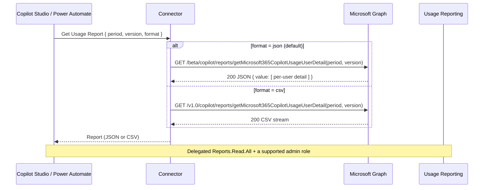

Adoption reporting is where most Copilot rollouts get judged. Who's using it, in which apps, how often—the answers live in the Microsoft 365 admin center usage report, but pulling that data into a dashboard or an automated review means calling the Graph Copilot usage reports API. This custom MCP connector wraps that API so a Power Automate flow or a Copilot Studio agent can retrieve per-user usage as JSON or CSV.

You can find the complete code in my [SharingIsCaring repository](https://github.com/troystaylor/SharingIsCaring/tree/main/Copilot%20Usage%20Reports).

## What it does

The connector wraps `getMicrosoft365CopilotUsageUserDetail(period, version)`. It returns per-user last-activity dates across Teams, Word, Excel, PowerPoint, Outlook, OneNote, Loop, and Copilot Chat, plus prompt counts and agent activity in version 2. Ask for a period, pick a version and format, and the connector returns the report.

JSON comes from the beta Copilot reports namespace; CSV comes from the v1.0 endpoint. The connector routes each request to the right one based on the format you choose.

## Operations

| Operation | What it does |
|-----------|--------------|
| Get Usage Report (`GetUsageReport`) | Get per-user Copilot usage for a period, as JSON (default) or CSV. |
| Invoke MCP (`InvokeMCP`) | Model Context Protocol endpoint for Copilot Studio. Exposes the `get_usage_report` tool (JSON). |

## Parameters

- **Period** — the number of previous days to aggregate. `v1` supports `D7, D30, D90, D180, ALL`; `v2` supports `D7, D28, D90, D180, ALL`.
- **Version** — `v1` or `v2` (default). **v2** adds prompt counts (all apps, Copilot Chat work and web), active usage days, and last-activity dates for Microsoft 365 Copilot, Edge, and Copilot Agent.
- **Format** — `json` (default) or `csv`.

## Example

Get the last 7 days as JSON (v2):

Request: `period = D7`, `version = v2`, `format = json`

Response (abridged):

```json
{
  "value": [
    {
      "reportRefreshDate": "2026-07-23",
      "userPrincipalName": "avery@zava.com",
      "displayName": "Avery Howard",
      "lastActivityDate": "2026-07-22",
      "copilotChatLastActivityDate": "2026-07-22",
      "microsoftTeamsCopilotLastActivityDate": "2026-07-21",
      "wordCopilotLastActivityDate": "2026-07-20",
      "copilotActivityUserDetailsByPeriod": [ { "reportPeriod": 7 } ]
    }
  ]
}
```

With `version=v2` (the default), the response carries extra data beyond the named outputs—prompt counts and active usage days inside each `copilotActivityUserDetailsByPeriod` entry, and additional last-activity dates at the top level. These pass through in the JSON; Graph doesn't publish the exact property names, so they aren't declared as named outputs.

## Data flow



## Prerequisites

- A Microsoft Entra ID **app registration**. This connector uses the generic `aad` identity provider with your own client ID and secret.
- The signing-in user must hold a supported **admin role**—for example **Reports Reader**, **Usage Summary Reports Reader**, **AI Administrator**, or **Global Reader**.

## Set up credentials

The connector uses OAuth 2.0 (authorization code) with Microsoft Entra ID and the **`Reports.Read.All`** delegated permission:

1. In the [Microsoft Entra admin center](https://entra.microsoft.com), register a new application.
2. Add a **Web** redirect URI: `https://global.consent.azure-apim.net/redirect`.
3. Under **API permissions**, add the delegated Microsoft Graph permission **`Reports.Read.All`** and grant admin consent.
4. Under **Certificates & secrets**, create a client secret. Record the Application (client) ID and secret value.
5. Set the client ID in `apiProperties.json` (`clientId`) and provide the client secret on the connector's **Security** tab after deployment.

## Deploy with PAC CLI

A known PAC CLI issue blocks OAuth `connectionParameters` on create, so deploy in two steps and configure OAuth in the portal:

```powershell
# 1. Create the connector with the definition, properties, and script
pac connector create `
  --api-definition-file "apiDefinition.swagger.json" `
  --api-properties-file "apiProperties.json" `
  --script-file "script.csx"

# 2. In the Power Platform portal, open the connector's Security tab and set:
#    - Client ID and Client secret from your app registration
#    - Confirm the redirect URL matches https://global.consent.azure-apim.net/redirect
```

## Telemetry

`script.csx` includes an Application Insights hook (`LogToAppInsights`) that emits events for requests, Graph calls, MCP tool calls, and errors. It's disabled by default—the instrumentation key is a placeholder, and telemetry is skipped until you set a real key. Replace the `APP_INSIGHTS_KEY` constant to turn it on. Telemetry failures are swallowed and never block an operation.

## Limitations

- **JSON comes from the beta namespace** — the v1.0 Copilot reports endpoint returns CSV, so this connector routes JSON requests to `/beta/copilot/reports/...`. APIs under `/beta` are subject to change.
- **Licensed users only** — the report returns usage for users with a Microsoft 365 Copilot license. Unlicensed Copilot Chat usage isn't available here (check the admin center Copilot Chat Usage report or Purview audit logs).
- **Admin role required** — the signed-in user must hold a supported reports or admin role, not just the app permission.
- **Data anonymization** — usage report data may be anonymized depending on the tenant's admin center reports privacy setting.

## References

- [copilotReportRoot: getMicrosoft365CopilotUsageUserDetail](https://learn.microsoft.com/en-us/microsoft-365/copilot/extensibility/api/admin-settings/reports/copilotreportroot-getmicrosoft365copilotusageuserdetail)
- [Microsoft 365 Copilot usage report (admin center)](https://learn.microsoft.com/en-us/microsoft-365/admin/activity-reports/microsoft-365-copilot-usage)
- [Authorization for APIs to read Microsoft 365 usage reports](https://learn.microsoft.com/en-us/graph/reportroot-authorization)

Full source is in the [SharingIsCaring repository](https://github.com/troystaylor/SharingIsCaring/tree/main/Copilot%20Usage%20Reports).

#PowerPlatform #CopilotStudio #MCP #CustomConnectors #Reporting #GraphAPI
