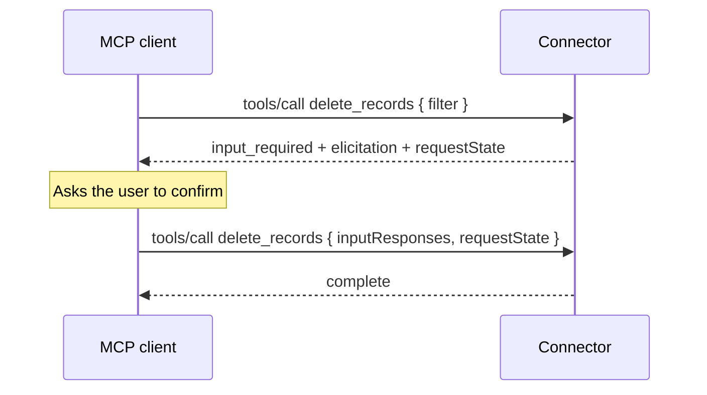

Every previous release of the [Power MCP Template](https://github.com/troystaylor/SharingIsCaring/tree/main/Connector-Code/Power%20MCP%20Template) carried a section called **Stateless limitations**, listing the parts of MCP a Power Platform custom connector couldn't do. That section is gone.

MCP `2026-07-28` removed the `initialize` handshake, deleted the `Mcp-Session-Id` header, and made the protocol stateless. Every request now carries its own protocol version, client identity, and capabilities in `_meta`. A custom connector is a stateless request-in, response-out function, so the runtime and the protocol finally agree on the same execution model.

The template ships as `script.csx`, `apiDefinition.swagger.json`, `apiProperties.json`, a `copilot-instructions.md` for agents editing the code, and a readme. You write tools, resources, prompts, and skills; the built-in `McpRequestHandler` handles the protocol.

## What the protocol change fixed

| Old limitation | Where it went |
|----------------|---------------|
| Session state across calls | The protocol has no sessions. State travels as explicit handles in tool arguments. |
| Elicitation, or asking the user mid-call | Multi Round-Trip Requests. The server returns `input_required` and the client retries with answers. |
| Version negotiation without a handshake | Per-request `_meta`, plus a `server/discover` RPC. |
| Cache-friendly tool catalogs | `ttlMs` and `cacheScope` on every list result, with deterministic ordering. |

Two things stay out of reach, both because a connector can't hold a stream open: the `subscriptions/listen` notification stream, and the `io.modelcontextprotocol/tasks` extension.

## Dual-era serving

Copilot Studio is still a legacy client. It opens with `initialize` and knows nothing about `_meta`, `server/discover`, or `resultType`. The spec permits one server to answer both eras on a single endpoint, so the template does.

The era is decided per request:

| Signal | Era | Behavior |
|--------|-----|----------|
| `params._meta["io.modelcontextprotocol/protocolVersion"]` | modern | Full 2026-07-28 semantics |
| `MCP-Protocol-Version` header | modern | Same |
| `method: "server/discover"` | modern | Answered regardless |
| None of the above | legacy | Byte-identical to the previous template |

Modern-only fields—`resultType`, `ttlMs`, `cacheScope`, and `_meta.serverInfo`—never appear in a legacy response. That's what makes the upgrade safe to deploy against a Copilot Studio agent that's already running.

## Configuring the server

`McpServerOptions` at the top of the script drives `server/discover`, the legacy `initialize`, and the cache hints:

```csharp
private static readonly McpServerOptions Options = new McpServerOptions
{
    ServerInfo = new McpServerInfo
    {
        Name = "power-mcp-server",
        Version = "1.0.0",
        Title = "Power MCP Server",
        Description = "Power Platform custom connector implementing Model Context Protocol"
    },

    ProtocolVersion = "2026-07-28",
    SupportedProtocolVersions = new List<string> { "2026-07-28", "2025-11-25", "2025-06-18" },

    Capabilities = new McpCapabilities
    {
        Tools = true,
        Resources = true,
        Prompts = true,
        Completions = true
    },

    ListCacheTtlMs = 300000,
    ListCacheScope = "public",
    ResourceCacheTtlMs = 60000,
    ResourceCacheScope = "private",
    DiscoverCacheTtlMs = 3600000,

    Instructions = ""
};
```

Drop a revision from `SupportedProtocolVersions` and the server returns `UnsupportedProtocolVersionError` (`-32022`) with the list it does support, so the client can retry.

`server/discover` is mandatory for servers on `2026-07-28`, and the framework generates it from these options. There's nothing to implement.

## Cache scope is a security decision

`2026-07-28` requires cache hints on every `complete` result from `server/discover`, the four list methods, and `resources/read`. The framework attaches them; you choose the values.

`public` permits a shared gateway to serve one caller's cached response to another. Use `private` whenever the result depends on who's asking, which is why `resources/read` defaults to it. Tool and prompt lists default to `public` because they're normally identical for everyone. If your `tools/list` varies by the caller's granted scopes, change `ListCacheScope` to `private`.

Tool ordering is deterministic (registration order), which is what makes list caching and upstream prompt caching worth anything.

## Multi Round-Trip Requests

MRTR is how `2026-07-28` replaced server-initiated `elicitation/create`, `sampling/createMessage`, and `roots/list`. Rather than pushing a request down an open stream, the server returns `resultType: "input_required"` and the client retries the original call with the answers attached.

That inversion is what makes elicitation possible from a connector. There's no stream to hold open and no session to keep, just two ordinary request and response exchanges.



Ask for the confirmation and stash what you need to resume:

```csharp
handler.AddTool("delete_records", "Permanently delete matching records.",
    schema: s => s.String("filter", "Records to delete", required: true),
    handler: async (args, ct) =>
    {
        var filter = args.Value<string>("filter");

        return McpRequestHandler.InputRequired(
            new JObject
            {
                ["confirm"] = McpRequestHandler.ElicitationRequest(
                    $"Permanently delete all records matching '{filter}'?",
                    s => s.Boolean("proceed", "Confirm deletion", required: true))
            },
            requestState: filter);
    });
```

On the retry, `inputResponses` and `requestState` arrive on the request context. Because the server holds nothing between the two calls, anything you need to resume has to go in `requestState`. Treat it as opaque to the client, and keep secrets out of it—it round-trips through the caller.

Legacy clients can't interpret `resultType`. Instead of emitting a shape Copilot Studio would fail to parse, the framework converts an `input_required` into a tool error naming the missing input, so the model asks for it as a normal argument. One code path, sensible degradation.

## Agent Skills over MCP

An [Agent Skill](https://agentskills.io/) is a portable package of instructions and resources that an agent loads on demand. `AddSkill()` publishes one over MCP, so a connector becomes a distribution point for skills that [Microsoft Agent Framework](https://learn.microsoft.com/en-us/agent-framework/agents/skills?pivots=programming-language-csharp#mcp-based-skills) agents and Microsoft Foundry Toolbox pull at runtime. This adds no protocol surface—skills are ordinary MCP resources under the `skill://` scheme.

```csharp
handler.AddSkill("expense-report",
    "File and validate employee expense reports according to company policy. " +
    "Use when asked about expense submissions, reimbursement rules, or spending limits.",
    instructions: @"1. Read the `policy-limits` resource for current per-category caps.
2. Validate each line item against those caps.
3. Flag any item that exceeds a cap and state which rule it breaks.",
    resources: r => r
        .Resource("references/policy-limits.md", "Per-category spending caps.", () => limitsMarkdown),
    license: "Apache-2.0");
```

That one call generates `skill://index.json`, `skill://expense-report/SKILL.md`, and a resource per sibling file. Every naming and length constraint is checked at registration, so a malformed skill throws when the connector loads instead of failing quietly at discovery time.

Because the skill lives on the server, editing the instructions updates every connected agent without redeploying any of them.

## The schema builder stays narrower than the spec

`2026-07-28` loosened `inputSchema` and `outputSchema` to allow any JSON Schema 2020-12 keyword, including `$ref` and `$defs`. `McpSchemaBuilder` doesn't use them, and neither should a schema you hand-write.

The reason is Copilot Studio. Its [documented MCP limitations](https://learn.microsoft.com/microsoft-copilot-studio/mcp-troubleshooting) include four schema behaviors that are easy to trip over:

| Schema construct | What Copilot Studio does |
|------------------|--------------------------|
| `$ref` or any reference-type input | Drops the tool from `tools/list`, silently |
| `"type": ["string", "null"]` | Truncates the schema |
| `exclusiveMinimum` as a number (2020-12 form) | Throws `System.FormatException` |
| `enum` | Accepts it, but treats the parameter as a plain string |

A dropped tool produces no error anywhere. It simply never appears. The builder inlines nested objects rather than referencing them and never emits a multi-type array. If you add numeric bounds, use the draft-04 boolean form of `exclusiveMinimum`.

## New error codes

`2026-07-28` partitioned the JSON-RPC implementation-defined range. `-32000` to `-32019` is legacy and frozen; `-32020` to `-32099` belongs to the specification.

| Code | Name | When |
|------|------|------|
| `-32020` | `HeaderMismatch` | `Mcp-Method` or `Mcp-Name` disagrees with the body |
| `-32021` | `MissingRequiredClientCapability` | Client didn't declare a capability the request needs |
| `-32022` | `UnsupportedProtocolVersion` | Requested revision isn't in `SupportedProtocolVersions` |

Resource-not-found also moved from `-32002` to `-32602`.

## Methods removed in this revision

A modern caller that invokes `initialize`, `notifications/initialized`, `notifications/roots/list_changed`, `ping`, `logging/setLevel`, `resources/subscribe`, or `resources/unsubscribe` gets `MethodNotFound`. A legacy caller gets the same behavior it always did. Don't delete the legacy branch—Copilot Studio depends on it.

## Wiring it up

`ExecuteAsync` now passes the request through so the framework can read the transport headers:

```csharp
public override async Task<HttpResponseMessage> ExecuteAsync()
{
    var handler = new McpRequestHandler(Options);
    RegisterCapabilities(handler);

    var body = await this.Context.Request.Content.ReadAsStringAsync().ConfigureAwait(false);
    var result = await handler.HandleAsync(
        body,
        McpTransportHeaders.FromRequest(this.Context.Request),
        this.CancellationToken).ConfigureAwait(false);

    return new HttpResponseMessage(HttpStatusCode.OK)
    {
        Content = new StringContent(result, Encoding.UTF8, "application/json")
    };
}
```

The connector files ship ready to deploy once you set `host`. The Swagger is a single `POST` with `basePath` of `/mcp` and the operation at `/`, carrying `x-ms-agentic-protocol: mcp-streamable-1.0`. That operation must have no `parameters` key at all, not even an empty array—Power Platform injects its own body parameter and a declared one collides with it.

```powershell
pac connector create `
  --api-definition-file "apiDefinition.swagger.json" `
  --api-properties-file "apiProperties.json" `
  --script-file "script.csx"
```

## Upgrading from v2

The script sections swapped order. Section 1 is now the connector entry point—server options, `RegisterCapabilities`, `ExecuteAsync`, and optional Application Insights logging. Section 2 is the framework, which you leave alone unless you're extending it.

One breaking rename came with the revision: `AddTool` declared `schemaConfig` and `annotationsConfig`, while every call site and both doc files used `schema:` and `annotations:`. The parameters are now named `schema` and `annotations`, matching what everything already called them.

If you're new to the template, start with the [original Power MCP post](/power%20platform/custom%20connectors/2026-01-20-power-mcp-custom-connector.html) for the architecture, then [v2](/power%20platform/custom%20connectors/2026-02-18-power-mcp-template-v2.html) for the fluent registration API.

The full template is in my [SharingIsCaring repository](https://github.com/troystaylor/SharingIsCaring/tree/main/Connector-Code/Power%20MCP%20Template).
