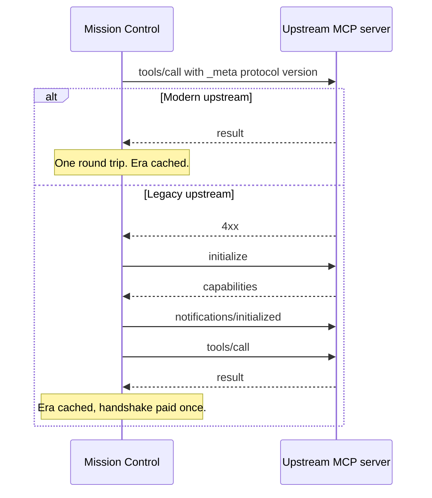

The [Power Mission Control Template](https://github.com/troystaylor/SharingIsCaring/tree/main/Connector-Code/Power%20Mission%20Control%20Template) trades dozens of typed tools for three—`scan`, `launch`, and `sequence`—so a Copilot Studio agent discovers API operations on demand instead of loading every schema upfront. That part hasn't changed. What changed is the protocol underneath it.

The template now runs on MCP `2026-07-28`, and mission control is the one connector where that revision matters twice. In `McpChain` discovery mode it's both an MCP server and an MCP client, so it has to negotiate protocol eras coming in and going out.

I covered the pattern itself in [the original Power Mission Control post](/power%20platform/custom%20connectors/2026-03-23-power-mission-control-mcp-template.html), and the protocol changes in [the Power MCP Template update](/power%20platform/custom%20connectors/2026-07-31-power-mcp-template-mcp-2026-07-28.html). This covers what mission control adds on top.

## Serving both eras

As a server, mission control behaves like the base template. A request carrying a `_meta` protocol version, an `MCP-Protocol-Version` header, or a call to `server/discover` is served modern. Everything else, Copilot Studio included, is served exactly as before.

The three tools are stable by design, which makes them worth caching:

```csharp
ProtocolVersion = "2026-07-28",
SupportedProtocolVersions = new List<string> { "2026-07-28", "2025-11-25", "2025-06-18" },

ListCacheTtlMs = 900000,   // 15 min — the three tools are stable
ListCacheScope = "public",
DiscoverCacheTtlMs = 3600000,

Instructions = "Call scan_{service} first to find the operation you need, then launch_{service} to execute it."
```

Fill in `Instructions`. `server/discover` returns it, and it's the one place you can tell the model how to drive three generic tools before it has called anything. Without it, the planner has to infer the scan-then-launch sequence from tool descriptions alone.

The capability catalog is also deterministically ordered now, so a client can hold it across reconnects rather than re-fetching.

## Calling out as a client

`McpChain` mode routes a `scan` query to an external MCP server and parses the documentation results. That external server has its own protocol era, and the connector has to figure out which one.

`McpChainClient` tries the modern path first:



Two things fall out of this.

The happy path drops from three HTTP round trips to one, inside a code path that already needed a cache because it was slow. And the era is cached per endpoint, so the probe is paid once rather than on every scan.

The fallback logic reads the error rather than the status alone. A recognized modern error—`-32020`, `-32021`, or `-32022`—means the upstream is modern and refused that specific request, so the client doesn't fall back and retry as legacy. Any other `4xx` identifies a legacy server.

This mattered immediately. The documented default `McpChainEndpoint` is MS Learn MCP, and Microsoft shipped `2026-07-28` support on day zero. Under the old client code, a modern upstream would have broken `McpChain` discovery outright.

## Confirming a destructive launch

`launch` and `sequence` execute whatever endpoint and method the planner hands them, including `DELETE`. Multi Round-Trip Requests let a stateless connector ask before acting:

```csharp
handler.AddTool("launch_guarded", "Launch an operation, confirming destructive methods first.",
    schema: s => s
        .String("endpoint", "API endpoint path", required: true)
        .String("method", "HTTP method", required: true),
    handler: async (args, ct) =>
    {
        var method = args.Value<string>("method");
        if (method == "DELETE")
        {
            return McpRequestHandler.InputRequired(
                new JObject
                {
                    ["confirm"] = McpRequestHandler.ElicitationRequest(
                        $"Confirm {method} on {args.Value<string>("endpoint")}?",
                        s => s.Boolean("proceed", "Confirm", required: true))
                },
                requestState: args.Value<string>("endpoint"));
        }
        // Execute
    });
```

Legacy clients can't parse `input_required`, so the framework degrades it to a tool error naming the confirmation they can't supply. Nothing executes unconfirmed either way.

## Mission control or typed tools

The readme's comparison table used to read like a version history—v2 versus v3. Both patterns ship on the same framework, so the comparison is now between two approaches you choose per connector.

| | Typed tools | Mission control |
|---|---|---|
| Pattern | One `AddTool()` per API operation | Three tools: scan, launch, sequence |
| Tool count | Grows with API surface (10–50+) | Fixed at three, plus optional custom tools |
| Discovery | `tools/list` dumps all schemas upfront | Progressive—the planner scans first |
| Schema delivery | Full JSON Schema per tool, always loaded | On demand via `include_schema=true` |
| API coverage | Only operations you explicitly register | Any endpoint via generic `launch` |
| `tools/list` payload (30 operations) | ~15,000 tokens | ~1,500 tokens |
| Per-interaction cost | 0, schemas are pre-loaded | ~200–400 for the scan call |

Typed tools win for a small fixed set of operations, or where each one needs unique logic that doesn't fit a generic proxy. Mission control wins past roughly ten operations, or when the API will keep growing—adding an operation means adding an index entry, not writing code.

You can mix them. `AddTool()`, `AddResource()`, `AddResourceTemplate()`, `AddPrompt()`, and `AddSkill()` all work alongside mission control mode, so high-value operations can be exposed directly while the generic tools cover the rest.

`AddSkill()` is a good fit here. Publishing a skill that documents how to drive scan, launch, and sequence gives Microsoft Agent Framework agents the same guidance `Instructions` gives the Copilot Studio planner.

## Also in this revision

- `Mcp-Method` and `Mcp-Name` headers are sent on outbound calls and validated on inbound ones, with `HeaderMismatch` (`-32020`) when a header disagrees with the body
- Error codes `-32020`, `-32021`, and `-32022`; resource-not-found moved from `-32002` to `-32602`
- `ResourceLinkContent`, and `structuredContent` now accepts any JSON value
- The schema builder is hardened against the four documented Copilot Studio schema defects, including `$ref` silently dropping a tool from `tools/list`
- `AddTool` declared `schemaConfig` and `annotationsConfig` while every call site used `schema:` and `annotations:`. The parameters now match the call sites.

## Getting started

Set `ServiceName` and `BaseApiUrl` in `MissionControlOptions`, pick a discovery mode, then build the capability index with the companion `generate-capability-index.prompt.md`—paste your API documentation, and Copilot generates the JSON array to drop into `CAPABILITY_INDEX`.

```csharp
private static readonly MissionControlOptions McOptions = new MissionControlOptions
{
    ServiceName = "salesforce",
    BaseApiUrl = "https://your-instance.salesforce.com/services/data/v66.0",
    DiscoveryMode = DiscoveryMode.Static,
    MaxDiscoverResults = 3,
};
```

Deploy as a custom connector and add it to an agent with [generative orchestration](https://learn.microsoft.com/microsoft-copilot-studio/advanced-generative-actions) enabled.

The full template is in my [SharingIsCaring repository](https://github.com/troystaylor/SharingIsCaring/tree/main/Connector-Code/Power%20Mission%20Control%20Template).
