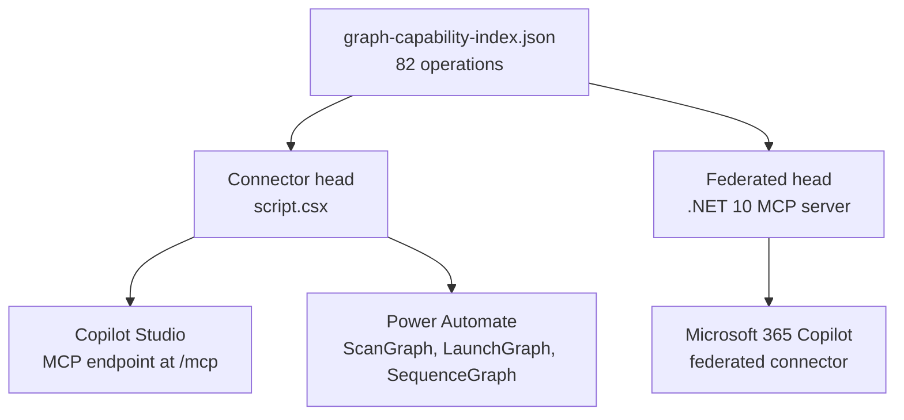

Microsoft Graph has hundreds of operations. Register them as typed tools and an agent pays for every schema in its context window before it does any work. [Graph Mission Control](https://github.com/troystaylor/SharingIsCaring/tree/main/Graph%20Mission%20Control) registers three instead, and lets the model discover the rest on demand.

It's built on the [Power Mission Control Template](https://github.com/troystaylor/SharingIsCaring/tree/main/Connector-Code/Power%20Mission%20Control%20Template), so the protocol and framework details live there. This post covers what's specific to Graph.

## Why three operations

| Approach | `tools/list` cost |
|---|---|
| One typed tool per Graph operation | ~500 tokens × N |
| Graph Mission Control | ~1,500 tokens, fixed |

The planner calls `scan_graph` to find what it needs, then `launch_graph` to run it. Operation schemas are fetched on demand, never injected up front.

| Tool | Purpose |
|---|---|
| `scan_graph` | Find Graph operations matching an intent. Returns endpoint, method, and parameters. |
| `launch_graph` | Execute one Graph v1.0 call. |
| `sequence_graph` | Execute up to 20 calls in a single round trip via Graph `$batch`. |

## Two heads, one index

The repo ships two independent deployments that compile against the same capability index.



The connector head is dual-mode. Copilot Studio talks to the MCP endpoint at `/mcp` with [generative orchestration](https://learn.microsoft.com/microsoft-copilot-studio/advanced-generative-actions) enabled, and Power Automate gets the typed `ScanGraph`, `LaunchGraph`, and `SequenceGraph` actions with full schemas and dynamic content. Both route through the same index and the same proxy, so behavior can't drift between them.

The federated head is a public HTTPS MCP server. Federated connectors require one, and a Power Platform custom connector isn't a public endpoint, so that surface needs its own deployment.

Deploy either head without the other.

## The capability index

`graph-capability-index.json` is the source of truth: 82 Graph v1.0 operations, 50 read and 32 write.

| Domain | Operations |
|---|---|
| mail | 14 |
| files | 13 |
| calendar | 12 |
| teams | 12 |
| people | 8 |
| sites | 8 |
| tasks | 8 |
| groups | 3 |
| insights | 3 |
| search | 1 |

Each entry carries a `readOnly` flag. The connector head ignores it—Copilot Studio and Power Automate get the full surface—but the federated head depends on it.

That flag can't be derived from the HTTP verb. Three operations are `POST` and semantically reads:

```
POST /me/findMeetingTimes
POST /me/calendar/getSchedule
POST /search/query
```

A verb-based filter would drop `/search/query`, which is the highest-value read in the whole index.

## Batching

`sequence_graph` maps onto the native Graph `$batch` endpoint rather than issuing calls one at a time, so twenty operations cost one round trip. Two constraints follow from Graph's implementation:

- **20 requests maximum.** `MaxBatchSize` matches it.
- **Sub-request URLs must be version-relative**—`/me/messages`, not `/v1.0/me/messages`. This is why `DefaultApiVersion` is left unset and the version lives in `BaseApiUrl` only. Setting both would prefix every sub-request URL and Graph would reject the batch.

A partial failure isn't a failure. Individual requests can fail while the sequence returns 200, with per-request `status` and `success`.

## Authentication on the connector head

Entra ID with on-behalf-of, so calls run as the signed-in user and Graph enforces that user's own permissions. Graph publishes its own app registration and scopes, so you only need one app registration—the connector app.

Add the delegated Graph permissions your scenarios need and grant admin consent. Start narrow: `User.Read`, `Mail.Read`, and `Calendars.Read` cover most read scenarios. The `aad` identity provider hardcodes `scope=openid` in the on-behalf-of exchange and has no scopes parameter, so pre-consented delegated permissions are what actually govern access.

Two setup steps trip people up.

**The per-call sign-in prompt.** On the same app registration, go to **Expose an API**, add a scope named `access_as_user`, then add `fe053c5f-3692-4f14-aef2-ee34fc081cae` under **Authorized client applications**. That's the Azure API Connections service principal. Without it, users are prompted to sign in on every call.

**The redirect URI is a second pass.** `apiProperties.json` sets `redirectMode: GlobalPerConnector`, which mints a URI carrying the connector's own name and a hash of its id:

```text
https://global.consent.azure-apim.net/redirect/new-5fgraph-20mission-20control-5f<hash>
```

You can't know it until the connector exists. Deploy first, read the exact value off the connector's **Security** tab, then add it to the app registration as a **Web** redirect URI. Until you do, every connection attempt fails with `AADSTS50011`. The generic `https://global.consent.azure-apim.net/redirect` doesn't satisfy it, so keep both.

When a call fails, the two statuses mean different things:

| Status | Meaning | Fix |
|---|---|---|
| 401 | Graph rejected the token—expired, or wrong audience | Reconnect. If it persists, check `resourceUri` is `https://graph.microsoft.com`. |
| 403 | Token is valid, a delegated permission is missing | Graph names the permission in the error. Add it and grant admin consent. |

Graph's own error code and message pass through, so a 403 tells you which permission to add.

## Deploy the connector head

```powershell
pac auth create --environment <ENVIRONMENT_ID>

pac connector create --environment <ENVIRONMENT_ID> `
  --api-definition-file "apiDefinition.swagger.json" `
  --api-properties-file "apiProperties.json" `
  --script-file "script.csx"
```

Pass `--environment` explicitly even though `pac auth create` already named one. Relying on the auth profile alone fails with an opaque `An unexpected error occurred`.

Then configure OAuth on the connector's **Security** tab: identity provider Azure Active Directory, plus the client ID and secret from your app registration.

Earlier guidance said to omit `apiProperties.json` because PAC CLI 2.8.1 failed whenever OAuth `connectionParameters` were present. That's fixed as of 2.9.3, so all three files go in one command and the two-step workaround is gone.

`script.csx` is compiled by the platform at deploy time, not locally, so a real `pac connector create` is the only validation.

## The federated head

`Graph Mission Control MCP/` surfaces the same operations inside Microsoft 365 Copilot as a federated connector. It ships two tools, not three, because launch can write:

| Tool | Purpose |
|---|---|
| `search_work` | Search across mail, files, events, Teams messages, people, and sites |
| `fetch_work` | Read one Graph resource by path |

### Read-only by construction

Federated connectors are read-only by contract, and each tool must carry the `readOnlyHint` annotation. That annotation is checked at registration time and never enforced at runtime, so the server enforces it itself in two independent layers:

| Layer | Guarantee |
|---|---|
| `fetch_work` only ever issues `GET` | No request can mutate anything |
| Path must match a `readOnly: true` index entry | Reads stay inside the approved surface |

Both are necessary. `/me/messages` and `/chats/{chatId}/messages` each have a read and a write at the same path, distinguished only by method—the path guard allows them and the GET-only rule blocks the write. Meanwhile GET alone would happily read `/servicePrincipals` and `/auditLogs/signIns`, which the path guard rejects.

`ToolRegistry.Add` throws if a tool declares `readOnlyHint: false`, so a violation fails startup rather than a request.

### Search splits by entity-type group

Graph rejects most cross-type searches with `Invalid entity type combination`. Only certain types may share a single `/search/query` request:

| Group | Types |
|---|---|
| Files | `drive`, `driveItem`, `list`, `listItem`, `site`, `externalItem` |
| Mail | `message` |
| Calendar | `event` |
| Teams | `chatMessage` |
| People | `person` |

`search_work` buckets the requested sources by group, issues one search per group, and merges the hits. A failure in one bucket is reported alongside the results that succeeded.

This isn't theoretical. The tool's own defaults are mail, files, and events, which is an illegal combination, so every default call failed until the bucketing went in.

### Discovery goes through the tools

Federated connectors expose tools only. Microsoft's documentation describes tool availability exclusively, and MCP resources and prompts never appear for this surface. Copilot Studio does support resources, but the server owner has to configure the resource as the output of a tool, so resources are never independently browsable on any Microsoft surface.

That leaves the tools as the only discovery channel, and fifty readable operations would otherwise be reachable but invisible. So `fetch_work` returns the full catalog of readable paths, grouped by domain, whenever it gets a path it doesn't recognize. A dead end becomes self-correction on the first miss. The catalog runs about 1.3 KB for 50 operations and is produced only on a miss, so it costs nothing in the `tools/list` payload a planner loads every session.

### What it adds over Copilot on its own

These aren't competitors on the same axis. Microsoft 365 Copilot reasons over a semantic index of your content; this server makes live, deterministic Graph reads. Where they overlap, Copilot on its own is usually better—an index plus a model beats fifty REST endpoints at summarizing, fuzzy intent, and cross-document reasoning. This server returns JSON. It doesn't reason.

The value sits in the parts that don't overlap. Roughly 30 of the 50 read-only capabilities have no native equivalent, because they're configuration, structure, and computation rather than content:

| Ask | Capability | Why the index can't answer it |
|---|---|---|
| Working hours, time zone, auto-reply | `get_mailbox_settings` | Mailbox configuration, not content |
| When are we both free? | `get_free_busy_schedule` | Live availability computation |
| Find a slot for these five people | `find_meeting_times` | Graph-side scheduling algorithm |
| Who reports to whom | `get_manager`, `list_direct_reports` | Directory graph traversal |
| My Planner and To Do tasks | `list_my_planner_tasks`, `list_todo_tasks` | Separate task stores |
| Rows in a SharePoint list | `list_site_lists`, `list_list_items` | Structured list items, not documents |
| Meeting transcript text | `list_online_meeting_transcripts`, `get_transcript_content` | Explicit transcript fetch |
| What's trending around me | `list_trending_documents`, `list_used_documents` | Graph insights signals |
| Group membership | `list_group_members`, `get_group` | Directory objects |

Three structural differences go beyond the capability list:

- **Freshness.** Reads hit Graph at request time. The semantic index has ingestion lag, so "did the contract arrive yet" is answered correctly here and possibly not there.
- **Determinism.** `$filter`, `$select`, `$orderby`, `$top`, and `@odata.nextLink` paging return complete, exactly specified result sets. The index returns relevance-ranked top-N. "All 47 unread messages from finance, oldest first" is a query, not a search.
- **Auditability.** Every call lands in Application Insights with its exact Graph path and result code, so "did it actually run" is answerable. With native grounding it isn't, which is why a connector that's merely not selected looks identical to one that's broken.

The honest counterweight: Copilot on its own needs no Entra app, no on-behalf-of chain, no container, and no per-user connection step. Inside the overlap this is more moving parts for a worse answer. The case rests on the non-overlapping capabilities, the freshness and determinism properties, and the fact that the same index drives the Power Automate connector, where none of Copilot's grounding exists at all.

## Deploy the federated head

```powershell
azd env new <ENV_NAME> --location <REGION> --subscription <SUBSCRIPTION_ID>
azd env set ENTRA_TENANT_ID <TENANT_ID>
azd env set ENTRA_CLIENT_ID <SERVER_APP_CLIENT_ID>
azd up
```

`azd up` provisions a Container App, registry, log workspace, Application Insights, and a user-assigned identity, then builds and pushes the image. Five billable resources, two of which bill whether or not anyone uses the server. `minReplicas: 1` is deliberate, because a cold start would land inside Copilot's request timeout. Set it to `0` in `infra/resources.bicep` if you'd rather pay less than answer promptly, and run `azd down` when you're finished evaluating.

There's no client secret. The server authenticates to Entra with workload identity federation, using the same user-assigned identity that pulls the image, which needs a federated credential on the server app registration:

| Field | Value |
|---|---|
| Issuer | `https://login.microsoftonline.com/<TENANT_ID>/v2.0` |
| Subject | The identity's principal ID, not its client ID |
| Audience | `api://AzureADTokenExchange` |

Entra accepts a federated credential with a wrong issuer, subject, or audience without any error, then fails later at token exchange. Verify it by making a real call, never by the credential saving successfully.

Registration then runs through three portals:

1. **Teams Developer Portal** → **Tools** → **Microsoft Entra SSO client ID registration**. Supply the server app's client ID, base URL, and scope. The scope must be fully qualified—`api://<Application ID URI>/mcp.access`, not the bare `mcp.access`. A bare scope name has no resource attached, so Entra resolves it against Microsoft Graph and consent fails with `AADSTS650053`.
2. On the server app registration, add the returned Application ID URI to `identifierUris`, add `https://teams.microsoft.com/api/platform/v1.0/oAuthConsentRedirect` as a **Web** redirect URI, and pre-authorize `ab3be6b7-f5df-413d-ac2d-abf1e3fd9c0b`, the Microsoft Enterprise token store. Then `azd env set ENTRA_EXTRA_AUDIENCES "<Application ID URI>"` and redeploy, because Copilot's token carries that audience rather than the app's own `api://` URI.
3. **Microsoft 365 admin center** → **Copilot** → **Connectors** → **Gallery** → **Created by your org** → **Connect to MCP server**. Supply the display name, base URL, and SSO registration ID. Display name caps at 30 characters, which is undocumented and the only field on the form short enough to hit it.

Each user then connects the server themselves in **Copilot Chat** → **Settings** → **Sources**. Admin rollout only makes the connector available. Until a user creates the connection, prompts are answered from Copilot's native M365 data and the connector is never consulted, which looks like a broken connector but is just an unconnected one. Changes take up to 15 minutes to take effect, so an immediate failure isn't meaningful.

Every user who queries the federated head needs a Microsoft 365 Copilot license. It's a flat per-user add-on rather than a per-call meter, so query volume costs nothing extra, but a tenant without it can't use this head at all. Check that first.

Check the billing terms too, before you plan around a flat cost. Microsoft now meters several Copilot services with [Copilot Credits](https://learn.microsoft.com/en-us/microsoft-365/copilot/usage-based-billing-overview-copilot-credits), and a Copilot license doesn't always cover what a custom agent does. The [Work IQ API](https://learn.microsoft.com/en-us/microsoft-365/copilot/extensibility/work-iq/#access-and-pricing) bills on usage even for licensed users when a custom or third-party agent calls it.

## Behavior worth knowing

- **Pagination.** `launch_graph` surfaces `@odata.nextLink` as `nextLink`. Pass it back as the endpoint to page forward. `fetch_work` accepts a continuation in `path` and passes it through untouched, since re-applying `$top` or `$select` would corrupt it.
- **Absolute URLs.** Only `https://graph.microsoft.com/v1.0/...` is accepted. Following an arbitrary absolute URL would turn the tool into an open proxy for whatever host the caller names.
- **Throttling.** Transient responses (429, 503, 504) are retried up to three times, honoring `Retry-After` when it's short enough to be worth waiting for. A longer `Retry-After` surfaces as an error instead.
- **Directory search.** Graph rejects `$search` and `$count` on `/users` and `/groups` unless the request carries `ConsistencyLevel: eventual`, and `$search` also requires `$count=true`. Both are added automatically.
- **Response size.** Mail bodies and Teams messages are HTML and can be very large. Summarization strips markup and truncates at 500 characters for bodies, 1000 for text. Set `SummarizeResponses = false` to disable.
- **Default page size.** Graph defaults to 10 and allows up to 999. The connector injects `$top=25` on collection reads when no page size is given.

## Going past 82 operations

The connector runs `DiscoveryMode.Static` against the embedded index. Graph has no per-resource describe endpoint—`$metadata` is one monolithic CSDL document—so `Hybrid` has nothing to call.

To reach the rest of Graph, switch to `McpChain` against MS Learn, at the cost of an external call on every scan:

```csharp
DiscoveryMode = DiscoveryMode.McpChain,
McpChainEndpoint = "https://learn.microsoft.com/api/mcp",
McpChainToolName = "microsoft_docs_search",
McpChainQueryPrefix = "Microsoft Graph",
```

The modes are exclusive rather than additive—`McpChain` replaces index search instead of supplementing it.

To add operations to the static index instead, edit `graph-capability-index.json` and re-embed it into `script.csx`. The `CAPABILITY_INDEX` constant is a C# verbatim string, so every `"` becomes `""`. Do that mechanically:

```powershell
$json = Get-Content .\graph-capability-index.json -Raw
$escaped = $json.TrimEnd() -replace '"', '""'
```

Both heads and the full readme are in my [SharingIsCaring repository](https://github.com/troystaylor/SharingIsCaring/tree/main/Graph%20Mission%20Control).
