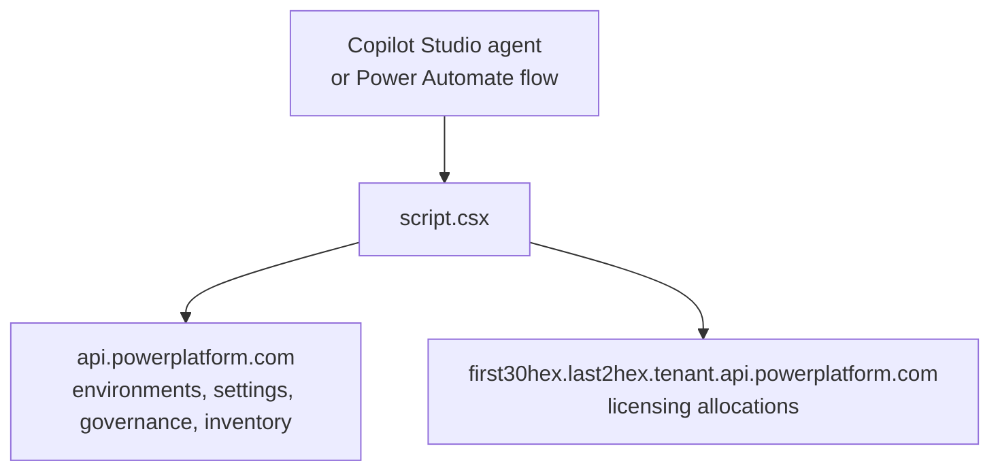

**Draw from Tenant Pool** decides whether an environment spends Copilot Credits from your tenant capacity pool. That pool is enforced monthly, unused credits don't roll over, and the [August 2026 licensing guide](https://cdn-dynmedia-1.microsoft.com/is/content/microsoftcorp/microsoft/bade/documents/products-and-services/en-us/ai/Microsoft-Copilot-Studio-Licensing-Guide-August-2026.pdf) is blunt about the consequence of going over: technical enforcement, up to service denial. One environment overspending is a tenant-wide problem.

The Power Platform admin center exposes the setting one environment at a time. If you run 40 environments and one agent in a sandbox is draining shared capacity, turning it off everywhere but production means 40 trips through the UI.

[Power Platform Admin v1.1](https://github.com/troystaylor/SharingIsCaring/tree/main/Power%20Platform%20Admin) adds two tools for that setting. The same release makes the connector dual-mode, so Power Automate gets typed actions next to the MCP endpoint that Copilot Studio uses.

The [original post](/power%20platform/custom%20connectors/mcp/2026-05-13-power-platform-admin-mcp-connector.html) covers the first 12 tools. This one covers what changed.

## What's new in 1.1

| | v1.0 | v1.1 |
|---|---|---|
| MCP tools | 12 | 14 |
| Power Automate actions | None | 6 typed operations |
| Environment pickers | None | Dynamic dropdown on every action |
| APIs called | `api.powerplatform.com` | Adds the tenant-routed licensing host |

## The two new tools

| Tool | Description |
|------|-------------|
| `admin_get_tenant_pool_draw` | Check whether an environment draws Copilot Credit capacity from the tenant pool |
| `admin_set_tenant_pool_draw` | Turn that draw on or off |

Both act on two entitlements, `MCSMessages` and `MCSSessions`, because the single toggle in the admin center covers both:

```csharp
private static readonly string[] TENANT_POOL_ENTITLEMENTS =
    { "MCSMessages", "MCSSessions" };
```

Those IDs are older than the billing vocabulary. Microsoft renamed Copilot Studio messages to Copilot Credits in September 2025, and the current licensing guide has no message or session meter left in it—one credit pack is 25,000 Copilot Credits per month, and pay-as-you-go bills at $0.01 per credit. The entitlement IDs on the API never followed the rename, so the connector uses the names the service still answers to.

## This route is unsupported

`licensing/allocations` isn't in the [published Power Platform REST reference](https://learn.microsoft.com/rest/api/power-platform/). The documented licensing surface is [Currency Allocation](https://learn.microsoft.com/rest/api/power-platform/licensing/currency-allocation), which shares the namespace but not this route. The endpoint can change or stop working without notice.

Treat these two tools as a way to fix a org-wide capacity problem in one conversation, not as a permanent integration. Read before you write, and check the result in the admin center the first few times.

## Licensing answers on a different host

Environments, settings, governance, connectors, and apps all answer at `api.powerplatform.com`. Licensing allocations don't. That route is tenant-routed, and the host is built from the tenant GUID: lowercased, dashes stripped, split after the first 30 hex characters.



Send a licensing call to the wrong host shape and you get `404 RouteNotFound`.

```csharp
private string ResolveTenantHost()
{
    var dashless = ResolveTenantId().Replace("-", "").ToLowerInvariant();
    if (dashless.Length != 32)
        throw new InvalidOperationException(
            "Tenant id is not 32 hex characters; cannot build the licensing host.");

    return $"{dashless.Substring(0, 30)}.{dashless.Substring(30)}{TENANT_HOST_SUFFIX}";
}
```

The tenant ID comes from the token, not from a connection parameter. `IScriptContext` has no way to read connection parameters, so the script decodes the `tid` claim out of the bearer token it already receives:

```csharp
var segments = auth.Parameter.Split('.');
var payload = segments[1].Replace('-', '+').Replace('_', '/');
if (payload.Length % 4 == 2) payload += "==";
else if (payload.Length % 4 == 3) payload += "=";

var claims = JObject.Parse(
    Encoding.UTF8.GetString(Convert.FromBase64String(payload)));
var tid = claims["tid"]?.ToString();
```

Setup stays the same as v1.0. No extra field on the connection, no tenant ID to paste.

## A missing document is the answer

An environment that has never had capacity allocated has no allocation document, and the API returns 404. That 404 isn't a failure. It's the platform saying the environment draws from the pool by default.

`RouteNotFound` also returns 404, so the script reads the error code in the body instead of trusting the status:

```csharp
if (result.Status == HttpStatusCode.NotFound &&
    result.Body != null &&
    result.Body.IndexOf("AllocationDocumentDoesNotExist",
        StringComparison.OrdinalIgnoreCase) >= 0)
{
    return null;
}
```

A null document flows through to a plain answer for the agent:

```
No allocation document exists for this environment,
so it draws from the tenant pool by default.
```

## Writing back without clobbering

The read and the write use different route names for the same data. `GET /licensing/allocationsV2` requires a `$filter` on the environment and entitlements. `PUT /licensing/allocations` takes the whole document.

That PUT is a full upsert with no ETag. A blind write would erase any capacity allocation or enforcement rule someone else configured on the environment, and nothing would warn you. So the set tool reads first and changes only the `TenantPool` rule:

```csharp
var rule = FindTenantPoolRule(entitlement);
if (rule == null)
    rules.Add(new JObject
    {
        ["ruleType"] = "TenantPool",
        ["enabled"] = enabled
    });
else
    rule["enabled"] = enabled;
```

Enforcement rules also carry `Alert`, `PayGo`, and `Deny` types. Rewriting one entry in the array keeps the rest intact.

Read-modify-write narrows the window, it doesn't close it. With no ETag there's no optimistic concurrency, so an admin editing the same environment in the admin center at the same moment can still lose a change.

## Six typed actions for Power Automate

| Action | Method | Path |
|--------|--------|------|
| Invoke Power Platform Admin MCP | POST | `/mcp` |
| List Environments | GET | `/admin/environments` |
| Get Environment | GET | `/admin/environment` |
| Get Settings | GET | `/admin/settings` |
| Update Settings | POST | `/admin/settings/update` |
| Get Draw From Tenant Pool | GET | `/admin/tenantpool` |
| Set Draw From Tenant Pool | POST | `/admin/tenantpool/update` |

Every `environmentId` parameter is a picker, not a GUID field:

```json
"x-ms-dynamic-values": {
  "operationId": "GetEnvironmentDropdown",
  "value-path": "id",
  "value-title": "name"
}
```

`GetEnvironmentDropdown` is marked `x-ms-visibility: internal`, so makers see environment names in a list and never see the operation that fills it.

Both surfaces call the same handlers. The typed `GetTenantPoolDraw` operation and the `admin_get_tenant_pool_draw` MCP tool both land in `HandleGetTenantPoolDraw`, so a flow and an agent can't drift apart.

## Permissions to add

Add two delegated permissions to the app registration from v1.0, on `Power Platform API` (resource ID `8578e004-a5c6-46e7-913e-12f58912df43`):

- `Licensing.Allocations.Read`
- `Licensing.Allocations.ReadWrite`

The caller needs **Power Platform Administrator** or **Global Administrator** for the tenant pool tools. These are the roles that gate licensing and capacity in the admin center, and an environment-scoped System Administrator won't clear them.

Grant admin consent for the new scopes, then delete and recreate the connection so the token carries them.

## Prompts to try

```
Does my sandbox environment draw Copilot Studio capacity from the tenant pool?
Stop the sandbox environments from drawing from the Copilot Studio tenant pool
Turn tenant pool draw back on for [environment name]
```

With [generative orchestration](https://learn.microsoft.com/microsoft-copilot-studio/advanced-generative-actions) enabled, the agent chains `admin_list_environments` into `admin_get_tenant_pool_draw` to sweep every environment before you change anything.

## Updating an existing install

```powershell
cd "Power Platform Admin"
pac connector update `
  --connector-id <your-connector-id> `
  --api-definition-file apiDefinition.swagger.json `
  --api-properties-file apiProperties.json `
  --script-file script.csx
```

Set the `clientId` in `apiProperties.json` to your app registration before you run it. If the update fails with "An unexpected error occurred," push the definition and script without `--api-properties-file`, then set OAuth on the connector's Security tab in the portal.

## Resources

- [Source code](https://github.com/troystaylor/SharingIsCaring/tree/main/Power%20Platform%20Admin)
- [Power Platform API reference](https://learn.microsoft.com/power-platform/admin/programmability-and-extensibility/powerplatform-api-reference)
- [Permissions reference](https://learn.microsoft.com/power-platform/admin/programmability-permission-reference)
- [Currency Allocation, the supported licensing allocation API](https://learn.microsoft.com/rest/api/power-platform/licensing/currency-allocation)
- [Microsoft Copilot Studio Licensing Guide, August 2026](https://cdn-dynmedia-1.microsoft.com/is/content/microsoftcorp/microsoft/bade/documents/products-and-services/en-us/ai/Microsoft-Copilot-Studio-Licensing-Guide-August-2026.pdf)
- [FAQ for Copilot Studio billing and licensing](https://learn.microsoft.com/microsoft-copilot-studio/faq-billing-licensing)
