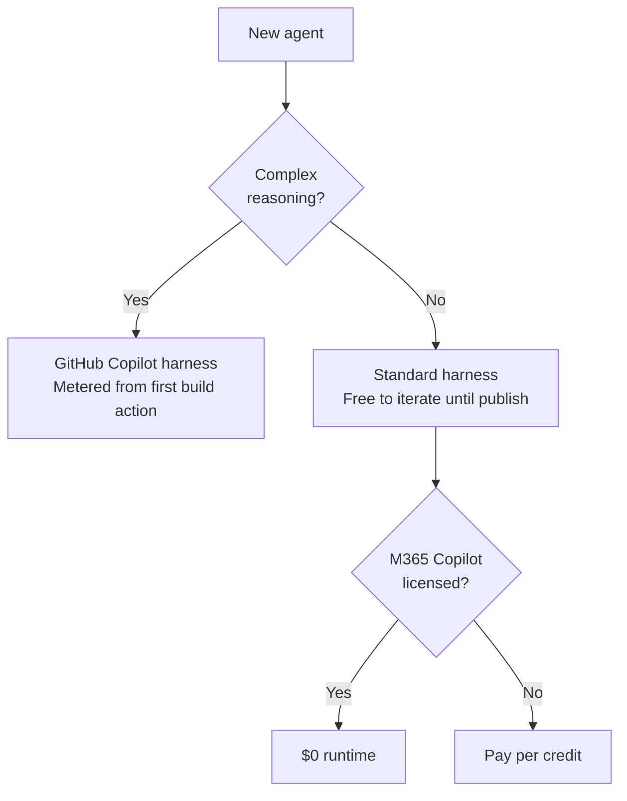

Microsoft [made the GitHub Copilot harness generally available](https://techcommunity.microsoft.com/blog/copilot-studio-blog/more-powerful-agents-and-workflows-for-autonomous-business-processes-introducing/4542969) on August 3, after a two-month preview, and gave it its name. Copilot Studio now has three harnesses: Copilot Chat, Standard, and GitHub Copilot.

The [Copilot Studio extension for VS Code](https://learn.microsoft.com/microsoft-copilot-studio/visual-studio-code-extension-overview) clones a live agent to disk as YAML, lets you edit it, and pushes the change back. I cloned one agent on the Standard harness and one on the GitHub Copilot harness in a live tenant and edited both to find out what actually round-trips.

Three findings, in order of how much they should change your decisions:

1. **The two harnesses I tested are a price class apart.** Roughly an order of magnitude per interaction. Employee-facing Standard harness agents are included in Microsoft 365 Copilot licensing, and GitHub Copilot harness agents are billed for all work regardless of it, which Microsoft now states outright.
2. **Microsoft's extension documentation disagrees with the product in eight places.** Two of them break your files.
3. **A working setup.** Instructions, a skill, two prompts, and a script that reports what your agent actually contains.

## What projects to disk

The round trip is confirmed. Edit a projected file, apply, and the change reaches the live agent, including entirely new nodes with hand-written ids. Verified on the Standard harness.

What you get to edit differs by harness:

| | Standard harness | GitHub Copilot harness |
|---|---|---|
| Authoring cost | Free until publish | Metered from first build action |
| Topics as code | Yes | No topics at all |
| Behaviors as code | n/a | Files project; apply **untested** |
| **Instructions as code** | **No** | **Yes** |

A rule-and-topic agent can be built and iterated as code for nothing until publish. A reasoning agent projects more, since its instructions and behaviors both land on disk, but every test run is billed. Testing is the inner loop of agent development, not a final step.

## The harnesses are a price class apart

At $0.01 per Copilot Credit:

| | Credits | Cost |
|---|---|---|
| Standard, classic answer | 1 | $0.01 |
| Standard, generative answer | 2 | $0.02 |
| Standard, agent action | 5 | $0.05 |
| Standard, tenant graph grounding | 10 | $0.10 |
| Standard, multi-step run (4 agent actions) | 20 | $0.20 |
| GitHub Copilot, light task | 100–300 | $1.00–$3.00 |
| GitHub Copilot, medium task | 300–500 | $3.00–$5.00 |
| GitHub Copilot, heavy task | >500 | >$5.00 |

A light GitHub Copilot task costs 5 to 15 times a complete Standard harness multi-step run.

Those tiers are runtime figures, and development is additional. Microsoft's ["How Copilot credits are measured"](https://learn.microsoft.com/microsoft-copilot-studio/agents-experience/billing-credit-overview#how-copilot-credits-are-measured) section frames consumption entirely around "how often customers interact." It contains no development term, no worked example, and no guidance on expected iteration counts. The same page states elsewhere that building, previewing, testing, and generating evaluations all consume credits, but never quantifies them, and never confirms whether a test run bills as a full task. The GA announcement repeats the point without numbers, noting that natural language authoring, evaluations, and testing all fall under usage-based billing on this harness. Budget development separately as iterations × tier cost, and measure your own iteration count, because none is published. The tiers themselves appear on that page only as an image.

Employee-facing Standard harness usage is free for Microsoft 365 Copilot licensed users. Every billable feature in the [Standard harness rate table](https://learn.microsoft.com/microsoft-copilot-studio/requirements-messages-management#copilot-credits-billing-rates) carries a "no charge" inclusion when the agent runs under the authenticated licensed user's identity. Microsoft's own worked example bills 100 of 150 users for exactly this reason. The GA announcement confirms the inclusion continues for the Standard and Copilot Chat harnesses, and says agents on the GitHub Copilot harness "use usage-based billing for all work, regardless of Microsoft 365 Copilot licensing."

For an internal agent at 100,000 interactions a year:

| | Annual |
|---|---|
| Standard, M365 Copilot licensed employees | **$0** |
| Standard, unlicensed, ~20 credits per run | ~$20,000 |
| GitHub Copilot harness, medium tier | ~$400,000 |

Read the caveats on that inclusion before you plan around it. It's business-to-employee only, subject to unstated fair-usage limits Microsoft can revise, excludes Computer-Using Agents, and for agent flows applies only to the "When an agent calls the flow" trigger. Reasoning models double-bill, feature rate plus premium AI tools at 10 credits per 1K tokens. Enforcement at 125% of prepaid capacity disables agents rather than throttling them.

## Choosing



Pick the GitHub Copilot harness when you genuinely need goal decomposition, native Word, Excel, or PDF generation, memory, or recovery from failed steps. Nothing else does those.

Pick the Standard harness for threshold lookups, approval routing, and structured Q&A, which is most of what agents get asked to do. Deterministic logic in a `ConditionGroup` can't hallucinate a policy number, costs a fraction to run, iterates free, and is reviewable in Git.

The Copilot Chat harness is the third option, aimed at customizing Microsoft 365 Copilot Chat rather than building a standalone agent. It bills on the same fixed rate card as the Standard harness.

The harness question is really how much of this agent has to sit on the expensive one.

What you can't currently do is edit a Standard harness agent's generative instructions as code. Push logic into topics instead.

## Telling the harnesses apart

I tested the Standard and GitHub Copilot harnesses. Copilot Chat, the third, I didn't clone.

Microsoft's extension documentation is banner-marked **Standard harness** throughout, which left open whether GitHub Copilot harness agents could be cloned at all. They can, and they project more.

| | Standard harness | GitHub Copilot harness |
|---|---|---|
| `AuthoringShape` | `1` | `2` |
| `template` | `default-2.1.0` | `cliagent-1.0.0` |
| `recognizer.kind` | `GenerativeAIRecognizer` | `CLICopilotRecognizer` |
| Editable files | `topics/*.mcs.yml` | `behaviors/*.mcs.yml` |
| Instructions | git-ignored `botdefinition.json` | tracked `settings.mcs.yml` |
| `botdefinition.json` | ~750 KB | ~23 KB |
| Publisher observed | Copilot Studio (`cra4a_`) | org default (`Default_`) |

A script in the pack reads `.mcs/conn.json` and `settings.mcs.yml` and reports which harness you have, what projected, and the node kinds valid for that specific agent:

```powershell
.github/skills/copilot-studio-agent/scripts/Get-AgentSchema.ps1 <agent folder>
```

The node kinds matter most. It extracts them from the definition rather than from a list someone wrote down:

```powershell
foreach ($component in $def.components) {
    foreach ($field in 'dialog', 'metadata') {
        $payload = $component[$field]
        if ($payload -isnot [string]) { continue }
        foreach ($match in [regex]::Matches($payload, '(?m)^\s*(?:-\s*)?kind:\s*([A-Za-z0-9_.]+)')) {
            [void]$nodeKinds.Add($match.Groups[1].Value)
        }
    }
}
```

One detail worth copying if you write your own tooling: `botdefinition.json` contains keys that differ only by case, `id` and `Id`. `ConvertFrom-Json` throws on that unless you pass `-AsHashtable`.

## Corrections

Where the product disagrees with Microsoft Learn.

| Docs say | Product does |
|---|---|
| `connectioreferences.mcs.yml` | `connectionreferences.mcs.yml` |
| Name files `.topic.yaml` / `.tool.yaml` | Clone emits `.mcs.yaml`; renaming breaks component mapping |
| Topic examples with no `mcs.metadata` | Required on every component file |
| Five node kinds | 29 in one ordinary agent |
| — | `modelDescription` is the discovery surface, undocumented |
| — | `OnRecognizedIntent`, `intent: {}`, `inputType` / `outputType`, undocumented |
| — | `behaviors/` and `agent.sync.yaml`, undocumented |
| One folder layout | Two, keyed on `AuthoringShape` |

The first two are the ones that cost you time. The [file structure diagram](https://learn.microsoft.com/microsoft-copilot-studio/visual-studio-code-extension-edit-agent-components#agent-file-structure) is missing the `n` in `connection`, so searching for that filename finds nothing. And the naming conventions in the same article's best practices section tell you to use `.topic.yaml` and `.tool.yaml` suffixes, but the extension maps files to remote components by path and name. Rename a cloned file to match the guidance and the mapping breaks.

Three behaviors nobody documents:

- **Projection emits custom components only.** An agent of nothing but system topics produces no `topics/` folder. That's correct, not a failed clone.
- **`.mcs/.gitignore` contains `*`.** The definition is deliberately excluded from source control, so whatever fails to project isn't versioned at all.
- **`intent: {}` plus `modelDescription`** gives behavior-style generative selection on the Standard harness.

## What's in the pack

| File | Kind | Loads |
|---|---|---|
| `.github/instructions/copilot-studio-agent.instructions.md` | Instructions | Automatically, for `*.mcs.yaml` and `*.mcs.yml` |
| `.github/skills/copilot-studio-agent/SKILL.md` | Skill | On demand, when you're authoring |
| `.github/skills/copilot-studio-agent/scripts/Get-AgentSchema.ps1` | Script | When the skill or a prompt calls it |
| `.github/prompts/cs-component.prompt.md` | Prompt | When you run `/cs-component` |
| `.github/prompts/cs-sync.prompt.md` | Prompt | When you run `/cs-sync` |

The split is deliberate. The instructions file is short and always-on for agent definition files, carrying the handful of rules that prevent a failed apply:

```markdown
---
applyTo: "**/*.mcs.yaml,**/*.mcs.yml"
description: "Hard rules for editing cloned Microsoft Copilot Studio agent definition files (.mcs.yaml / .mcs.yml) managed by the Copilot Studio VS Code extension."
---
```

The skill carries the full schema and folder layout and only enters context when you actually need it. Under usage-based billing, a fat always-on instruction file is a charge you pay on every turn of every session.

Two rules in the instructions file earn their place:

- **Never invent a `kind:` value.** A guessed kind fails on apply and costs a round trip. If it isn't in the verified vocabulary, confirm it with `Ctrl+Space` or the Problems pane first.
- **Never mix harness primitives.** `InlineAgentSkill` belongs to the GitHub Copilot harness and `AdaptiveDialog` to the Standard harness. Write the wrong one and nothing invokes it.

The `/cs-component` prompt opens by running the schema script, so the harness is settled before anything gets written, and it holds you to the description before the body. The description is the only thing the orchestrator reads when deciding whether to invoke a component. Write it as the when, not the what. "Use when the user asks whether a purchase requires competitive bidding" fires. "Bidding logic" doesn't.

`/cs-sync` walks the apply ritual in order: preview remote changes, commit local work before retrieving, resolve conflicts explicitly, check the Problems pane, summarize, then apply. The order isn't cosmetic. Apply is blocked while remote changes are outstanding, and `Get Changes` overwrites uncommitted local work.

It also ends by reminding you that apply is not publish. `Copilot Studio: Apply Changes` updates the agent in the environment so you can test it in the test pane. End users see nothing until a separate publish.

## Using it

Copy `.github/` into the workspace where you cloned your agent, or clone the agent into the folder that already has it. Then:

```text
Ctrl+Shift+P → Copilot Studio: Clone Agent
```

Once files are on disk, the instructions apply themselves whenever you open a `.mcs.yaml`. Ask for the skill by name, or start editing a topic and it gets pulled in.

## Limits

Verified August 2026 against `CopilotStudioSolutionVersion 2026.6.3.20581040`, using two agents in a single Dataverse environment, one on the Standard harness and one on the GitHub Copilot harness. The Copilot Chat harness is untested here.

The GitHub Copilot harness reached general availability on August 3, 2026, so anything written about it before that date describes the preview. `cliagent-1.0.0` is a 1.0 template and `behaviors/` is undocumented, so expect both to move. The node vocabulary is per-agent, so run the script against your own rather than trusting the count above.

## Resources

- [Copilot Studio agents as code pack](https://github.com/troystaylor/SharingIsCaring/tree/main/Copilot%20Studio%20Agents%20as%20Code)
- [Introducing a new harness for Copilot Studio](https://techcommunity.microsoft.com/blog/copilot-studio-blog/more-powerful-agents-and-workflows-for-autonomous-business-processes-introducing/4542969)
- [Copilot Studio extension for VS Code](https://learn.microsoft.com/microsoft-copilot-studio/visual-studio-code-extension-overview)
- [Edit agent components](https://learn.microsoft.com/microsoft-copilot-studio/visual-studio-code-extension-edit-agent-components)
- [Standard harness billing rates](https://learn.microsoft.com/microsoft-copilot-studio/requirements-messages-management#copilot-credits-billing-rates)
- [GitHub Copilot harness billing](https://learn.microsoft.com/microsoft-copilot-studio/agents-experience/billing-credit-overview)
- [Copilot Studio agent usage estimator](https://microsoft.github.io/copilot-studio-estimator/)
