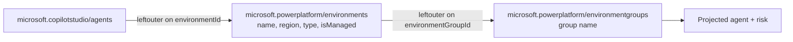

The GitHub Copilot harness [went generally available on August 3](https://techcommunity.microsoft.com/blog/copilot-studio-blog/more-powerful-agents-and-workflows-for-autonomous-business-processes-introducing/4542969). A light task on it costs 100 to 300 Copilot Credits. A complete four-action run on the Standard harness costs 20, and costs nothing at all when the caller holds a Microsoft 365 Copilot license.

Makers pick the harness. Nothing tells you which one they picked. The Power Platform admin center lists agents one environment at a time and doesn't show harness at all, so the question "which of my agents run on the expensive one" has no screen behind it.

[Power Platform Admin v1.2](https://github.com/troystaylor/SharingIsCaring/tree/main/Power%20Platform%20Admin) adds `admin_list_agents`, which walks the whole estate in one call. Every agent comes back with an `isCLIAgent` value, and that field is the harness. It also carries environment context, sharing counts, Entra identity, and a risk level you can trace back to the signals that produced it.

Yesterday's [v1.1 post](/power%20platform/custom%20connectors/mcp/2026-08-05-power-platform-admin-tenant-pool-draw.html) covers the tenant pool tools and the dual-mode rebuild. The [original post](/power%20platform/custom%20connectors/mcp/2026-05-13-power-platform-admin-mcp-connector.html) covers the first 12 tools.

## What's new in 1.2

| | v1.1 | v1.2 |
|---|---|---|
| MCP tools | 14 | 15 |
| Power Automate actions | 6 typed operations | 7 typed operations |
| APIs called | Environments, settings, governance, licensing | Adds `resourcequery` |

One tool, one action:

| Surface | Name |
|---|---|
| Copilot Studio | `admin_list_agents` |
| Power Automate | **List Agents** at `/admin/agents` |

`environmentId` is optional on both. Leave it blank and you get the tenant.

## isCLIAgent is the harness

This is the field to read first.

| `isCLIAgent` | Harness | What it costs |
|---|---|---|
| `"true"` | GitHub Copilot | 100–500+ credits per task, billed regardless of M365 Copilot licensing |
| `"false"` | Standard or Copilot Chat | 1–20 credits per run, no charge for licensed employees |
| `"unknown"` | Not reported | Unresolved |

Cloning both harnesses to disk shows why the field is named the way it is. A GitHub Copilot harness agent projects `template: cliagent-1.0.0` and `recognizer.kind: CLICopilotRecognizer`, where a Standard harness agent projects `default-2.1.0` and `GenerativeAIRecognizer`. The [agents-as-code post](/copilot%20studio/power%20platform/2026-08-06-copilot-studio-agents-as-code.html) has the full comparison.

That makes the inventory a cost report. At $0.01 per credit, an agent on the wrong harness for its workload is a four-figure annual difference at modest volume, and roughly $400,000 against $0 for an internal agent at 100,000 interactions a year. One tenant-wide read tells you where those agents are and who owns them.

Development is on top of runtime. Building, previewing, testing, and generating evaluations all consume credits on the GitHub Copilot harness, and Microsoft publishes no figure for any of them. A GitHub Copilot harness agent in a developer environment that has never been published is still spending.

## Absent isn't false

`isCLIAgent` is missing entirely on some agents. Coercing that to `false` would report an agent as Standard harness when the platform never said so, and Standard is the cheap answer — the direction you least want a governance report to guess in. The connector returns three states:

```csharp
private static string TriState(JToken parent, string propertyName)
{
    var token = parent?[propertyName];
    if (token == null || token.Type == JTokenType.Null) return "unknown";
    if (token.Type == JTokenType.Boolean) return token.Value<bool>() ? "true" : "false";

    bool parsed;
    return bool.TryParse(token.ToString(), out parsed) ? (parsed ? "true" : "false") : "unknown";
}
```

In a flow, compare against the strings `'true'`, `'false'`, and `'unknown'`. A condition that tests it as a boolean never matches. Treat `'unknown'` as a row to investigate, not as Standard.

One caveat on all of it: `resourcequery` returns the resource provider's raw property bag, and `isCLIAgent` is not in the published reference. It can change shape or disappear without notice. Use it for reporting and chargeback triage, not as a hard enforcement gate.

## One query, three tables

Agents live in `PowerPlatformResources` under type `microsoft.copilotstudio/agents`. The rows carry an `environmentId` and nothing else about the environment, so an inventory built on that alone gives you 400 GUIDs and no way to tell production from a developer sandbox.

The connector joins the environment and environment group rows in the same query:



Both joins are `leftouter`, so an agent in an environment the caller can't read still comes back with its own properties intact rather than vanishing from the count.

One detail that costs an afternoon if you miss it: every clause is a polymorphic document and `$type` has to serialize first. Build the clause with `$type` anywhere but the first key and the service rejects the whole query.

```csharp
new JObject
{
    ["$type"] = "where",
    ["FieldName"] = "type",
    ["Operator"] = "in~",
    ["Values"] = new JArray { AGENT_RESOURCE_TYPE }
}
```

## SkipToken doesn't page

`resourcequery` returns a `SkipToken` in its response. Send it back and you get the same rows again. Verified against the live API, it never advances.

`Skip` offsets work. The connector pages 1,000 rows at a time and stops at 10 pages:

```csharp
if (rows.Count < AGENT_PAGE_SIZE) break;

if (pages >= AGENT_MAX_PAGES)
{
    truncated = true;
    break;
}

skip += AGENT_PAGE_SIZE;
```

A 10,000-agent ceiling sets `truncated: true` in the response rather than returning a short list that looks complete. Scope to an environment if you hit it.

Offset paging has a second failure mode that's quieter. Sorting on `createdAt` alone isn't a total order — agents provisioned from a template share a timestamp to the second — so the service is free to order ties differently between requests, and the skip window slides over rows that were never returned. The sort carries `name` as a unique tiebreaker:

```csharp
["FieldNamesAscDesc"] = new JObject
{
    ["tostring(properties.createdAt)"] = "desc",
    ["name"] = "asc"
}
```

Results are also de-duplicated by resource name, so a repeated row can't inflate the count if the service reorders anyway.

## A risk score you can argue with

Every agent gets a `riskLevel` of None, Low, Medium, or High. A score with no explanation is a number an admin has to take on faith, so each agent also carries the `riskSignals` that produced it.

| Signal | Score | Why |
|---|---|---|
| `quarantined` | +3 | The platform already flagged it |
| `sharedWithEntireTenant` | +2 | Everyone can run it |
| `broadEditorAccess` | +2 | 10 or more editor users |
| `cliAuthoredAndTenantWide` | +2 | GitHub Copilot harness, shared to everyone |
| `missingEntraAgentIdPostMandate` | +2 | No Entra Agent ID on an agent created after July 2026 |
| `noEntraAgentId` | +1 | Same gap on an older agent |
| `createdOutsideMakerPortal` | +1 | `isCLIAgent` is `true` |
| `defaultEnvironment` | +1 | Default environment |
| `unmanagedEnvironment` | +1 | Non-default environments only |
| `tenantWideInNonProductionEnvironment` | +1 | Trial or developer, shared to all |
| `neverPublished` | −1 | No runtime exposure |

Thresholds are 5 for High, 3 for Medium, 1 for Low. The score floors at 0.

`cliAuthoredAndTenantWide` is the pairing to watch. A GitHub Copilot harness agent shared with the entire tenant is the most expensive shape available: the priciest per-task rate, multiplied by everyone in the company, with no license inclusion to absorb it.

Three of those choices are worth defending.

**Editor breadth counts double, viewer breadth doesn't.** Editors can rewrite instructions and swap tools. Ten people who can change what an agent does is a bigger exposure than ten people who can talk to it.

**The default environment is scored as itself, not as unmanaged.** It can never be a Managed Environment. Scoring it as unmanaged would fire on nearly every agent in most tenants and flatten the distribution into noise.

```csharp
if (defaultEnvironment) { score += 1; signals.Add("defaultEnvironment"); }
else if (!managedEnvironment) { score += 1; signals.Add("unmanagedEnvironment"); }
```

**One signal subtracts.** An agent that was never published has no runtime exposure, so `neverPublished` takes a point back. A half-built experiment in a dev environment shouldn't outrank a published agent shared with the company.

## The Entra Agent ID gap

Entra Agent IDs give each agent a directory identity that Conditional Access and access reviews can act on. Newly created agents get one; older agents don't have one to backfill.

That makes a missing ID mean two different things, so the connector dates it:

```csharp
private static readonly DateTimeOffset ENTRA_AGENT_ID_MANDATE =
    new DateTimeOffset(2026, 7, 1, 0, 0, 0, TimeSpan.Zero);
```

A gap on an agent created before that date is a backlog item worth +1. A gap on an agent created after it means something bypassed the path that assigns one, and scores +2.

## What comes back

The response is one object, not a paged list:

```json
{
  "agentCount": 412,
  "truncated": false,
  "environmentId": null,
  "agents": [ ... ]
}
```

Each agent carries display name, schema name, environment name, region, type, managed state, environment group, creator, creation date, last publish, owner, authentication mode, orchestration mode, model, quarantine state, `isCLIAgent`, viewer and editor counts, channels, and the risk fields.

In a flow, apply-to-each over `agents` and check `truncated` before you treat the result as the whole estate. `riskSignals` and `channels` are string arrays — `join(item()?['riskSignals'], ', ')` flattens them for a table or an email body.

## Prompts to try

```
Which of my agents run on the GitHub Copilot harness?
List every agent where isCLIAgent is true, with its environment and owner
Show me GitHub Copilot harness agents shared with the entire tenant
Are there any agents where the harness came back as unknown?
Inventory every Copilot Studio agent in my tenant
Show me agents with a Medium or High risk level and explain why
Which agents are missing a Microsoft Entra Agent ID?
List the agents in my default environment and who can edit them
```

With [generative orchestration](https://learn.microsoft.com/microsoft-copilot-studio/advanced-generative-actions) enabled, the agent can chain the inventory into `admin_get_settings` or `admin_get_security_recommendations` to check whether the environments holding the priciest agents are governed at all.

## Permissions

No new scope. `resourcequery` has no documented permission to grant, and it was verified to work with the delegated scopes already on the app registration plus a Power Platform admin role.

## Updating an existing install

```powershell
cd "Power Platform Admin"
pac connector update `
  --connector-id <your-connector-id> `
  --api-definition-file apiDefinition.swagger.json `
  --api-properties-file apiProperties.json `
  --script-file script.csx
```

Set the `clientId` in `apiProperties.json` to your app registration first. If the update fails with "An unexpected error occurred," push the definition and script without `--api-properties-file`, then set OAuth on the connector's Security tab in the portal.

The connection doesn't need to be recreated this time. No scopes changed.

## Resources

- [Source code](https://github.com/troystaylor/SharingIsCaring/tree/main/Power%20Platform%20Admin)
- [Power Platform API reference](https://learn.microsoft.com/power-platform/admin/programmability-and-extensibility/powerplatform-api-reference)
- [Permissions reference](https://learn.microsoft.com/power-platform/admin/programmability-permission-reference)
- [GitHub Copilot harness billing](https://learn.microsoft.com/microsoft-copilot-studio/agents-experience/billing-credit-overview)
- [Standard harness billing rates](https://learn.microsoft.com/microsoft-copilot-studio/requirements-messages-management#copilot-credits-billing-rates)
- [Introducing a new harness for Copilot Studio](https://techcommunity.microsoft.com/blog/copilot-studio-blog/more-powerful-agents-and-workflows-for-autonomous-business-processes-introducing/4542969)
- [Microsoft Entra Agent ID](https://learn.microsoft.com/entra/identity/agent-id/agent-id-overview)
- [Managed Environments overview](https://learn.microsoft.com/power-platform/admin/managed-environment-overview)
