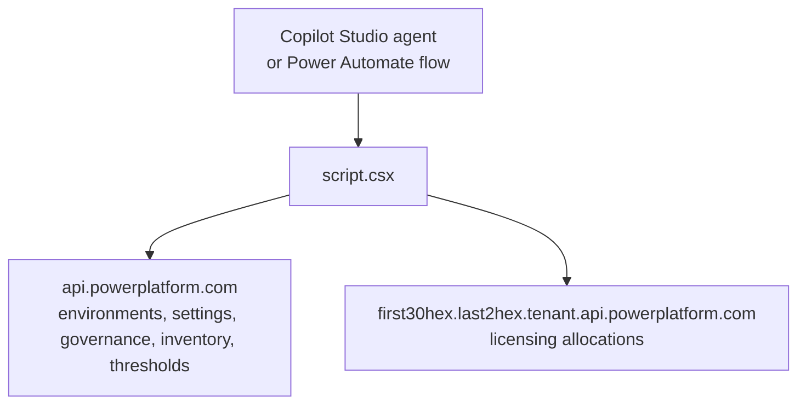

Turning off **Draw from Tenant Pool** stops an environment from spending shared capacity. It doesn't cap what that environment spends on its own allocation, and it does nothing for an environment billing overage to pay-as-you-go at $0.01 per credit. A resource threshold is the limit itself: how much of an entitlement a resource may consume, at what percentage to send a notification, and whether to stop when the number is passed.

[Power Platform Admin v1.3](https://github.com/troystaylor/SharingIsCaring/tree/main/Power%20Platform%20Admin) adds two tools for that surface. This one is [in the published REST reference](https://learn.microsoft.com/rest/api/power-platform/licensing/resource-threshold), which is a change from the [v1.1 tenant pool tools](/power%20platform/custom%20connectors/mcp/2026-08-05-power-platform-admin-tenant-pool-draw.html) that call an undocumented route. The [v1.2 post](/power%20platform/custom%20connectors/mcp/2026-08-06-power-platform-admin-agent-inventory.html) covers agent inventory, and the [original post](/power%20platform/custom%20connectors/mcp/2026-05-13-power-platform-admin-mcp-connector.html) covers the first 12 tools.

## What's new in 1.3

| | v1.2 | v1.3 |
|---|---|---|
| MCP tools | 15 | 17 |
| Power Automate actions | 7 typed operations | 9 typed operations |
| Licensing routes | Undocumented `licensing/allocations` | Adds documented `licensing/.../threshold` |

| Tool | Power Automate action | What it does |
|---|---|---|
| `admin_list_resource_thresholds` | **List Resource Thresholds** | Every threshold on an entitlement, with limit, consumption, and stop flags |
| `admin_upsert_resource_threshold` | **Upsert Resource Threshold** | Create or update the threshold for one environment resource |

## Two routes, two shapes

The read is entitlement-scoped and returns every environment that has a threshold. The write is environment-scoped and targets one resource.

```http
GET  /licensing/entitlements/{entitlementId}/resourceThresholds?api-version=2024-10-01
PUT  /licensing/environments/{environmentId}/entitlements/{entitlementId}/resources/{resourceId}/threshold?api-version=2024-10-01
```

`entitlementId` is what the resource consumes — `MCSMessages` or `MCSSessions` for Copilot Studio. Those IDs predate the rename to Copilot Credits, and the API never followed it.

`resourceId` has no discovery route of its own, so read before you write:

```
What resource thresholds are set on the MCSMessages entitlement?
```

Both tools live on `api.powerplatform.com`. The tenant pool tools are the ones that need the tenant-routed host.



## PUT replaces the whole document

The verb is `PUT` and the body is the complete threshold. Send `{ "limit": 50000 }` against a threshold that already notifies at 80% and stops over capacity, and both of those come back unset.

So the connector reads the current threshold, seeds the payload from it, and overlays only the fields you supplied:

```csharp
var existing = await TryFindResourceThreshold(entitlementId, envId, resourceId);

var payload = new JObject();
if (existing != null)
{
    foreach (var field in THRESHOLD_WRITABLE_FIELDS)
    {
        var current = existing[field];
        if (current != null && current.Type != JTokenType.Null)
            payload[field] = NormalizeThresholdSeed(field, current);
    }
}

var applied = new JArray();
foreach (var field in THRESHOLD_WRITABLE_FIELDS)
{
    var supplied = arguments[field];
    if (supplied == null || supplied.Type == JTokenType.Null) continue;

    payload[field] = CoerceThresholdValue(field, supplied);
    applied.Add(field);
}
```

The response reports `mergedWithExisting` and an `appliedFields` array, so a flow can log what actually changed rather than what was sent.

There's no ETag on the route. A concurrent edit from the admin center between the read and the write is still lost. Don't run this on a fan-out loop over 40 environments while someone is in PPAC.

## The read model and the write model disagree

`limit` comes back as `number (double)` on `ResourceThresholdModel` and goes in as `integer (int32)` on `ResourceThresholdRequestModel`. Both are documented that way. Read a threshold of 50000, echo it back untouched as part of a merge, and the service can reject `50000.0` on model binding — a failure caused entirely by preserving a value nobody asked to change.

Seeded values get rounded to int on the way back in:

```csharp
private static JToken NormalizeThresholdSeed(string field, JToken value)
{
    if (field == "limit" || field == "notificationThreshold")
    {
        double number;
        if (TryReadDouble(value, out number) && number >= int.MinValue && number <= int.MaxValue)
            return (int)Math.Round(number);
    }

    return value.DeepClone();
}
```

`resourceConsumption` stays a double. It's a double on both models.

## A failed read still lets you write

`TryFindResourceThreshold` swallows its exception and returns null:

```csharp
catch (Exception ex)
{
    // A caller that can write but not read must still be able to upsert,
    // so a failed read degrades to a create rather than failing the call.
    this.Context.Logger.LogInformation($"Could not read existing resource thresholds to merge: {ex.Message}");
    return null;
}
```

An admin whose role grants the write but not the entitlement-wide read would otherwise be blocked from setting a limit by a call they never asked for. The degraded path is a create, and the response says so: `mergedWithExisting` is `false` and the message notes that unspecified fields were left unset.

Read the message. It's the difference between a limit you added to an existing threshold and one that quietly replaced it.

## Validation before the round trip

`notificationThreshold` is a percentage. The API types it as int32 and stops there, so `notificationThreshold: 8000` for "80%" is a valid int32 that means nothing.

```csharp
if (field == "notificationThreshold" && number > 100)
    throw new ArgumentException("notificationThreshold is a percentage and must be between 0 and 100.");
```

An empty write is also rejected locally. A `PUT` with three path parameters and no body fields is a request to blank the document:

```csharp
if (applied.Count == 0)
    throw new ArgumentException(
        "Supply at least one threshold field to set: limit, notificationThreshold, notifyIfOverCapacity, resourceConsumption, stopIfOverCapacity, or stopResource.");
```

## In a flow

Both actions render with the same environment picker as the rest of the connector — display names at design time, no GUIDs to paste. `entitlementId` and `resourceId` are free text.

**List Resource Thresholds** returns `entitlementId`, `environmentId`, `thresholdCount`, and a `thresholds` array. Apply-to-each over `thresholds`. Passing `environmentId` filters the array; leaving it blank returns every environment on the entitlement.

**Upsert Resource Threshold** takes the three IDs on the query string and everything else in the body. Omit a property to keep its current value. Sending `null` is treated the same as omitting it, so a flow that builds the body from optional inputs won't clear a field it never populated.

A weekly consumption report is the read on its own: list `MCSMessages` thresholds, filter to rows where `resourceConsumption` is past `notificationThreshold` percent of `limit`, and mail the table.

## Prompts to try

```
What resource thresholds are set on the MCSMessages entitlement?
Which environments are closest to their Copilot Studio message limit?
Cap Copilot Studio messages at 50,000 for this environment and notify me at 80%
Stop the resource once it goes over its message limit
Show me every threshold with stopIfOverCapacity turned off
```

With [generative orchestration](https://learn.microsoft.com/microsoft-copilot-studio/advanced-generative-actions) enabled, the agent can chain the threshold read into `admin_list_agents` and answer which agents sit in the environment that's about to blow its limit.

## Permissions

No new scope. The threshold routes sit under `licensing`, so the `Licensing.Allocations.*` scopes already on the app registration plus a tenant admin role are what the connector uses. There's no threshold-specific permission published — verify with `admin_list_resource_thresholds` before relying on the write.

## Updating an existing install

```powershell
cd "Power Platform Admin"
pac connector update `
  --connector-id <your-connector-id> `
  --api-definition-file apiDefinition.swagger.json `
  --api-properties-file apiProperties.json `
  --script-file script.csx
```

Set the `clientId` in `apiProperties.json` to your app registration first. If the update fails with "An unexpected error occurred," push the definition and script without `--api-properties-file`, then set OAuth on the connector's Security tab in the portal.

The connection doesn't need to be recreated. No scopes changed.

## Resources

- [Source code](https://github.com/troystaylor/SharingIsCaring/tree/main/Power%20Platform%20Admin)
- [Resource Threshold REST reference](https://learn.microsoft.com/rest/api/power-platform/licensing/resource-threshold)
- [Get All Resource Thresholds](https://learn.microsoft.com/rest/api/power-platform/licensing/resource-threshold/get-all-resource-thresholds)
- [Upsert Resource Threshold](https://learn.microsoft.com/rest/api/power-platform/licensing/resource-threshold/upsert-resource-threshold)
- [Manage Copilot Studio credits and capacity](https://learn.microsoft.com/power-platform/admin/manage-copilot-studio-messages-capacity)
- [Manage Copilot credit allocations programmatically](https://learn.microsoft.com/power-platform/admin/programmability-tutorial-manage-copilot-credit-allocations)
- [Permissions reference](https://learn.microsoft.com/power-platform/admin/programmability-permission-reference)
