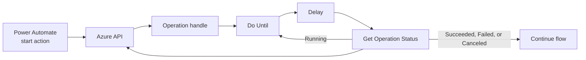

Creating a storage account might finish in seconds. Deploying a virtual machine, Azure Kubernetes Service (AKS) cluster, or Azure Resource Manager (ARM) template can take much longer. A Power Platform custom connector script has a two-minute execution limit, so waiting inside `script.csx` makes long operations unreliable.

Two projects solve this together:

- [Azure Async Operation Polling](https://github.com/troystaylor/SharingIsCaring/tree/main/Connector-Code/Azure%20Async%20Operation%20Polling) is the reusable script pattern. Copy it into a connector for ARM, Microsoft Fabric, Microsoft Foundry, Power BI, or another service with a long-running operation API.
- [Azure Async Operations](https://github.com/troystaylor/SharingIsCaring/tree/main/Connector-Code/Azure%20Async%20Operations) is a complete ARM custom connector built from that pattern. It creates, updates, deletes, and invokes actions on Azure resources.

The connector doesn't wait for Azure to finish. A start action makes one request and returns an operation handle. A second action checks the status once. A Power Automate **Do Until** loop controls the delay and repeats the check.

## Move the waiting into the flow

The custom code follows one rule: each connector action makes no more than one outbound request.



Both actions return the same envelope:

```json
{
  "status": "Running",
  "isComplete": false,
  "retryAfterSeconds": 15,
  "operationHandle": "eyJ1IjoiaHR0cHM6Ly9tYW5hZ2VtZW50...",
  "result": null,
  "error": null
}
```

The script normalizes service-specific states into four values:

- `Running`
- `Succeeded`
- `Failed`
- `Canceled`

An unfamiliar status stays `Running`. Treating an unknown value as success could let the flow continue while Azure is still changing a resource.

## Build the Power Automate loop

Use the same flow shape for every operation:

1. Add one of the connector's start actions.
2. Initialize `handle`, `isComplete`, and `finalStatus` from the response.
3. Add a **Do Until** loop that runs until `isComplete` equals `true`.
4. Inside the loop, add a **Delay** using `retryAfterSeconds`.
5. Call **Get Operation Status** with `handle`.
6. Set `isComplete` and `finalStatus` from the status response.
7. If the new `operationHandle` isn't empty, update `handle`.
8. After the loop, branch on `finalStatus`. Read `result` for success or `error` for failure.

Set the loop count and timeout high enough for the slowest expected operation. Every iteration uses one connector request.

The condition in step 7 matters. Power Automate rejects a variable update that references the same variable:

```text
Self reference is not supported when updating the value of variable
```

An expression such as `coalesce(body('Get_Operation_Status')?['operationHandle'], variables('handle'))` won't work. Use a condition and update the variable only when the response contains a handle. The final status response returns a null handle, so the condition also avoids replacing the last valid value with null.

## Handle both Azure polling shapes

[Azure documents two ways to track an asynchronous operation](https://learn.microsoft.com/azure/azure-resource-manager/management/async-operations). The start response tells the caller which one to use.

| Polling shape | Start response | Status response |
|---|---|---|
| Status document | `Azure-AsyncOperation` or `Operation-Location` header | HTTP 200 with a status field |
| Location | `Location` header on HTTP 202 | HTTP 202 while running, then HTTP 200 with the result |

The distinction has two sharp edges.

First, an async header takes precedence over the HTTP status. A network security group create can return HTTP 201 with `Azure-AsyncOperation`. Code that assumes every non-202 response has finished will report success too early.

Second, `Location` means "poll this URL" only when the response is HTTP 202. A `Location` header on HTTP 201 often points to the resource that was just created. Polling that URL would mistake the resource document for an operation status.

The script resolves these rules when the operation starts:

```csharp
if (TryHeader(response, "Azure-AsyncOperation", out url))
    return new JObject { ["u"] = url, ["k"] = "azureAsync", ["v"] = HANDLE_VERSION };

if (TryHeader(response, "Operation-Location", out url))
    return new JObject { ["u"] = url, ["k"] = "azureAsync", ["v"] = HANDLE_VERSION };

if (response.StatusCode != HttpStatusCode.Accepted)
    return null;

if (response.Headers.Location != null)
    return new JObject { ["u"] = response.Headers.Location.ToString(), ["k"] = "location", ["v"] = HANDLE_VERSION };
```

Operations that return no async header have completed inline. An action such as `listKeys` can return `isComplete: true` and put its response body in `result` without entering the loop.

## Keep the operation handle opaque

The handle is compact, base64url-encoded JSON:

```json
{
  "u": "https://management.azure.com/...",
  "k": "location",
  "v": 1
}
```

It records the polling URL, polling shape, and schema version. The flow doesn't need to parse any of them. Base64url makes the value convenient to carry through a flow, but it doesn't sign or encrypt it.

A flow variable is user-editable, and each status request carries the connection's bearer token. The script rejects a handle unless its polling URL is absolute HTTPS, which prevents cleartext forwarding. When adapting the template for production, also allowlist the service's expected polling hosts or add an integrity check. HTTPS alone doesn't prove that an edited handle still points to Azure.

## Return predictable errors

Each action returns HTTP 200 to Power Automate. A failed Azure operation appears in the response envelope:

```json
{
  "status": "Failed",
  "isComplete": true,
  "retryAfterSeconds": 0,
  "operationHandle": null,
  "error": {
    "code": "ResourceGroupNotFound",
    "message": "Resource group 'rg-missing' could not be found.",
    "httpStatus": 404
  }
}
```

This keeps the Do Until loop on one branch. The flow checks `status` instead of catching a connector exception midway through the loop.

The script also preserves nested Azure errors. If a template deployment fails because a storage account name is taken, the top-level `DeploymentFailed` message remains in `error`, and the underlying conflict remains in `error.details`.

`error.httpStatus` appears only when the HTTP request failed. Azure can return HTTP 200 for a status document whose operation state is `Failed`; adding `"httpStatus": 200` to that error would be misleading.

## Use the ARM connector

The complete Azure Async Operations connector exposes six actions.

| Action | Method | Use |
|---|---|---|
| **Create or Update Resource** | PUT | Create or update an ARM resource |
| **Delete Resource** | DELETE | Delete an ARM resource |
| **Invoke Resource Action** | POST | Run `restart`, `start`, `deallocate`, `regenerateKey`, or another action |
| **Create or Update Child Resource** | PUT | Create or update a nested resource such as a subnet or VM extension |
| **Delete Child Resource** | DELETE | Delete a nested resource |
| **Get Operation Status** | GET | Perform one status check |

The start actions accept the target API version, so one connector can work across resource providers.

| Goal | ARM path |
|---|---|
| Create a storage account | `/subscriptions/{sub}/resourcegroups/{rg}/providers/Microsoft.Storage/storageAccounts/{name}` |
| Restart a virtual machine | `/subscriptions/{sub}/resourcegroups/{rg}/providers/Microsoft.Compute/virtualMachines/{vm}/restart` |
| Add a subnet | `/subscriptions/{sub}/resourcegroups/{rg}/providers/Microsoft.Network/virtualNetworks/{vnet}/subnets/{subnet}` |
| Deploy an ARM template | `/subscriptions/{sub}/resourcegroups/{rg}/providers/Microsoft.Resources/deployments/{name}` |

Use **Create or Update Resource** for a template deployment. Its deployment resource follows the standard ARM resource path.

## Deploy the ARM connector

You need:

- An Azure subscription and permission to manage the target resources
- An Entra app registration
- A Power Platform environment that allows custom connectors
- [Power Platform CLI](https://learn.microsoft.com/power-platform/developer/cli/introduction)

Register an Entra application, add the **Azure Service Management** `user_impersonation` delegated permission, grant admin consent, and create a client secret. Put the application ID in `apiProperties.json`, but don't commit the secret.

Deploy all three connector files:

```powershell
pac connector create `
    --api-definition-file apiDefinition.swagger.json `
    --api-properties-file apiProperties.json `
    --script-file script.csx
```

The connector authenticates for the `https://management.azure.com` audience. Azure also requires enough permission to read the operation status URL. [The ARM guidance](https://learn.microsoft.com/azure/azure-resource-manager/management/async-operations#permission-for-tracking-async-status) notes that status tracking can require resource group-level permission even when the caller can start an operation at the resource level.

### Register the generated redirect URL

After deployment, Power Platform replaces the placeholder redirect URL with a connector-specific URL. Download the deployed connector and read:

```text
properties.connectionParameters.token.oAuthSettings.redirectUrl
```

Add that generated URL to the Entra app registration. OAuth consent will fail if only the generic `https://global.consent.azure-apim.net/redirect` URL is registered. Each Power Platform environment generates a different redirect URL.

## Adapt the polling template

The standalone project contains `script.csx` without an OpenAPI definition. Copy it into an existing connector and change three settings:

```csharp
private static readonly HashSet<string> START_OPERATIONS =
    new HashSet<string>(StringComparer.Ordinal)
{
    "StartLongRunningOperation"
};

private const string POLL_OPERATION = "GetOperationStatus";
private const string HANDLE_PARAMETER = "operationHandle";
```

Then:

1. Add every start and poll operation to `scriptOperations` in `apiProperties.json`.
2. Review `NormalizeStatus` for the service's status vocabulary.
3. Review `NormalizeError` for the service's error body.
4. Confirm which header or operation ID identifies the polling URL.
5. Test synchronous success, synchronous failure, async success, async failure, and an unknown status.

Build one connector per service. A connection carries one OAuth audience, so an ARM connector can't also call Fabric or Foundry with the same token.

| Service | OAuth audience |
|---|---|
| Azure Resource Manager | `https://management.azure.com` |
| Microsoft Fabric | `https://api.fabric.microsoft.com` |
| Microsoft Foundry Agent Service | `https://ai.azure.com` |
| Azure Cognitive Services | `https://cognitiveservices.azure.com` |
| Power BI | `https://analysis.windows.net/powerbi/api` |

## Test the boundary cases

The implementation was checked against live ARM with 66 assertions. Coverage included:

- `Location` polling from storage account creation
- `Azure-AsyncOperation` polling from network security group creation
- A start call that returned in under one second
- A slowest observed poll of 0.3 seconds
- Synchronous HTTP 400 and 404 failures
- An ARM deployment that failed during provisioning
- Inline completion from `listKeys`
- Subnet create and delete operations
- Malformed, empty, and non-HTTPS handles
- Known and unknown status values

The connector was also deployed and run through a Power Automate Do Until loop. ARM supplied a 17-second retry interval, the flow completed after three polls, and the final result reported `provisioningState: Succeeded`.

## Resources

- [Azure Async Operation Polling template](https://github.com/troystaylor/SharingIsCaring/tree/main/Connector-Code/Azure%20Async%20Operation%20Polling)
- [Azure Async Operations connector](https://github.com/troystaylor/SharingIsCaring/tree/main/Connector-Code/Azure%20Async%20Operations)
- [Track asynchronous Azure operations](https://learn.microsoft.com/azure/azure-resource-manager/management/async-operations)
- [Write code in a custom connector](https://learn.microsoft.com/connectors/custom-connectors/write-code)
- [Create a custom connector from an OpenAPI definition](https://learn.microsoft.com/connectors/custom-connectors/define-openapi-definition)
