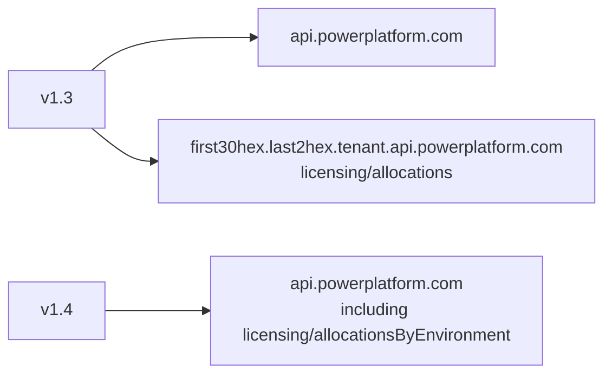

Microsoft published the **Allocations By Environment** API in July 2026. That's the supported route for reading and writing capacity allocations per environment, and it lives on `api.powerplatform.com` alongside everything else the connector already calls.

[Power Platform Admin v1.4](https://github.com/troystaylor/SharingIsCaring/tree/main/Power%20Platform%20Admin) moves onto it. Five new tools cover allocations, availability, and reserved entitlements. The tenant pool tools from [v1.1](/power%20platform/custom%20connectors/mcp/2026-08-05-power-platform-admin-tenant-pool-draw.html) were rewritten to use the same surface, so the tenant-routed host they reached is gone. Nothing in the connector calls an undocumented licensing route anymore.

The [v1.2 post](/power%20platform/custom%20connectors/mcp/2026-08-06-power-platform-admin-agent-inventory.html) covers agent inventory, [v1.3](/power%20platform/custom%20connectors/mcp/2026-08-13-power-platform-admin-resource-thresholds.html) covers resource thresholds, and the [original post](/power%20platform/custom%20connectors/mcp/2026-05-13-power-platform-admin-mcp-connector.html) covers the first 12 tools.

## What's new in 1.4

| | v1.3 | v1.4 |
|---|---|---|
| MCP tools | 17 | 22 |
| Power Automate actions | 9 typed operations | 14 typed operations |
| Hosts called | `api.powerplatform.com` plus a tenant-routed host | `api.powerplatform.com` only |
| Undocumented licensing routes | 1 | 0 |
| Confirmation gate on writes | Wording in tool descriptions | Enforced in the tool router |

| Tool | Power Automate action | What it does |
|---|---|---|
| `admin_list_environment_allocations` | **List Environment Allocations** | Allocations for every environment, with enforcement rules per currency |
| `admin_get_environment_allocations` | **Get Environment Allocations** | The allocation document for one environment |
| `admin_update_environment_allocation` | **Update Environment Allocation** | Set the allocated amount and/or enforcement rules for one currency |
| `admin_get_allocation_availability` | **Get Allocation Availability** | How much of each entitlement is still available to allocate |
| `admin_get_reserved_entitlements` | **Get Reserved Entitlements** | Reserved quantity per entitlement |

## One host now

v1.1 built a host from the `tid` claim of the access token — the tenant GUID lowercased, stripped of dashes, split into the first 30 hex characters and the last 2, assembled as `{prefix}.{suffix}.tenant.api.powerplatform.com`. It worked, and it was never in the published REST reference.



The identifiers survived the move but the wire shape didn't. `MCSMessages` and `MCSSessions` were entitlement IDs on the retired route. On the documented API they're `ExternalCurrencyType` values inside a `currencyAllocations` array:

```csharp
// MCSMessages and MCSSessions are ExternalCurrencyType values on the documented
// allocation API. The retired tenant-routed endpoint modelled them as entitlement
// IDs, so the wire shape differs even though the identifiers are spelled the same.
private static readonly string[] TENANT_POOL_CURRENCIES = { "MCSMessages", "MCSSessions" };
```

Tenant pool draw is now an enforcement rule on those two currencies rather than a document of its own. `admin_get_tenant_pool_draw` and `admin_set_tenant_pool_draw` keep their names and arguments, so an agent or flow built on v1.1 keeps working.

## Every documented currency, four enforcement rules

The allocation tools cover the full `ExternalCurrencyType` list — AI, Copilot Studio messages and sessions, Power Pages authenticated and anonymous, hosted and unattended RPA, Power Automate per-process, Process Mining storage, and the rest — with `Alert`, `PayGo`, `TenantPool`, and `Deny`.

`Throttle` is missing from that list on purpose. It appears on the `allocationsV2` surface but not on the by-environment API, so the connector rejects it locally rather than sending a value the endpoint doesn't document:

```csharp
throw new ArgumentException(
    $"ruleType '{trimmed}' is not a documented enforcement rule for the by-environment allocation " +
    "API. Expected one of: " + string.Join(", ", ENFORCEMENT_RULE_TYPES) + ".");
```

Currency spelling is validated the same way, against the documented list. Unknown values coming back *from* the service pass through untouched — Microsoft can add a member without a version bump, and a connector that filters reads would hide capacity that exists.

`Deny` deserves care. Enabling it halts consumption once the allocation is exhausted, which can break running apps and agents mid-request.

## Writes read back and report whether it took

The `PATCH` accepts a `currencyAllocations` array, and the published contract doesn't say whether the service merges the collection or replaces it. Sending the whole array makes both behaviors produce the same result, so `admin_update_environment_allocation` reads the current document, changes only the currency you named, and sends everything back.

Then it re-reads and compares:

```csharp
var applied = await PatchEnvironmentAllocation(envId, document).ConfigureAwait(false);
var after = await FetchEnvironmentAllocation(envId).ConfigureAwait(false);

var verified = VerifyCurrencyMatches(after, currencyType, target);
```

The response carries `verified` plus a `changes` array of `field`, `from`, and `to` entries, so a flow logs what moved instead of what was requested. A `false` on `verified` means the read-back didn't match:

```
Updated AI on environment {id}, but the read-back did not match the requested
values. Another administrator may have written concurrently — the service exposes
no ETag. Re-read the allocation before making further changes.
```

There's still no ETag. Read-modify-write with verification narrows the window and tells you when you lost the race; it doesn't close it. Don't fan this out across 40 environments while someone is in PPAC.

A call that supplies neither `allocated` nor `enforcementRules` is rejected rather than rewriting the document with its own current values.

## Confirmation the agent can't reason its way past

"Confirm with the user before executing" in a tool description is a suggestion. An orchestrator resolving an ambiguous instruction can decide it already has consent — and `Deny` on a production currency is not a decision to leave to inference.

v1.4 puts the check in the tool router:

```csharp
private static readonly HashSet<string> CONFIRMATION_REQUIRED_TOOLS =
    new HashSet<string>(StringComparer.OrdinalIgnoreCase)
    {
        "admin_update_setting",
        "admin_update_copilot_governance",
        "admin_set_tenant_pool_draw",
        "admin_upsert_resource_threshold",
        "admin_update_environment_allocation",
        "admin_install_package"
    };
```

`confirm` is required in each tool's input schema, and the router refuses the call regardless:

```csharp
throw new ArgumentException(
    $"{toolName} changes tenant or environment configuration and cannot be run from an " +
    "implied instruction. Show the caller what will change, then set confirm to true.");
```

A missing, `false`, or non-boolean `confirm` all land in the same place. The string `"true"` is accepted because some agents stringify booleans, and nothing weaker than an explicit affirmative gets through.

The typed Power Automate operations are deliberately not gated. A maker who drags **Update Environment Allocation** into a designer has already made the decision, and adding a required body property would break every flow built on the previous version.

## In a flow

Five new actions, same environment picker as the rest of the connector — display names at design time, no GUIDs to paste.

**List Environment Allocations** takes no inputs and returns every environment, which makes the tenant-wide reports practical: which environments have `Deny` enabled on any currency, which draw from the tenant pool without a resource threshold, which have AI capacity sitting allocated and unused.

**Get Allocation Availability** and **Get Reserved Entitlements** each accept an OData `$filter`, but Microsoft doesn't publish the filterable fields. Call them unfiltered and narrow the result in the flow. Reserved quantities don't include enforcement rules — read the environment allocation for those.

## Prompts to try

```
Show me capacity allocations across every environment
What AI capacity is allocated to my production environment?
How much AI capacity is still unallocated in the tenant?
Allocate 250 AI capacity to my sandbox and deny overage
Which environments have Deny enabled on any currency?
Which environments draw from the tenant pool but have no resource threshold?
```

That last one spans two APIs. With [generative orchestration](https://learn.microsoft.com/microsoft-copilot-studio/advanced-generative-actions) enabled, the agent reads allocations, reads thresholds, and joins them on environment ID without a tool built for the question.

## Permissions

No new scope. The allocation routes sit under `licensing`, so the `Licensing.Allocations.Read` and `Licensing.Allocations.ReadWrite` scopes already on the app registration cover them, plus **Power Platform Administrator** or **Global Administrator** on the caller. The endpoint reference advertises only `.default`, so verify with a read before relying on a write.

## Updating an existing install

```powershell
cd "Power Platform Admin"
pac connector update `
  --connector-id <your-connector-id> `
  --api-definition-file apiDefinition.swagger.json `
  --api-properties-file apiProperties.json `
  --script-file script.csx
```

Set the `clientId` in `apiProperties.json` to your app registration first. If the update fails with "An unexpected error occurred," push the definition and script without `--api-properties-file`, then set OAuth on the connector's Security tab in the portal.

The connection doesn't need to be recreated. Agents calling the six gated tools do need `confirm: true` added — that's the one breaking change in this release.

## Resources

- [Source code](https://github.com/troystaylor/SharingIsCaring/tree/main/Power%20Platform%20Admin)
- [List Allocations By Environment](https://learn.microsoft.com/rest/api/power-platform/licensing/allocations-by-environment/list-allocations-by-environment)
- [Get Allocations By Environment](https://learn.microsoft.com/rest/api/power-platform/licensing/allocations-by-environment/get-allocations-by-environment)
- [Update Allocations By Environment](https://learn.microsoft.com/rest/api/power-platform/licensing/allocations-by-environment/update-allocations-by-environment)
- [Get Allocations Availability V2](https://learn.microsoft.com/rest/api/power-platform/licensing/allocation/get-allocations-availability-v2)
- [Get Many Entitlements Reserved V2](https://learn.microsoft.com/rest/api/power-platform/licensing/allocation/get-many-entitlements-reserved-v2)
- [Manage Copilot credit allocations programmatically](https://learn.microsoft.com/power-platform/admin/programmability-tutorial-manage-copilot-credit-allocations)
- [Permissions reference](https://learn.microsoft.com/power-platform/admin/programmability-permission-reference)
