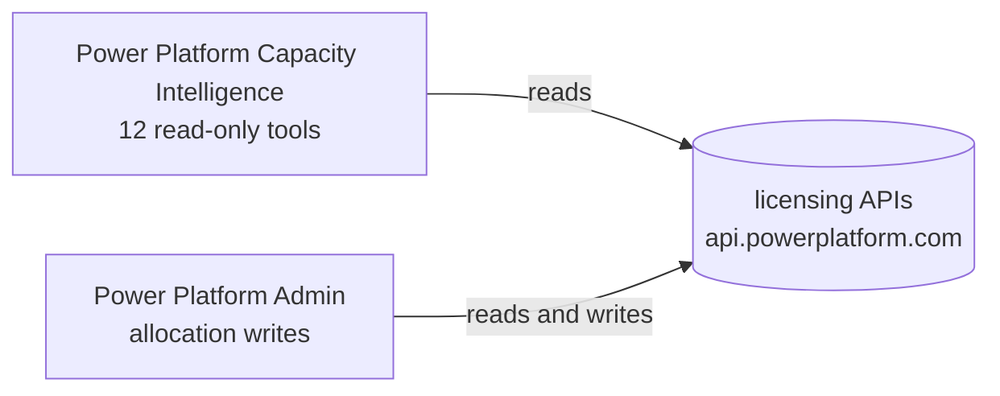

Ask how much Copilot Studio message capacity your tenant has left and you'll visit three places: the capacity page for what you own, a downloaded report for what you've used, and a spreadsheet to work out the difference. Ask which agents consumed it and you're out of options.

The licensing APIs Microsoft shipped in [July 2026](https://learn.microsoft.com/power-platform/admin/programmability-whats-new-changed#july-2026) answer both questions from one host. [Power Platform Capacity Intelligence](https://github.com/troystaylor/SharingIsCaring/tree/main/Power%20Platform%20Capacity%20Intelligence) wraps them in 12 typed Power Automate actions and the same 12 tools over Model Context Protocol, so a flow or a Copilot Studio agent can ask directly.

Every operation is read-only.

## Reading and writing stay in separate connectors

Allocation writes live in the [Power Platform Admin connector](/power%20platform/custom%20connectors/mcp/2026-09-08-power-platform-admin-capacity-allocations.html), which shipped them in v1.4.



An agent holding only this connector can report that production has burned 94% of its AI capacity. It can't change the allocation, enable `Deny`, or move capacity between environments. That makes it safe to hand to a wider audience than the admin connector — finance, a platform steering group, anyone who needs the number without needing the controls.

## What the 12 tools cover

| Area | Tool | Returns |
|---|---|---|
| Tenant capacity | `capacity_get_entitlement` | Entitled, consumed, allocated, available, and overage status |
| Tenant capacity | `capacity_get_entitlement_posture` | Capacity, headroom, and thresholds in one call, with percent used |
| Tenant capacity | `capacity_get_finops_license_summary` | Finance and Operations users: total, unlicensed, under-licensed, over-licensed |
| Environment scope | `capacity_list_environment_entitlements` | Entitlements available to one environment, with enforcement rules |
| Environment scope | `capacity_get_environment_resources` | Resources consuming capacity inside one environment |
| Tenant scope | `capacity_get_tenant_resources` | Resources consuming capacity across the estate |
| Tenant scope | `capacity_get_license_trends` | License counts over a date range, by model and tier |
| Headroom | `capacity_get_allocation_availability` | Capacity not yet allocated to any environment |
| Limits | `capacity_list_resource_thresholds` | Configured consumption caps |
| Attribution | `capacity_list_tenant_users` | Users consuming an entitlement, with amounts |
| Attribution | `capacity_get_user_consumption` | What one user consumed, by resource |
| Attribution | `capacity_get_resource_consumers` | Which users consumed one resource |

Start with **List Environment Entitlements**. Entitlement IDs aren't published anywhere convenient, and this tool returns the ones your environment actually has.

Each tool is also a typed Power Automate action with full request and response schemas, so it shows up in the designer with IntelliSense and output tokens. Every `environmentId` field renders as a picker of display names, backed by an internal dropdown operation — no GUIDs to paste.

The definition holds 15 operations: 12 typed actions, 2 internal dropdown sources, and the MCP endpoint.

## Where the live API diverges from the reference

Each contract was checked against a live tenant before the connector was written. Five published details didn't hold, and each one changed the implementation.

**Allocation availability rejects an unfiltered call.** The reference marks `$filter` optional. The service returns `400 Invalid filter options` without it. So `entitlementId` is required and the connector writes the filter:

```csharp
var filter = $"entitlementId eq '{EscapeODataLiteral(entitlementId)}'";
if (!string.IsNullOrWhiteSpace(environmentId))
    filter = $"environmentId eq '{EscapeODataLiteral(environmentId.Trim())}' and {filter}";
```

**Paged responses use a different token name.** The reference documents `@odata.nextLink` and `@odata.count`. What arrives is `value` and a lowercase `continuationtoken`. The connector accepts all three spellings and returns whichever it finds.

**Dates are typed as bare strings.** ISO `yyyy-MM-dd` works. The connector validates and normalizes before sending, so an inverted or unparseable range fails with a clear message instead of an opaque service error. Omit both dates and you get month-to-date, which matches how the service reports consumption.

**`EntitlementUnit` isn't a closed set.** Four values are documented. The service also returns others, including `Messages`. The connector passes `unit` through as a display string and never switches on it.

**Two endpoints return `403` with an empty body.** `Get Environment Resources` and `Get Tenant Resources` were denied for a tenant administrator whose sibling entitlement reads succeeded on the same token. No error detail came back at all, so the connector supplies the diagnosis:

```csharp
if (status == HttpStatusCode.Forbidden)
{
    return $"Access denied reading {description} (403). " +
           (string.IsNullOrWhiteSpace(body)
               ? "The service returned no detail. Grant Licensing.Allocations.Read to the app registration and sign in as a Power Platform or Global administrator. " +
                 "Some per-resource consumption endpoints stay denied even for tenant administrators; if a sibling entitlement read succeeds, the permission is present and this endpoint is restricted separately."
               : Truncate(body));
}
```

That last one costs the most time during setup. If **Get Entitlement** works and **Get Environment Resources** doesn't, granting the permission again won't help. You've hit a separate gate on per-resource consumption.

## Making the numbers mean what they say

A capacity figure without its context invites the wrong conclusion. Three response fields carry that context.

### consumptionType tells you what consumed covers

`consumed` isn't always a running total. `MonthToDate` resets on the first of the month, so a low figure on the third says nothing about usage. `Snapshot` is a point-in-time reading. Every tool that returns `consumed` returns `consumptionType` next to it.

`percentUsed` is computed by the connector as `consumed / entitled × 100`, rounded to two places, and only when `entitled` is greater than zero. It measures the past. The connector doesn't extrapolate, and the response says so.

### An empty result isn't always a zero

Three tools distinguish absence from measurement. The Finance and Operations summary is the clearest case — a tenant that has never produced a report returns zeroed counters and a default timestamp rather than a `204`:

```csharp
var neverRefreshed = IsDefaultTimestamp(doc["lastReportRefreshTime"]);
```

When that's true, `hasData` comes back `false` with an explanation: "This tenant has no Finance and Operations licensing report. The zero counts are the absence of a report, not a measured result."

Check `hasData` before charting it. A chart of zeros looks like a measurement.

`capacity_list_resource_thresholds` reports consumption as uncapped rather than returning a bare empty list, and `capacity_get_license_trends` explains that capacity-model entitlements have no assigned licenses to trend.

### Posture degrades in parts

`capacity_get_entitlement_posture` reads three sources — entitlement capacity, allocation availability, and thresholds. Those sources don't share authorization behavior, so one failure shouldn't blank the other two:

```csharp
try { entitlement = await HandleGetEntitlement(args).ConfigureAwait(false); }
catch (Exception ex) { problems.Add("entitlement: " + ex.Message); }

try { availability = await HandleGetAllocationAvailability(args).ConfigureAwait(false); }
catch (Exception ex) { problems.Add("availability: " + ex.Message); }

try { thresholds = await HandleListResourceThresholds(args).ConfigureAwait(false); }
catch (Exception ex) { problems.Add("thresholds: " + ex.Message); }
```

The response carries `problems` and a `complete` flag. A partial posture is a normal result, not a failure — check `complete` before treating it as whole.

## Paging is handed back to the caller

Paged tools return one page and the service's continuation token. Walking the full collection inside the script would risk the two-minute custom code limit on a large tenant, and a timeout is harder to diagnose than an explicit next-page token.

Loop while `hasMore` is true, passing `continuationToken` back each time:

```text
1. Get Tenant Resources          (entitlementId: MCSMessages)
2. Do Until: hasMore is false
   3. Append resources[] to an array variable
   4. Get Tenant Resources       (continuationToken from the previous response)
```

`pageSize` defaults to 100 and clamps at 1,000. Raising it makes fewer calls, which matters when a sweep starts drawing `429` responses.

Rows arrive flattened. The service nests them as `value[].resources[]` and `value[].users[]`; the connector unwraps that level, so an apply-to-each runs directly over `resources` or `users`.

## User attribution needs handling rules

The three attribution tools return identifiable people alongside consumption figures. Their responses carry a `privacyNote` saying so.

Telemetry is off by default, and when enabled it records only the tool name and entitlement ID through `ToolCall` and `ToolCallError` events. Consumption figures and user identifiers never reach Application Insights. Sending them would move personal data outside the boundary the caller expects, and a telemetry pipeline is the wrong place to keep it. Audit inside your own tenant against the connector's response instead.

Prefer resource-level attribution when it answers the question. Reach for user-level data when it doesn't, then retain the output according to your privacy obligations.

## Setting it up

### Grant the permission

Create a Microsoft Entra app registration with the delegated Power Platform API permission `Licensing.Allocations.Read`. The Power Platform API resource is `8578e004-a5c6-46e7-913e-12f58912df43`.

```powershell
az ad app permission add --id <appId> `
  --api 8578e004-a5c6-46e7-913e-12f58912df43 `
  --api-permissions 73cf5c38-5257-4f28-8bbb-f78acf3290a4=Scope

az ad app permission admin-consent --id <appId>
```

The [permission reference](https://learn.microsoft.com/power-platform/admin/programmability-permission-reference) doesn't publish scope IDs. That value was read from the service — confirm it in your own tenant rather than trusting a pasted GUID:

```powershell
az ad sp show --id 8578e004-a5c6-46e7-913e-12f58912df43 `
  --query "oauth2PermissionScopes[?starts_with(value,'Licensing')].{scope:value,id:id}" `
  --output table
```

The signed-in user needs **Power Platform Administrator** or **Global Administrator**. These reads are tenant-scoped.

### Deploy all three files

`apiProperties.json` declares script operations, so the service rejects a deployment without a script to route them to:

```powershell
ppcv ".\Power Platform Capacity Intelligence"

pac connector create `
  --api-definition-file ".\Power Platform Capacity Intelligence\apiDefinition.swagger.json" `
  --api-properties-file ".\Power Platform Capacity Intelligence\apiProperties.json" `
  --script-file ".\Power Platform Capacity Intelligence\script.csx"
```

Search for **Power Platform Capacity** in the connector list, not the folder name. `pac connector create` caps titles at 30 characters and "Power Platform Capacity Intelligence" is 35. `ppcv` doesn't check that limit, so the files validate cleanly and the deployment still fails.

Replace `[INSERT_YOUR_CLIENT_ID]` in `apiProperties.json` with your application ID first. The placeholder deploys verbatim and the connector won't authenticate until you fix it.

### Register the generated redirect URL

Deployment rewrites `redirectMode` to `GlobalPerConnector` and replaces `redirectUrl` with a generated value. That value has to be on the app registration or OAuth consent fails. This step is easy to miss and the failure it causes looks like a permission problem.

```powershell
pac connector download --connector-id <CONNECTOR_ID> --outputDirectory ".\verify"
# read properties.connectionParameters.token.oAuthSettings.redirectUrl

az ad app update --id <appId> --web-redirect-uris `
  "https://global.consent.azure-apim.net/redirect" `
  "<generated-url>"
```

The trailing segment identifies the environment, so a second environment produces a second URL and both need registering. Add to the existing list rather than replacing it if the app registration backs other connectors.

## Putting it to work

A monthly posture report starts with **List Environment Entitlements**, filters to entitlements whose status isn't `WithinCapacity`, and calls **Get Entitlement Posture** for each survivor:

```text
1. Trigger: Scheduled (monthly, first of the month)
2. List Environment Entitlements  (production environment)
3. Filter array: status is not equal to 'WithinCapacity'
4. For each remaining entitlement:
   5. Get Entitlement Posture     (entitlementId from the filtered item)
   6. Append to an HTML table: entitlementId, percentUsed, status, consumed, entitled
7. Mail the table to the platform owners
```

Tracing Copilot Studio consumption takes three calls — the total, the resources behind it, and the headroom left:

```text
1. Get Entitlement                (MCSMessages)
2. Get Tenant Resources           (MCSMessages, paging until hasMore is false)
3. Sort by consumed descending, take the top 10
4. Get Allocation Availability    (MCSMessages)
```

An agent answers the same questions conversationally:

```text
How much Copilot Studio message capacity has the tenant used this month?
Which agents consumed the most MCSMessages capacity in August?
Which entitlements are in overage?
How much AI capacity is still unallocated?
What entitlements does my production environment have?
Are there consumption thresholds configured for MCSMessages?
Who consumed the most Copilot Studio capacity last month?
```

When the answer calls for a change, switch to Power Platform Admin. This connector reports the position; that one moves it.

## Resources

- [Source code](https://github.com/troystaylor/SharingIsCaring/tree/main/Power%20Platform%20Capacity%20Intelligence)
- [July 2026 programmability additions](https://learn.microsoft.com/power-platform/admin/programmability-whats-new-changed#july-2026)
- [Get Entitlement](https://learn.microsoft.com/rest/api/power-platform/licensing/entitlement/get-entitlement)
- [Get Many Environment Entitlements](https://learn.microsoft.com/rest/api/power-platform/licensing/entitlement/get-many-environment-entitlements)
- [Get Environment Resources](https://learn.microsoft.com/rest/api/power-platform/licensing/entitlement-insight/get-environment-resources)
- [Get Tenant Users](https://learn.microsoft.com/rest/api/power-platform/licensing/entitlement-insight/get-tenant-users)
- [Get Allocations Availability V2](https://learn.microsoft.com/rest/api/power-platform/licensing/allocation/get-allocations-availability-v2)
- [Get All Resource Thresholds](https://learn.microsoft.com/rest/api/power-platform/licensing/resource-threshold/get-all-resource-thresholds)
- [Get Fin Ops License Summary V2](https://learn.microsoft.com/rest/api/power-platform/licensing/fin-ops-licensing/get-fin-ops-license-summary-v2)
- [Programmability permission reference](https://learn.microsoft.com/power-platform/admin/programmability-permission-reference)
